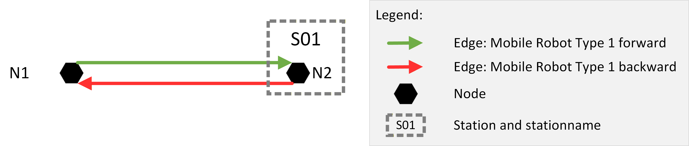

<!-- Generated from examples/*.md by build_examples.py - do not edit the example sections by hand. -->


# LIF - Layout Interchange Format

## Examples for the definition of path and behavior layouts for exchange between parties to integrate mobile robots and a fleet control system.

## Version 2.0.0 - September 2026

# Abstract

This document supplements the LIF - Layout Interchange Format specification, version 2.0.0. It contains worked examples of complete LIF files. Each example is also maintained as an individual document in the examples directory and validates against the LIF 2.0 JSON schema.

**Note:** The examples are kept simple, thus optional attributes (such as trajectory) are not defined for most.

| | |
|---|---|
Publisher | Verband Deutscher Maschinen- und Anlagenbau e. V. (VDMA) |
|  | Lyoner Strasse 18, 60528 Frankfurt am Main |
| Copyright | Verband Deutscher Maschinen- und Anlagenbau e. V. (VDMA) |
|  | Reprinting and any other form of reproduction is permitted only if the source is acknowledged. |
| Status | September 2026 |
| Version | 2.0.0 |

## Contents

[1 Forward Edge](#1-forward-edge)<br>
[2 Bidirectional Edge](#2-bidirectional-edge)<br>
[3 Counter-clockwise Rotation on Node](#3-counter-clockwise-rotation-on-node)<br>
[4 Omnidirectional Edge](#4-omnidirectional-edge)<br>
[5 Multiple Layouts in One LIF](#5-multiple-layouts-in-one-lif)<br>
[6 Station with One Node](#6-station-with-one-node)<br>
[7 Station with Two Nodes](#7-station-with-two-nodes)<br>
[8 Station with Two Nodes, Restricted for Different Mobile Robot Types](#8-station-with-two-nodes-restricted-for-different-mobile-robot-types)<br>
[9 Rotation Station](#9-rotation-station)<br>
[10 Station with Three Nodes, Restricted to Different Mobile Robot Types](#10-station-with-three-nodes-restricted-to-different-mobile-robot-types)<br>
[11 Multiple Edges with Load Restrictions](#11-multiple-edges-with-load-restrictions)<br>
[12 Multiple Edges Between Same Two Nodes for Different mobileRobotTypeEdgeProperty Constraints](#12-multiple-edges-between-same-two-nodes-for-different-mobilerobottypeedgeproperty-constraints)<br>
[13 Battery Charging Station](#13-battery-charging-station)<br>
[14 Two Levels of a Facility in One LIF File](#14-two-levels-of-a-facility-in-one-lif-file)<br>
[15 Rack Station Modelled by Three Stations](#15-rack-station-modelled-by-three-stations)<br>
[16 Rack Station Modelled by Three Nodes](#16-rack-station-modelled-by-three-nodes)<br>
[17 Edge with Trajectory Definition](#17-edge-with-trajectory-definition)<br>
[18 Manufacturer Specific Action on an Edge](#18-manufacturer-specific-action-on-an-edge)<br>
[19 Forward Edge with Two Mobile Robot Types with Differing Orientation](#19-forward-edge-with-two-mobile-robot-types-with-differing-orientation)<br>

## 1 Forward Edge

One edge (straight line) between two nodes. The mobile robot may only move forward oriented on this edge.


LIF-File:
```json
{
    "metaInformation": {
        "lifId": "LIF_Example_01",
        "creator": "VDMA",
        "exportTimestamp": "2026-09-28T10:00:00.00Z",
        "lifVersion": "2.0.0"
    },
    "origins": [
        {
            "originId": "Origin_1",
            "layouts": [
                {
                    "layoutId": "Layout_Ground_Level",
                    "layoutName": "Name of Layout Ground Level",
                    "layoutVersion": "1",
                    "layoutDescriptor": "Ground level of Customer",
                    "nodes": [
                        {
                            "nodeId": "N1",
                            "mapId": "Map_Z-Level_1",
                            "nodePosition": {
                                "x": 0.0,
                                "y": 0.0
                            },
                            "mobileRobotTypeNodeProperties": [
                                {
                                    "mobileRobotTypes": [
                                        {
                                            "manufacturer": "Manufacturer_A",
                                            "seriesName": "Series_1"
                                        }
                                    ]
                                }
                            ]
                        },
                        {
                            "nodeId": "N2",
                            "mapId": "Map_Z-Level_1",
                            "nodePosition": {
                                "x": 11.0,
                                "y": 0.0
                            },
                            "mobileRobotTypeNodeProperties": [
                                {
                                    "mobileRobotTypes": [
                                        {
                                            "manufacturer": "Manufacturer_A",
                                            "seriesName": "Series_1"
                                        }
                                    ]
                                }
                            ]
                        }
                    ],
                    "edges": [
                        {
                            "edgeId": "N1-N2",
                            "startNodeId": "N1",
                            "endNodeId": "N2",
                            "mobileRobotTypeEdgeProperties": [
                                {
                                    "mobileRobotTypes": [
                                        {
                                            "manufacturer": "Manufacturer_A",
                                            "seriesName": "Series_1"
                                        }
                                    ],
                                    "orientationType": "TANGENTIAL",
                                    "reachOrientationBeforeEntering": true,
                                    "mobileRobotOrientations": [
                                        0.0
                                    ]
                                }
                            ]
                        }
                    ]
                }
            ]
        }
    ]
}
```

## 2 Bidirectional Edge

Two edges (straight line) between two nodes. The mobile robot may only move forward oriented on one edge and backward oriented on the other edge.


LIF-File:
```json
{
    "metaInformation": {
        "lifId": "LIF_Example_02",
        "creator": "VDMA",
        "exportTimestamp": "2026-09-28T10:00:00.00Z",
        "lifVersion": "2.0.0"
    },
    "origins": [
        {
            "originId": "Origin_1",
            "layouts": [
                {
                    "layoutId": "Layout_Ground_Level",
                    "layoutName": "Name of Layout Ground Level",
                    "layoutVersion": "1",
                    "layoutDescriptor": "Ground level of Customer",
                    "nodes": [
                        {
                            "nodeId": "N1",
                            "mapId": "Map_Z-Level_1",
                            "nodePosition": {
                                "x": 0.0,
                                "y": 0.0
                            },
                            "mobileRobotTypeNodeProperties": [
                                {
                                    "mobileRobotTypes": [
                                        {
                                            "manufacturer": "Manufacturer_A",
                                            "seriesName": "Series_1"
                                        }
                                    ]
                                }
                            ]
                        },
                        {
                            "nodeId": "N2",
                            "mapId": "Map_Z-Level_1",
                            "nodePosition": {
                                "x": 11.0,
                                "y": 0.0
                            },
                            "mobileRobotTypeNodeProperties": [
                                {
                                    "mobileRobotTypes": [
                                        {
                                            "manufacturer": "Manufacturer_A",
                                            "seriesName": "Series_1"
                                        }
                                    ]
                                }
                            ]
                        }
                    ],
                    "edges": [
                        {
                            "edgeId": "N1-N2",
                            "startNodeId": "N1",
                            "endNodeId": "N2",
                            "mobileRobotTypeEdgeProperties": [
                                {
                                    "mobileRobotTypes": [
                                        {
                                            "manufacturer": "Manufacturer_A",
                                            "seriesName": "Series_1"
                                        }
                                    ],
                                    "orientationType": "TANGENTIAL",
                                    "reachOrientationBeforeEntering": true,
                                    "mobileRobotOrientations": [
                                        0.0
                                    ]
                                }
                            ]
                        },
                        {
                            "edgeId": "N2-N1",
                            "startNodeId": "N2",
                            "endNodeId": "N1",
                            "mobileRobotTypeEdgeProperties": [
                                {
                                    "mobileRobotTypes": [
                                        {
                                            "manufacturer": "Manufacturer_A",
                                            "seriesName": "Series_1"
                                        }
                                    ],
                                    "orientationType": "TANGENTIAL",
                                    "reachOrientationBeforeEntering": true,
                                    "mobileRobotOrientations": [
                                        3.14159
                                    ]
                                }
                            ]
                        }
                    ]
                }
            ]
        }
    ]
}
```

## 3 Counter-clockwise Rotation on Node

Two edges (straight line) between two nodes. The mobile robot may only move forward oriented on both edges; rotation counter-clockwise is allowed at node N2.


LIF-File:
```json
{
    "metaInformation": {
        "lifId": "LIF_Example_03",
        "creator": "VDMA",
        "exportTimestamp": "2026-09-28T10:00:00.00Z",
        "lifVersion": "2.0.0"
    },
    "origins": [
        {
            "originId": "Origin_1",
            "layouts": [
                {
                    "layoutId": "Layout_Ground_Level",
                    "layoutName": "Name of Layout Ground Level",
                    "layoutVersion": "1",
                    "layoutDescriptor": "Ground level of Customer",
                    "nodes": [
                        {
                            "nodeId": "N1",
                            "mapId": "Map_Z-Level_1",
                            "nodePosition": {
                                "x": 0.0,
                                "y": 0.0
                            },
                            "mobileRobotTypeNodeProperties": [
                                {
                                    "mobileRobotTypes": [
                                        {
                                            "manufacturer": "Manufacturer_A",
                                            "seriesName": "Series_1"
                                        }
                                    ]
                                }
                            ]
                        },
                        {
                            "nodeId": "N2",
                            "mapId": "Map_Z-Level_1",
                            "nodePosition": {
                                "x": 11.0,
                                "y": 0.0
                            },
                            "mobileRobotTypeNodeProperties": [
                                {
                                    "mobileRobotTypes": [
                                        {
                                            "manufacturer": "Manufacturer_A",
                                            "seriesName": "Series_1"
                                        }
                                    ]
                                }
                            ]
                        }
                    ],
                    "edges": [
                        {
                            "edgeId": "N1-N2",
                            "startNodeId": "N1",
                            "endNodeId": "N2",
                            "mobileRobotTypeEdgeProperties": [
                                {
                                    "mobileRobotTypes": [
                                        {
                                            "manufacturer": "Manufacturer_A",
                                            "seriesName": "Series_1"
                                        }
                                    ],
                                    "orientationType": "TANGENTIAL",
                                    "reachOrientationBeforeEntering": true,
                                    "mobileRobotOrientations": [
                                        0.0
                                    ],
                                    "rotationAtStartNodeAllowed": "NONE",
                                    "rotationAtEndNodeAllowed": "CCW"
                                }
                            ]
                        },
                        {
                            "edgeId": "N2-N1",
                            "startNodeId": "N2",
                            "endNodeId": "N1",
                            "mobileRobotTypeEdgeProperties": [
                                {
                                    "mobileRobotTypes": [
                                        {
                                            "manufacturer": "Manufacturer_A",
                                            "seriesName": "Series_1"
                                        }
                                    ],
                                    "orientationType": "TANGENTIAL",
                                    "reachOrientationBeforeEntering": true,
                                    "mobileRobotOrientations": [
                                        0.0
                                    ],
                                    "rotationAtStartNodeAllowed": "CCW",
                                    "rotationAtEndNodeAllowed": "NONE"
                                }
                            ]
                        }
                    ]
                }
            ]
        }
    ]
}
```

> **Note:** The LIF 1.0 prose stated the rotation node as N1, contradicting its own JSON (both edges mark N1 as NONE and N2 as CCW); the prose has been corrected to N2.

## 4 Omnidirectional Edge

Two edges (straight line) between two nodes. The mobile robot moves omnidirectionally to 90° on the edge from N1 to N2 and moves omnidirectionally back to -90° on the edge from N2 back to N1.


LIF-File:
```json
{
    "metaInformation": {
        "lifId": "LIF_Example_04",
        "creator": "VDMA",
        "exportTimestamp": "2026-09-28T10:00:00.00Z",
        "lifVersion": "2.0.0"
    },
    "origins": [
        {
            "originId": "Origin_1",
            "layouts": [
                {
                    "layoutId": "Layout_Ground_Level",
                    "layoutName": "Name of Layout Ground Level",
                    "layoutVersion": "1",
                    "layoutDescriptor": "Ground level of Customer",
                    "nodes": [
                        {
                            "nodeId": "N1",
                            "mapId": "Map_Z-Level_1",
                            "nodePosition": {
                                "x": 0.0,
                                "y": 0.0
                            },
                            "mobileRobotTypeNodeProperties": [
                                {
                                    "mobileRobotTypes": [
                                        {
                                            "manufacturer": "Manufacturer_A",
                                            "seriesName": "Series_1"
                                        }
                                    ]
                                }
                            ]
                        },
                        {
                            "nodeId": "N2",
                            "mapId": "Map_Z-Level_1",
                            "nodePosition": {
                                "x": 11.0,
                                "y": 0.0
                            },
                            "mobileRobotTypeNodeProperties": [
                                {
                                    "mobileRobotTypes": [
                                        {
                                            "manufacturer": "Manufacturer_A",
                                            "seriesName": "Series_1"
                                        }
                                    ]
                                }
                            ]
                        }
                    ],
                    "edges": [
                        {
                            "edgeId": "N1-N2",
                            "startNodeId": "N1",
                            "endNodeId": "N2",
                            "mobileRobotTypeEdgeProperties": [
                                {
                                    "mobileRobotTypes": [
                                        {
                                            "manufacturer": "Manufacturer_A",
                                            "seriesName": "Series_1"
                                        }
                                    ],
                                    "orientationType": "TANGENTIAL",
                                    "reachOrientationBeforeEntering": false,
                                    "mobileRobotOrientations": [
                                        1.5708
                                    ],
                                    "rotationAtStartNodeAllowed": "NONE",
                                    "rotationAtEndNodeAllowed": "NONE"
                                }
                            ]
                        },
                        {
                            "edgeId": "N2-N1",
                            "startNodeId": "N2",
                            "endNodeId": "N1",
                            "mobileRobotTypeEdgeProperties": [
                                {
                                    "mobileRobotTypes": [
                                        {
                                            "manufacturer": "Manufacturer_A",
                                            "seriesName": "Series_1"
                                        }
                                    ],
                                    "orientationType": "TANGENTIAL",
                                    "reachOrientationBeforeEntering": false,
                                    "mobileRobotOrientations": [
                                        -1.5708
                                    ],
                                    "rotationAtStartNodeAllowed": "NONE",
                                    "rotationAtEndNodeAllowed": "NONE"
                                }
                            ]
                        }
                    ]
                }
            ]
        }
    ]
}
```

## 5 Multiple Layouts in One LIF

Two layouts in one LIF file, representing two different levels of the facility. Each layout references its own origin, reflecting that the levels are located on different levels of the facility.


LIF-File:
```json
{
    "metaInformation": {
        "lifId": "LIF_Example_05",
        "creator": "VDMA",
        "exportTimestamp": "2026-09-28T10:00:00.00Z",
        "lifVersion": "2.0.0"
    },
    "origins": [
        {
            "originId": "Origin_Level_0",
            "originDescriptor": "Origin of the ground level",
            "layouts": [
                {
                    "layoutId": "Layout_Ground_Level",
                    "layoutName": "Name of Layout Ground Level",
                    "layoutVersion": "1",
                    "layoutLevelId": "0",
                    "layoutDescriptor": "Ground level of Customer",
                    "nodes": [
                        {
                            "nodeId": "N1",
                            "mapId": "Map_Z-Level_1",
                            "nodePosition": {
                                "x": 0.0,
                                "y": 0.0
                            },
                            "mobileRobotTypeNodeProperties": [
                                {
                                    "mobileRobotTypes": [
                                        {
                                            "manufacturer": "Manufacturer_A",
                                            "seriesName": "Series_1"
                                        }
                                    ]
                                }
                            ]
                        },
                        {
                            "nodeId": "N2",
                            "mapId": "Map_Z-Level_1",
                            "nodePosition": {
                                "x": 11.0,
                                "y": 0.0
                            },
                            "mobileRobotTypeNodeProperties": [
                                {
                                    "mobileRobotTypes": [
                                        {
                                            "manufacturer": "Manufacturer_A",
                                            "seriesName": "Series_1"
                                        }
                                    ]
                                }
                            ]
                        }
                    ],
                    "edges": [
                        {
                            "edgeId": "N1-N2",
                            "startNodeId": "N1",
                            "endNodeId": "N2",
                            "mobileRobotTypeEdgeProperties": [
                                {
                                    "mobileRobotTypes": [
                                        {
                                            "manufacturer": "Manufacturer_A",
                                            "seriesName": "Series_1"
                                        }
                                    ],
                                    "orientationType": "TANGENTIAL",
                                    "reachOrientationBeforeEntering": true,
                                    "mobileRobotOrientations": [
                                        0.0
                                    ]
                                }
                            ]
                        }
                    ]
                }
            ]
        },
        {
            "originId": "Origin_Level_1",
            "originDescriptor": "Origin of the upper level",
            "layouts": [
                {
                    "layoutId": "Layout_Upper_Level",
                    "layoutName": "Name of Layout Upper Level",
                    "layoutVersion": "1",
                    "layoutLevelId": "1",
                    "layoutDescriptor": "Upper level of Customer",
                    "nodes": [
                        {
                            "nodeId": "N101",
                            "mapId": "Map_Z-Level_2",
                            "nodePosition": {
                                "x": 12.4,
                                "y": 3.4
                            },
                            "mobileRobotTypeNodeProperties": [
                                {
                                    "mobileRobotTypes": [
                                        {
                                            "manufacturer": "Manufacturer_A",
                                            "seriesName": "Series_1"
                                        }
                                    ]
                                }
                            ]
                        },
                        {
                            "nodeId": "N102",
                            "mapId": "Map_Z-Level_2",
                            "nodePosition": {
                                "x": 12.0,
                                "y": 3.4
                            },
                            "mobileRobotTypeNodeProperties": [
                                {
                                    "mobileRobotTypes": [
                                        {
                                            "manufacturer": "Manufacturer_A",
                                            "seriesName": "Series_1"
                                        }
                                    ]
                                }
                            ]
                        }
                    ],
                    "edges": [
                        {
                            "edgeId": "N101-N102",
                            "startNodeId": "N101",
                            "endNodeId": "N102",
                            "mobileRobotTypeEdgeProperties": [
                                {
                                    "mobileRobotTypes": [
                                        {
                                            "manufacturer": "Manufacturer_A",
                                            "seriesName": "Series_1"
                                        }
                                    ],
                                    "orientationType": "TANGENTIAL",
                                    "reachOrientationBeforeEntering": true,
                                    "mobileRobotOrientations": [
                                        0.0
                                    ]
                                }
                            ]
                        }
                    ]
                }
            ]
        }
    ]
}
```

> **Note:** Migration note: in LIF 1.0 all layouts implicitly shared one global origin. In LIF 2.0 each level is assigned its own origin with a distinct originId, since the two levels lie in different planes of the facility.

## 6 Station with One Node

Two edges (straight line) between two nodes. At one node there is a station for picking up pallets. The mobile robot may only move forward oriented on one edge and backward oriented on the other edge.



LIF-File:
```json
{
    "metaInformation": {
        "lifId": "LIF_Example_06",
        "creator": "VDMA",
        "exportTimestamp": "2026-09-28T10:00:00.00Z",
        "lifVersion": "2.0.0"
    },
    "origins": [
        {
            "originId": "Origin_1",
            "layouts": [
                {
                    "layoutId": "Layout_Ground_Level",
                    "layoutName": "Name of Layout Ground Level",
                    "layoutVersion": "1",
                    "layoutDescriptor": "Ground level of Customer",
                    "nodes": [
                        {
                            "nodeId": "N1",
                            "mapId": "Map_Z-Level_1",
                            "nodePosition": {
                                "x": 0.0,
                                "y": 0.0
                            },
                            "mobileRobotTypeNodeProperties": [
                                {
                                    "mobileRobotTypes": [
                                        {
                                            "manufacturer": "Manufacturer_A",
                                            "seriesName": "Series_1"
                                        }
                                    ]
                                }
                            ]
                        },
                        {
                            "nodeId": "N2",
                            "mapId": "Map_Z-Level_1",
                            "nodePosition": {
                                "x": 11.0,
                                "y": 0.0
                            },
                            "mobileRobotTypeNodeProperties": [
                                {
                                    "mobileRobotTypes": [
                                        {
                                            "manufacturer": "Manufacturer_A",
                                            "seriesName": "Series_1"
                                        }
                                    ],
                                    "feasibleActions": [
                                        {
                                            "actionType": "pick",
                                            "blockingType": "HARD",
                                            "actionParameters": [
                                                {
                                                    "key": "loadType",
                                                    "value": "Example load type"
                                                }
                                            ]
                                        }
                                    ]
                                }
                            ]
                        }
                    ],
                    "edges": [
                        {
                            "edgeId": "N1-N2",
                            "startNodeId": "N1",
                            "endNodeId": "N2",
                            "mobileRobotTypeEdgeProperties": [
                                {
                                    "mobileRobotTypes": [
                                        {
                                            "manufacturer": "Manufacturer_A",
                                            "seriesName": "Series_1"
                                        }
                                    ],
                                    "orientationType": "TANGENTIAL",
                                    "reachOrientationBeforeEntering": true,
                                    "mobileRobotOrientations": [
                                        3.14159
                                    ]
                                }
                            ]
                        },
                        {
                            "edgeId": "N2-N1",
                            "startNodeId": "N2",
                            "endNodeId": "N1",
                            "mobileRobotTypeEdgeProperties": [
                                {
                                    "mobileRobotTypes": [
                                        {
                                            "manufacturer": "Manufacturer_A",
                                            "seriesName": "Series_1"
                                        }
                                    ],
                                    "orientationType": "TANGENTIAL",
                                    "reachOrientationBeforeEntering": true,
                                    "mobileRobotOrientations": [
                                        0.0
                                    ]
                                }
                            ]
                        }
                    ],
                    "stations": [
                        {
                            "stationId": "S01",
                            "interactionNodeIds": [
                                "N2"
                            ],
                            "stationName": "SOURCE_01",
                            "stationDescriptor": "Source to pick up pallet",
                            "stationHeight": 0.55
                        }
                    ]
                }
            ]
        }
    ]
}
```

## 7 Station with Two Nodes

Modelling a station with two different nodes, such as a rotation station for a pallet.


LIF-File:
```json
{
    "metaInformation": {
        "lifId": "LIF_Example_07",
        "creator": "VDMA",
        "exportTimestamp": "2026-09-28T10:00:00.00Z",
        "lifVersion": "2.0.0"
    },
    "origins": [
        {
            "originId": "Origin_1",
            "layouts": [
                {
                    "layoutId": "Layout_Ground_Level",
                    "layoutName": "Name of Layout Ground Level",
                    "layoutVersion": "1",
                    "layoutDescriptor": "Ground level of Customer",
                    "nodes": [
                        {
                            "nodeId": "N1",
                            "mapId": "Map_Z-Level_1",
                            "nodePosition": {
                                "x": 9.2,
                                "y": 3.4
                            },
                            "mobileRobotTypeNodeProperties": [
                                {
                                    "mobileRobotTypes": [
                                        {
                                            "manufacturer": "Manufacturer_A",
                                            "seriesName": "Series_1"
                                        }
                                    ],
                                    "feasibleActions": [
                                        {
                                            "actionType": "pick",
                                            "blockingType": "HARD",
                                            "actionParameters": [
                                                {
                                                    "key": "loadType",
                                                    "value": "Example load type"
                                                }
                                            ]
                                        },
                                        {
                                            "actionType": "drop",
                                            "blockingType": "HARD",
                                            "actionParameters": [
                                                {
                                                    "key": "loadType",
                                                    "value": "Example load type"
                                                }
                                            ]
                                        }
                                    ]
                                }
                            ]
                        },
                        {
                            "nodeId": "N2",
                            "mapId": "Map_Z-Level_1",
                            "nodePosition": {
                                "x": 9.4,
                                "y": 3.2
                            },
                            "mobileRobotTypeNodeProperties": [
                                {
                                    "mobileRobotTypes": [
                                        {
                                            "manufacturer": "Manufacturer_A",
                                            "seriesName": "Series_1"
                                        }
                                    ],
                                    "feasibleActions": [
                                        {
                                            "actionType": "pick",
                                            "blockingType": "HARD"
                                        },
                                        {
                                            "actionType": "drop",
                                            "blockingType": "HARD"
                                        }
                                    ]
                                }
                            ]
                        },
                        {
                            "nodeId": "N3",
                            "mapId": "Map_Z-Level_1",
                            "nodePosition": {
                                "x": 0.0,
                                "y": 0.0
                            },
                            "mobileRobotTypeNodeProperties": [
                                {
                                    "mobileRobotTypes": [
                                        {
                                            "manufacturer": "Manufacturer_A",
                                            "seriesName": "Series_1"
                                        }
                                    ]
                                }
                            ]
                        },
                        {
                            "nodeId": "N11",
                            "mapId": "Map_Z-Level_1",
                            "nodePosition": {
                                "x": 0.0,
                                "y": 3.4
                            },
                            "mobileRobotTypeNodeProperties": [
                                {
                                    "mobileRobotTypes": [
                                        {
                                            "manufacturer": "Manufacturer_A",
                                            "seriesName": "Series_1"
                                        }
                                    ]
                                }
                            ]
                        },
                        {
                            "nodeId": "N21",
                            "mapId": "Map_Z-Level_1",
                            "nodePosition": {
                                "x": 9.2,
                                "y": 0.0
                            },
                            "mobileRobotTypeNodeProperties": [
                                {
                                    "mobileRobotTypes": [
                                        {
                                            "manufacturer": "Manufacturer_A",
                                            "seriesName": "Series_1"
                                        }
                                    ]
                                }
                            ]
                        }
                    ],
                    "edges": [
                        {
                            "edgeId": "N11-N1",
                            "startNodeId": "N11",
                            "endNodeId": "N1",
                            "mobileRobotTypeEdgeProperties": [
                                {
                                    "mobileRobotTypes": [
                                        {
                                            "manufacturer": "Manufacturer_A",
                                            "seriesName": "Series_1"
                                        }
                                    ],
                                    "orientationType": "TANGENTIAL",
                                    "reachOrientationBeforeEntering": true,
                                    "mobileRobotOrientations": [
                                        3.14159
                                    ]
                                }
                            ]
                        },
                        {
                            "edgeId": "N3-N11",
                            "startNodeId": "N3",
                            "endNodeId": "N11",
                            "mobileRobotTypeEdgeProperties": [
                                {
                                    "mobileRobotTypes": [
                                        {
                                            "manufacturer": "Manufacturer_A",
                                            "seriesName": "Series_1"
                                        }
                                    ],
                                    "orientationType": "TANGENTIAL",
                                    "reachOrientationBeforeEntering": true,
                                    "mobileRobotOrientations": [
                                        0.0
                                    ]
                                }
                            ]
                        },
                        {
                            "edgeId": "N1-N3",
                            "startNodeId": "N1",
                            "endNodeId": "N3",
                            "mobileRobotTypeEdgeProperties": [
                                {
                                    "mobileRobotTypes": [
                                        {
                                            "manufacturer": "Manufacturer_A",
                                            "seriesName": "Series_1"
                                        }
                                    ],
                                    "orientationType": "TANGENTIAL",
                                    "reachOrientationBeforeEntering": true,
                                    "mobileRobotOrientations": [
                                        0.0
                                    ]
                                }
                            ]
                        },
                        {
                            "edgeId": "N3-N21",
                            "startNodeId": "N3",
                            "endNodeId": "N21",
                            "mobileRobotTypeEdgeProperties": [
                                {
                                    "mobileRobotTypes": [
                                        {
                                            "manufacturer": "Manufacturer_A",
                                            "seriesName": "Series_1"
                                        }
                                    ],
                                    "orientationType": "TANGENTIAL",
                                    "reachOrientationBeforeEntering": true,
                                    "mobileRobotOrientations": [
                                        0.0
                                    ]
                                }
                            ]
                        },
                        {
                            "edgeId": "N21-N2",
                            "startNodeId": "N21",
                            "endNodeId": "N2",
                            "mobileRobotTypeEdgeProperties": [
                                {
                                    "mobileRobotTypes": [
                                        {
                                            "manufacturer": "Manufacturer_A",
                                            "seriesName": "Series_1"
                                        }
                                    ],
                                    "orientationType": "TANGENTIAL",
                                    "reachOrientationBeforeEntering": true,
                                    "mobileRobotOrientations": [
                                        3.14159
                                    ]
                                }
                            ]
                        },
                        {
                            "edgeId": "N2-N3",
                            "startNodeId": "N2",
                            "endNodeId": "N3",
                            "mobileRobotTypeEdgeProperties": [
                                {
                                    "mobileRobotTypes": [
                                        {
                                            "manufacturer": "Manufacturer_A",
                                            "seriesName": "Series_1"
                                        }
                                    ],
                                    "orientationType": "TANGENTIAL",
                                    "reachOrientationBeforeEntering": true,
                                    "mobileRobotOrientations": [
                                        0.0
                                    ]
                                }
                            ]
                        }
                    ],
                    "stations": [
                        {
                            "stationId": "S01",
                            "interactionNodeIds": [
                                "N1",
                                "N2"
                            ],
                            "stationName": "ROTATION_01",
                            "stationDescriptor": "Pallet rotation station",
                            "stationHeight": 0.55
                        }
                    ]
                }
            ]
        }
    ]
}
```

> **Note:** The LIF 1.0 example named this station SOURCE_01 despite describing it as a rotation station; renamed to ROTATION_01.

## 8 Station with Two Nodes, Restricted for Different Mobile Robot Types

Station with two nodes, but restricted for different mobile robot types.


LIF-File:
```json
{
    "metaInformation": {
        "lifId": "LIF_Example_08",
        "creator": "VDMA",
        "exportTimestamp": "2026-09-28T10:00:00.00Z",
        "lifVersion": "2.0.0"
    },
    "origins": [
        {
            "originId": "Origin_1",
            "layouts": [
                {
                    "layoutId": "Layout_Ground_Level",
                    "layoutName": "Name of Layout Ground Level",
                    "layoutVersion": "1",
                    "layoutDescriptor": "Ground level of Customer",
                    "nodes": [
                        {
                            "nodeId": "N1",
                            "mapId": "Map_Z-Level_1",
                            "nodePosition": {
                                "x": 7.2,
                                "y": 0.0
                            },
                            "mobileRobotTypeNodeProperties": [
                                {
                                    "mobileRobotTypes": [
                                        {
                                            "manufacturer": "Manufacturer_A",
                                            "seriesName": "Series_1"
                                        }
                                    ]
                                }
                            ]
                        },
                        {
                            "nodeId": "N2",
                            "mapId": "Map_Z-Level_1",
                            "nodePosition": {
                                "x": 9.2,
                                "y": 0.0
                            },
                            "mobileRobotTypeNodeProperties": [
                                {
                                    "mobileRobotTypes": [
                                        {
                                            "manufacturer": "Manufacturer_A",
                                            "seriesName": "Series_1"
                                        }
                                    ],
                                    "feasibleActions": [
                                        {
                                            "actionType": "drop",
                                            "blockingType": "HARD",
                                            "actionParameters": [
                                                {
                                                    "key": "loadType",
                                                    "value": "Example load type"
                                                }
                                            ]
                                        }
                                    ]
                                }
                            ]
                        },
                        {
                            "nodeId": "N3",
                            "mapId": "Map_Z-Level_1",
                            "nodePosition": {
                                "x": 9.6,
                                "y": 0.0
                            },
                            "mobileRobotTypeNodeProperties": [
                                {
                                    "mobileRobotTypes": [
                                        {
                                            "manufacturer": "Manufacturer_A",
                                            "seriesName": "Series_2"
                                        }
                                    ],
                                    "feasibleActions": [
                                        {
                                            "actionType": "pick",
                                            "blockingType": "HARD",
                                            "actionParameters": [
                                                {
                                                    "key": "loadType",
                                                    "value": "Example load type"
                                                }
                                            ]
                                        }
                                    ]
                                }
                            ]
                        },
                        {
                            "nodeId": "N4",
                            "mapId": "Map_Z-Level_1",
                            "nodePosition": {
                                "x": 14.8,
                                "y": 3.4
                            },
                            "mobileRobotTypeNodeProperties": [
                                {
                                    "mobileRobotTypes": [
                                        {
                                            "manufacturer": "Manufacturer_A",
                                            "seriesName": "Series_2"
                                        }
                                    ]
                                }
                            ]
                        }
                    ],
                    "edges": [
                        {
                            "edgeId": "N1-N2",
                            "startNodeId": "N1",
                            "endNodeId": "N2",
                            "mobileRobotTypeEdgeProperties": [
                                {
                                    "mobileRobotTypes": [
                                        {
                                            "manufacturer": "Manufacturer_A",
                                            "seriesName": "Series_1"
                                        }
                                    ],
                                    "orientationType": "TANGENTIAL",
                                    "reachOrientationBeforeEntering": true,
                                    "mobileRobotOrientations": [
                                        3.14159
                                    ]
                                }
                            ]
                        },
                        {
                            "edgeId": "N2-N1",
                            "startNodeId": "N2",
                            "endNodeId": "N1",
                            "mobileRobotTypeEdgeProperties": [
                                {
                                    "mobileRobotTypes": [
                                        {
                                            "manufacturer": "Manufacturer_A",
                                            "seriesName": "Series_1"
                                        }
                                    ],
                                    "orientationType": "TANGENTIAL",
                                    "reachOrientationBeforeEntering": true,
                                    "mobileRobotOrientations": [
                                        0.0
                                    ]
                                }
                            ]
                        },
                        {
                            "edgeId": "N4-N3",
                            "startNodeId": "N4",
                            "endNodeId": "N3",
                            "mobileRobotTypeEdgeProperties": [
                                {
                                    "mobileRobotTypes": [
                                        {
                                            "manufacturer": "Manufacturer_A",
                                            "seriesName": "Series_2"
                                        }
                                    ],
                                    "orientationType": "TANGENTIAL",
                                    "reachOrientationBeforeEntering": true,
                                    "mobileRobotOrientations": [
                                        3.14159
                                    ]
                                }
                            ]
                        },
                        {
                            "edgeId": "N3-N4",
                            "startNodeId": "N3",
                            "endNodeId": "N4",
                            "mobileRobotTypeEdgeProperties": [
                                {
                                    "mobileRobotTypes": [
                                        {
                                            "manufacturer": "Manufacturer_A",
                                            "seriesName": "Series_2"
                                        }
                                    ],
                                    "orientationType": "TANGENTIAL",
                                    "reachOrientationBeforeEntering": true,
                                    "mobileRobotOrientations": [
                                        0.0
                                    ]
                                }
                            ]
                        }
                    ],
                    "stations": [
                        {
                            "stationId": "S01",
                            "interactionNodeIds": [
                                "N2",
                                "N3"
                            ],
                            "stationName": "HANDOVER_01",
                            "stationDescriptor": "Handover station for pallet",
                            "stationHeight": 0.0
                        }
                    ]
                }
            ]
        }
    ]
}
```

> **Note:** The LIF 1.0 example named this station SOURCE_01 despite describing it as a handover station; renamed to HANDOVER_01.

## 9 Rotation Station

Rotation station for a pallet, on which a rectangular load can be dropped "short side leading" and then picked up "long side leading".


LIF-File:
```json
{
    "metaInformation": {
        "lifId": "LIF_Example_09",
        "creator": "VDMA",
        "exportTimestamp": "2026-09-28T10:00:00.00Z",
        "lifVersion": "2.0.0"
    },
    "origins": [
        {
            "originId": "Origin_1",
            "layouts": [
                {
                    "layoutId": "Layout_Ground_Level",
                    "layoutName": "Name of Layout Ground Level",
                    "layoutVersion": "1",
                    "layoutDescriptor": "Ground level of Customer",
                    "nodes": [
                        {
                            "nodeId": "N1",
                            "mapId": "Map_Z-Level_1",
                            "nodePosition": {
                                "x": 7.2,
                                "y": 0.0
                            },
                            "mobileRobotTypeNodeProperties": [
                                {
                                    "mobileRobotTypes": [
                                        {
                                            "manufacturer": "Manufacturer_A",
                                            "seriesName": "Series_1"
                                        }
                                    ]
                                }
                            ]
                        },
                        {
                            "nodeId": "N11",
                            "mapId": "Map_Z-Level_1",
                            "nodePosition": {
                                "x": 9.2,
                                "y": 0.0
                            },
                            "mobileRobotTypeNodeProperties": [
                                {
                                    "mobileRobotTypes": [
                                        {
                                            "manufacturer": "Manufacturer_A",
                                            "seriesName": "Series_1"
                                        }
                                    ],
                                    "feasibleActions": [
                                        {
                                            "actionType": "drop",
                                            "blockingType": "HARD"
                                        }
                                    ]
                                }
                            ]
                        },
                        {
                            "nodeId": "N21",
                            "mapId": "Map_Z-Level_1",
                            "nodePosition": {
                                "x": 9.2,
                                "y": 0.0
                            },
                            "mobileRobotTypeNodeProperties": [
                                {
                                    "mobileRobotTypes": [
                                        {
                                            "manufacturer": "Manufacturer_A",
                                            "seriesName": "Series_1"
                                        }
                                    ],
                                    "theta": -1.5708,
                                    "feasibleActions": [
                                        {
                                            "actionType": "pick",
                                            "blockingType": "HARD",
                                            "actionParameters": [
                                                {
                                                    "key": "loadType",
                                                    "value": "Example load type"
                                                }
                                            ]
                                        }
                                    ]
                                }
                            ]
                        },
                        {
                            "nodeId": "N2",
                            "mapId": "Map_Z-Level_1",
                            "nodePosition": {
                                "x": 9.2,
                                "y": -5.0
                            },
                            "mobileRobotTypeNodeProperties": [
                                {
                                    "mobileRobotTypes": [
                                        {
                                            "manufacturer": "Manufacturer_A",
                                            "seriesName": "Series_1"
                                        }
                                    ]
                                }
                            ]
                        }
                    ],
                    "edges": [
                        {
                            "edgeId": "N1-N11",
                            "startNodeId": "N1",
                            "endNodeId": "N11",
                            "mobileRobotTypeEdgeProperties": [
                                {
                                    "mobileRobotTypes": [
                                        {
                                            "manufacturer": "Manufacturer_A",
                                            "seriesName": "Series_1"
                                        }
                                    ],
                                    "orientationType": "TANGENTIAL",
                                    "reachOrientationBeforeEntering": true,
                                    "mobileRobotOrientations": [
                                        3.14159
                                    ]
                                }
                            ]
                        },
                        {
                            "edgeId": "N11-N21",
                            "startNodeId": "N11",
                            "endNodeId": "N21",
                            "mobileRobotTypeEdgeProperties": [
                                {
                                    "mobileRobotTypes": [
                                        {
                                            "manufacturer": "Manufacturer_A",
                                            "seriesName": "Series_1"
                                        }
                                    ],
                                    "reachOrientationBeforeEntering": true,
                                    "rotationAtStartNodeAllowed": "CW"
                                }
                            ]
                        },
                        {
                            "edgeId": "N21-N2",
                            "startNodeId": "N21",
                            "endNodeId": "N2",
                            "mobileRobotTypeEdgeProperties": [
                                {
                                    "mobileRobotTypes": [
                                        {
                                            "manufacturer": "Manufacturer_A",
                                            "seriesName": "Series_1"
                                        }
                                    ],
                                    "orientationType": "TANGENTIAL",
                                    "reachOrientationBeforeEntering": true,
                                    "mobileRobotOrientations": [
                                        0.0
                                    ]
                                }
                            ]
                        }
                    ],
                    "stations": [
                        {
                            "stationId": "S01",
                            "interactionNodeIds": [
                                "N11",
                                "N21"
                            ],
                            "stationName": "Rotation_01",
                            "stationDescriptor": "Rotation station for pallet",
                            "stationHeight": 0.75
                        }
                    ]
                }
            ]
        }
    ]
}
```

## 10 Station with Three Nodes, Restricted to Different Mobile Robot Types

One station with three nodes, but restricted to different mobile robot types.

Restriction on edges:

* Series_1 forward
* Series_2 backward
* Series_2 & Series_3 forward
* Series_2 & Series_3 backward

Explanation:

* NSL: Series_1 pick and drop
* NSB: Series_1 pick
* NSR: Series_2 drop
* NSR: Series_3 pick and drop


LIF-File:
```json
{
    "metaInformation": {
        "lifId": "LIF_Example_10",
        "creator": "VDMA",
        "exportTimestamp": "2026-09-28T10:00:00.00Z",
        "lifVersion": "2.0.0"
    },
    "origins": [
        {
            "originId": "Origin_1",
            "layouts": [
                {
                    "layoutId": "Layout_Ground_Level",
                    "layoutName": "Name of Layout Ground Level",
                    "layoutVersion": "1",
                    "layoutDescriptor": "Ground level of Customer",
                    "nodes": [
                        {
                            "nodeId": "N1",
                            "mapId": "Map_Z-Level_1",
                            "nodePosition": {
                                "x": 7.2,
                                "y": 0.0
                            },
                            "mobileRobotTypeNodeProperties": [
                                {
                                    "mobileRobotTypes": [
                                        {
                                            "manufacturer": "Manufacturer_A",
                                            "seriesName": "Series_1"
                                        }
                                    ]
                                }
                            ]
                        },
                        {
                            "nodeId": "NSL",
                            "mapId": "Map_Z-Level_1",
                            "nodePosition": {
                                "x": 9.2,
                                "y": 0.0
                            },
                            "mobileRobotTypeNodeProperties": [
                                {
                                    "mobileRobotTypes": [
                                        {
                                            "manufacturer": "Manufacturer_A",
                                            "seriesName": "Series_1"
                                        }
                                    ],
                                    "feasibleActions": [
                                        {
                                            "actionType": "pick",
                                            "blockingType": "HARD"
                                        },
                                        {
                                            "actionType": "drop",
                                            "blockingType": "HARD"
                                        }
                                    ]
                                }
                            ]
                        },
                        {
                            "nodeId": "NSR",
                            "mapId": "Map_Z-Level_1",
                            "nodePosition": {
                                "x": 10.2,
                                "y": 0.0
                            },
                            "mobileRobotTypeNodeProperties": [
                                {
                                    "mobileRobotTypes": [
                                        {
                                            "manufacturer": "Manufacturer_A",
                                            "seriesName": "Series_2"
                                        }
                                    ],
                                    "feasibleActions": [
                                        {
                                            "actionType": "drop",
                                            "blockingType": "HARD"
                                        }
                                    ]
                                },
                                {
                                    "mobileRobotTypes": [
                                        {
                                            "manufacturer": "Manufacturer_A",
                                            "seriesName": "Series_3"
                                        }
                                    ],
                                    "feasibleActions": [
                                        {
                                            "actionType": "pick",
                                            "blockingType": "HARD"
                                        },
                                        {
                                            "actionType": "drop",
                                            "blockingType": "HARD"
                                        }
                                    ]
                                }
                            ]
                        },
                        {
                            "nodeId": "NSB",
                            "mapId": "Map_Z-Level_1",
                            "nodePosition": {
                                "x": 9.7,
                                "y": -0.5
                            },
                            "mobileRobotTypeNodeProperties": [
                                {
                                    "mobileRobotTypes": [
                                        {
                                            "manufacturer": "Manufacturer_A",
                                            "seriesName": "Series_1"
                                        }
                                    ],
                                    "feasibleActions": [
                                        {
                                            "actionType": "pick",
                                            "blockingType": "HARD"
                                        }
                                    ]
                                }
                            ]
                        },
                        {
                            "nodeId": "N2",
                            "mapId": "Map_Z-Level_1",
                            "nodePosition": {
                                "x": 9.7,
                                "y": -5.0
                            },
                            "mobileRobotTypeNodeProperties": [
                                {
                                    "mobileRobotTypes": [
                                        {
                                            "manufacturer": "Manufacturer_A",
                                            "seriesName": "Series_1"
                                        }
                                    ]
                                }
                            ]
                        },
                        {
                            "nodeId": "N3",
                            "mapId": "Map_Z-Level_1",
                            "nodePosition": {
                                "x": 13.2,
                                "y": 0.0
                            },
                            "mobileRobotTypeNodeProperties": [
                                {
                                    "mobileRobotTypes": [
                                        {
                                            "manufacturer": "Manufacturer_A",
                                            "seriesName": "Series_2"
                                        },
                                        {
                                            "manufacturer": "Manufacturer_A",
                                            "seriesName": "Series_3"
                                        }
                                    ]
                                }
                            ]
                        }
                    ],
                    "edges": [
                        {
                            "edgeId": "N1-NSL",
                            "startNodeId": "N1",
                            "endNodeId": "NSL",
                            "mobileRobotTypeEdgeProperties": [
                                {
                                    "mobileRobotTypes": [
                                        {
                                            "manufacturer": "Manufacturer_A",
                                            "seriesName": "Series_1"
                                        }
                                    ],
                                    "orientationType": "TANGENTIAL",
                                    "reachOrientationBeforeEntering": true,
                                    "mobileRobotOrientations": [
                                        3.14159
                                    ]
                                }
                            ]
                        },
                        {
                            "edgeId": "NSL-N1",
                            "startNodeId": "NSL",
                            "endNodeId": "N1",
                            "mobileRobotTypeEdgeProperties": [
                                {
                                    "mobileRobotTypes": [
                                        {
                                            "manufacturer": "Manufacturer_A",
                                            "seriesName": "Series_1"
                                        }
                                    ],
                                    "orientationType": "TANGENTIAL",
                                    "reachOrientationBeforeEntering": true,
                                    "mobileRobotOrientations": [
                                        0.0
                                    ]
                                }
                            ]
                        },
                        {
                            "edgeId": "N2-NSB",
                            "startNodeId": "N2",
                            "endNodeId": "NSB",
                            "mobileRobotTypeEdgeProperties": [
                                {
                                    "mobileRobotTypes": [
                                        {
                                            "manufacturer": "Manufacturer_A",
                                            "seriesName": "Series_1"
                                        }
                                    ],
                                    "orientationType": "TANGENTIAL",
                                    "reachOrientationBeforeEntering": true,
                                    "mobileRobotOrientations": [
                                        3.14159
                                    ]
                                }
                            ]
                        },
                        {
                            "edgeId": "NSB-N2",
                            "startNodeId": "NSB",
                            "endNodeId": "N2",
                            "mobileRobotTypeEdgeProperties": [
                                {
                                    "mobileRobotTypes": [
                                        {
                                            "manufacturer": "Manufacturer_A",
                                            "seriesName": "Series_1"
                                        }
                                    ],
                                    "orientationType": "TANGENTIAL",
                                    "reachOrientationBeforeEntering": true,
                                    "mobileRobotOrientations": [
                                        0.0
                                    ]
                                }
                            ]
                        },
                        {
                            "edgeId": "N3-NSR",
                            "startNodeId": "N3",
                            "endNodeId": "NSR",
                            "mobileRobotTypeEdgeProperties": [
                                {
                                    "mobileRobotTypes": [
                                        {
                                            "manufacturer": "Manufacturer_A",
                                            "seriesName": "Series_2"
                                        },
                                        {
                                            "manufacturer": "Manufacturer_A",
                                            "seriesName": "Series_3"
                                        }
                                    ],
                                    "orientationType": "TANGENTIAL",
                                    "reachOrientationBeforeEntering": true,
                                    "mobileRobotOrientations": [
                                        3.14159
                                    ]
                                }
                            ]
                        },
                        {
                            "edgeId": "NSR-N3",
                            "startNodeId": "NSR",
                            "endNodeId": "N3",
                            "mobileRobotTypeEdgeProperties": [
                                {
                                    "mobileRobotTypes": [
                                        {
                                            "manufacturer": "Manufacturer_A",
                                            "seriesName": "Series_2"
                                        },
                                        {
                                            "manufacturer": "Manufacturer_A",
                                            "seriesName": "Series_3"
                                        }
                                    ],
                                    "orientationType": "TANGENTIAL",
                                    "reachOrientationBeforeEntering": true,
                                    "mobileRobotOrientations": [
                                        0.0
                                    ]
                                }
                            ]
                        }
                    ],
                    "stations": [
                        {
                            "stationId": "NS",
                            "interactionNodeIds": [
                                "NSL",
                                "NSB",
                                "NSR"
                            ],
                            "stationName": "Complicated handover station",
                            "stationDescriptor": "Handover station for multiple mobile robot types with different allowed actions",
                            "stationHeight": 0.5
                        }
                    ]
                }
            ]
        }
    ]
}
```

> **Note:** Where multiple mobile robot types share identical properties (node N3, edges N3-NSR and NSR-N3), they are expressed as a single property entry with several entries in the `mobileRobotTypes` array. Where the properties differ per type (node NSR), separate property entries are used.

## 11 Multiple Edges with Load Restrictions

Multiple edges with different load restrictions applied.


LIF-File:
```json
{
    "metaInformation": {
        "lifId": "LIF_Example_11",
        "creator": "VDMA",
        "exportTimestamp": "2026-09-28T10:00:00.00Z",
        "lifVersion": "2.0.0"
    },
    "origins": [
        {
            "originId": "Origin_1",
            "layouts": [
                {
                    "layoutId": "Layout_Ground_Level",
                    "layoutName": "Name of Layout Ground Level",
                    "layoutVersion": "1",
                    "layoutDescriptor": "Ground level of Customer",
                    "nodes": [
                        {
                            "nodeId": "N0",
                            "mapId": "Map_Z-Level_1",
                            "nodePosition": {
                                "x": 0.0,
                                "y": 0.0
                            },
                            "mobileRobotTypeNodeProperties": [
                                {
                                    "mobileRobotTypes": [
                                        {
                                            "manufacturer": "Manufacturer_A",
                                            "seriesName": "Series_1"
                                        }
                                    ],
                                    "feasibleActions": [
                                        {
                                            "actionType": "startCharging",
                                            "blockingType": "HARD"
                                        },
                                        {
                                            "actionType": "stopCharging",
                                            "blockingType": "HARD"
                                        }
                                    ]
                                }
                            ]
                        },
                        {
                            "nodeId": "N1",
                            "mapId": "Map_Z-Level_1",
                            "nodePosition": {
                                "x": 5.0,
                                "y": 0.0
                            },
                            "mobileRobotTypeNodeProperties": [
                                {
                                    "mobileRobotTypes": [
                                        {
                                            "manufacturer": "Manufacturer_A",
                                            "seriesName": "Series_1"
                                        }
                                    ]
                                }
                            ]
                        },
                        {
                            "nodeId": "N2",
                            "mapId": "Map_Z-Level_1",
                            "nodePosition": {
                                "x": 15.0,
                                "y": 0.0
                            },
                            "mobileRobotTypeNodeProperties": [
                                {
                                    "mobileRobotTypes": [
                                        {
                                            "manufacturer": "Manufacturer_A",
                                            "seriesName": "Series_1"
                                        }
                                    ]
                                }
                            ]
                        },
                        {
                            "nodeId": "N3",
                            "mapId": "Map_Z-Level_1",
                            "nodePosition": {
                                "x": 25.0,
                                "y": 0.0
                            },
                            "mobileRobotTypeNodeProperties": [
                                {
                                    "mobileRobotTypes": [
                                        {
                                            "manufacturer": "Manufacturer_A",
                                            "seriesName": "Series_1"
                                        }
                                    ]
                                }
                            ]
                        },
                        {
                            "nodeId": "N4",
                            "mapId": "Map_Z-Level_1",
                            "nodePosition": {
                                "x": 35.0,
                                "y": 0.0
                            },
                            "mobileRobotTypeNodeProperties": [
                                {
                                    "mobileRobotTypes": [
                                        {
                                            "manufacturer": "Manufacturer_A",
                                            "seriesName": "Series_1"
                                        }
                                    ]
                                }
                            ]
                        }
                    ],
                    "edges": [
                        {
                            "edgeId": "N0-N1",
                            "startNodeId": "N0",
                            "endNodeId": "N1",
                            "mobileRobotTypeEdgeProperties": [
                                {
                                    "mobileRobotTypes": [
                                        {
                                            "manufacturer": "Manufacturer_A",
                                            "seriesName": "Series_1"
                                        }
                                    ],
                                    "orientationType": "TANGENTIAL",
                                    "reachOrientationBeforeEntering": true,
                                    "mobileRobotOrientations": [
                                        3.14159
                                    ],
                                    "rotationAtStartNodeAllowed": "NONE",
                                    "rotationAtEndNodeAllowed": "BOTH",
                                    "loadRestriction": {
                                        "unloaded": true,
                                        "loaded": false
                                    }
                                }
                            ]
                        },
                        {
                            "edgeId": "N1-N0",
                            "startNodeId": "N1",
                            "endNodeId": "N0",
                            "mobileRobotTypeEdgeProperties": [
                                {
                                    "mobileRobotTypes": [
                                        {
                                            "manufacturer": "Manufacturer_A",
                                            "seriesName": "Series_1"
                                        }
                                    ],
                                    "orientationType": "TANGENTIAL",
                                    "reachOrientationBeforeEntering": true,
                                    "mobileRobotOrientations": [
                                        0.0
                                    ],
                                    "rotationAtStartNodeAllowed": "BOTH",
                                    "rotationAtEndNodeAllowed": "NONE",
                                    "loadRestriction": {
                                        "unloaded": true,
                                        "loaded": false
                                    }
                                }
                            ]
                        },
                        {
                            "edgeId": "N1-N2",
                            "startNodeId": "N1",
                            "endNodeId": "N2",
                            "mobileRobotTypeEdgeProperties": [
                                {
                                    "mobileRobotTypes": [
                                        {
                                            "manufacturer": "Manufacturer_A",
                                            "seriesName": "Series_1"
                                        }
                                    ],
                                    "reachOrientationBeforeEntering": true,
                                    "rotationAtStartNodeAllowed": "BOTH",
                                    "rotationAtEndNodeAllowed": "BOTH"
                                }
                            ]
                        },
                        {
                            "edgeId": "N2-N1",
                            "startNodeId": "N2",
                            "endNodeId": "N1",
                            "mobileRobotTypeEdgeProperties": [
                                {
                                    "mobileRobotTypes": [
                                        {
                                            "manufacturer": "Manufacturer_A",
                                            "seriesName": "Series_1"
                                        }
                                    ],
                                    "reachOrientationBeforeEntering": true,
                                    "rotationAtStartNodeAllowed": "BOTH",
                                    "rotationAtEndNodeAllowed": "BOTH"
                                }
                            ]
                        },
                        {
                            "edgeId": "N2-N3",
                            "startNodeId": "N2",
                            "endNodeId": "N3",
                            "mobileRobotTypeEdgeProperties": [
                                {
                                    "mobileRobotTypes": [
                                        {
                                            "manufacturer": "Manufacturer_A",
                                            "seriesName": "Series_1"
                                        }
                                    ],
                                    "reachOrientationBeforeEntering": true,
                                    "rotationAtStartNodeAllowed": "BOTH",
                                    "rotationAtEndNodeAllowed": "BOTH",
                                    "loadRestriction": {
                                        "unloaded": true,
                                        "loaded": true,
                                        "loadSetNames": [
                                            "Load_Type_EUR"
                                        ]
                                    }
                                }
                            ]
                        },
                        {
                            "edgeId": "N3-N2",
                            "startNodeId": "N3",
                            "endNodeId": "N2",
                            "mobileRobotTypeEdgeProperties": [
                                {
                                    "mobileRobotTypes": [
                                        {
                                            "manufacturer": "Manufacturer_A",
                                            "seriesName": "Series_1"
                                        }
                                    ],
                                    "reachOrientationBeforeEntering": true,
                                    "rotationAtStartNodeAllowed": "BOTH",
                                    "rotationAtEndNodeAllowed": "BOTH",
                                    "loadRestriction": {
                                        "unloaded": true,
                                        "loaded": true,
                                        "loadSetNames": [
                                            "Load_Type_EUR"
                                        ]
                                    }
                                }
                            ]
                        },
                        {
                            "edgeId": "N3-N4",
                            "startNodeId": "N3",
                            "endNodeId": "N4",
                            "mobileRobotTypeEdgeProperties": [
                                {
                                    "mobileRobotTypes": [
                                        {
                                            "manufacturer": "Manufacturer_A",
                                            "seriesName": "Series_1"
                                        }
                                    ],
                                    "reachOrientationBeforeEntering": true,
                                    "rotationAtStartNodeAllowed": "BOTH",
                                    "rotationAtEndNodeAllowed": "BOTH",
                                    "loadRestriction": {
                                        "unloaded": false,
                                        "loaded": true,
                                        "loadSetNames": [
                                            "Load_Type_EUR"
                                        ]
                                    }
                                }
                            ]
                        },
                        {
                            "edgeId": "N4-N3",
                            "startNodeId": "N4",
                            "endNodeId": "N3",
                            "mobileRobotTypeEdgeProperties": [
                                {
                                    "mobileRobotTypes": [
                                        {
                                            "manufacturer": "Manufacturer_A",
                                            "seriesName": "Series_1"
                                        }
                                    ],
                                    "reachOrientationBeforeEntering": true,
                                    "rotationAtStartNodeAllowed": "BOTH",
                                    "rotationAtEndNodeAllowed": "BOTH",
                                    "loadRestriction": {
                                        "unloaded": false,
                                        "loaded": true,
                                        "loadSetNames": [
                                            "Load_Type_EUR"
                                        ]
                                    }
                                }
                            ]
                        }
                    ]
                }
            ]
        }
    ]
}
```

## 12 Multiple Edges Between Same Two Nodes for Different mobileRobotTypeEdgeProperty Constraints

If, for example, a mobile robot would be incapable of remembering the properties of the load it is carrying, and/or the fleet control system would be asked to manage the mobile robots' maximumSpeed or other behaviour, multiple overlapping edges (or in other cases nodes) can accomplish this.


LIF-File:
```json
{
    "metaInformation": {
        "lifId": "LIF_Example_12",
        "creator": "VDMA",
        "exportTimestamp": "2026-09-28T10:00:00.00Z",
        "lifVersion": "2.0.0"
    },
    "origins": [
        {
            "originId": "Origin_1",
            "layouts": [
                {
                    "layoutId": "Layout_Ground_Level",
                    "layoutName": "Name of Layout Ground Level",
                    "layoutVersion": "1",
                    "layoutDescriptor": "Ground level of Customer",
                    "nodes": [
                        {
                            "nodeId": "N0",
                            "mapId": "Map_Z-Level_1",
                            "nodePosition": {
                                "x": 0.0,
                                "y": 0.0
                            },
                            "mobileRobotTypeNodeProperties": [
                                {
                                    "mobileRobotTypes": [
                                        {
                                            "manufacturer": "Manufacturer_A",
                                            "seriesName": "Series_1"
                                        }
                                    ],
                                    "feasibleActions": [
                                        {
                                            "actionType": "startCharging",
                                            "blockingType": "HARD"
                                        },
                                        {
                                            "actionType": "stopCharging",
                                            "blockingType": "HARD"
                                        }
                                    ]
                                }
                            ]
                        },
                        {
                            "nodeId": "N1",
                            "mapId": "Map_Z-Level_1",
                            "nodePosition": {
                                "x": 5.0,
                                "y": 0.0
                            },
                            "mobileRobotTypeNodeProperties": [
                                {
                                    "mobileRobotTypes": [
                                        {
                                            "manufacturer": "Manufacturer_A",
                                            "seriesName": "Series_1"
                                        }
                                    ]
                                }
                            ]
                        },
                        {
                            "nodeId": "N2",
                            "mapId": "Map_Z-Level_1",
                            "nodePosition": {
                                "x": 15.0,
                                "y": 0.0
                            },
                            "mobileRobotTypeNodeProperties": [
                                {
                                    "mobileRobotTypes": [
                                        {
                                            "manufacturer": "Manufacturer_A",
                                            "seriesName": "Series_1"
                                        }
                                    ]
                                }
                            ]
                        }
                    ],
                    "edges": [
                        {
                            "edgeId": "N0-N1_Unloaded",
                            "startNodeId": "N0",
                            "endNodeId": "N1",
                            "mobileRobotTypeEdgeProperties": [
                                {
                                    "mobileRobotTypes": [
                                        {
                                            "manufacturer": "Manufacturer_A",
                                            "seriesName": "Series_1"
                                        }
                                    ],
                                    "orientationType": "TANGENTIAL",
                                    "reachOrientationBeforeEntering": true,
                                    "mobileRobotOrientations": [
                                        3.14159
                                    ],
                                    "rotationAtStartNodeAllowed": "NONE",
                                    "rotationAtEndNodeAllowed": "BOTH",
                                    "loadRestriction": {
                                        "unloaded": true,
                                        "loaded": false
                                    }
                                }
                            ]
                        },
                        {
                            "edgeId": "N1-N0_Stable_Load",
                            "startNodeId": "N1",
                            "endNodeId": "N0",
                            "mobileRobotTypeEdgeProperties": [
                                {
                                    "mobileRobotTypes": [
                                        {
                                            "manufacturer": "Manufacturer_A",
                                            "seriesName": "Series_1"
                                        }
                                    ],
                                    "orientationType": "TANGENTIAL",
                                    "reachOrientationBeforeEntering": true,
                                    "mobileRobotOrientations": [
                                        0.0
                                    ],
                                    "rotationAtStartNodeAllowed": "BOTH",
                                    "rotationAtEndNodeAllowed": "NONE",
                                    "maximumSpeed": 0.8,
                                    "loadRestriction": {
                                        "unloaded": false,
                                        "loaded": true,
                                        "loadSetNames": [
                                            "Stable_Load_Unit"
                                        ]
                                    }
                                }
                            ]
                        },
                        {
                            "edgeId": "N1-N0_Unstable_Load",
                            "startNodeId": "N1",
                            "endNodeId": "N0",
                            "mobileRobotTypeEdgeProperties": [
                                {
                                    "mobileRobotTypes": [
                                        {
                                            "manufacturer": "Manufacturer_A",
                                            "seriesName": "Series_1"
                                        }
                                    ],
                                    "orientationType": "TANGENTIAL",
                                    "reachOrientationBeforeEntering": true,
                                    "mobileRobotOrientations": [
                                        0.0
                                    ],
                                    "rotationAtStartNodeAllowed": "BOTH",
                                    "rotationAtEndNodeAllowed": "NONE",
                                    "maximumSpeed": 0.3,
                                    "loadRestriction": {
                                        "unloaded": false,
                                        "loaded": true,
                                        "loadSetNames": [
                                            "Unstable_Load_Unit"
                                        ]
                                    }
                                }
                            ]
                        }
                    ]
                }
            ]
        }
    ]
}
```

## 13 Battery Charging Station

Modelling of a battery charging station.


LIF-File:
```json
{
    "metaInformation": {
        "lifId": "LIF_Example_13",
        "creator": "VDMA",
        "exportTimestamp": "2026-09-28T10:00:00.00Z",
        "lifVersion": "2.0.0"
    },
    "origins": [
        {
            "originId": "Origin_1",
            "layouts": [
                {
                    "layoutId": "Layout_Ground_Level",
                    "layoutName": "Name of Layout Ground Level",
                    "layoutVersion": "1",
                    "layoutDescriptor": "Ground level of Customer",
                    "nodes": [
                        {
                            "nodeId": "N_CHARGER",
                            "mapId": "Map_Z-Level_1",
                            "nodePosition": {
                                "x": 0.0,
                                "y": 0.0
                            },
                            "mobileRobotTypeNodeProperties": [
                                {
                                    "mobileRobotTypes": [
                                        {
                                            "manufacturer": "Manufacturer_A",
                                            "seriesName": "Series_1"
                                        }
                                    ],
                                    "feasibleActions": [
                                        {
                                            "actionType": "startCharging",
                                            "blockingType": "HARD"
                                        },
                                        {
                                            "actionType": "stopCharging",
                                            "blockingType": "HARD"
                                        }
                                    ]
                                }
                            ]
                        },
                        {
                            "nodeId": "N1",
                            "mapId": "Map_Z-Level_1",
                            "nodePosition": {
                                "x": 5.0,
                                "y": 0.0
                            },
                            "mobileRobotTypeNodeProperties": [
                                {
                                    "mobileRobotTypes": [
                                        {
                                            "manufacturer": "Manufacturer_A",
                                            "seriesName": "Series_1"
                                        }
                                    ]
                                }
                            ]
                        }
                    ],
                    "edges": [
                        {
                            "edgeId": "N_CHARGER-N1",
                            "startNodeId": "N_CHARGER",
                            "endNodeId": "N1",
                            "mobileRobotTypeEdgeProperties": [
                                {
                                    "mobileRobotTypes": [
                                        {
                                            "manufacturer": "Manufacturer_A",
                                            "seriesName": "Series_1"
                                        }
                                    ],
                                    "orientationType": "TANGENTIAL",
                                    "reachOrientationBeforeEntering": true,
                                    "mobileRobotOrientations": [
                                        3.14159
                                    ],
                                    "rotationAtStartNodeAllowed": "NONE",
                                    "rotationAtEndNodeAllowed": "BOTH",
                                    "loadRestriction": {
                                        "unloaded": true,
                                        "loaded": false
                                    }
                                }
                            ]
                        },
                        {
                            "edgeId": "N1-N_CHARGER",
                            "startNodeId": "N1",
                            "endNodeId": "N_CHARGER",
                            "mobileRobotTypeEdgeProperties": [
                                {
                                    "mobileRobotTypes": [
                                        {
                                            "manufacturer": "Manufacturer_A",
                                            "seriesName": "Series_1"
                                        }
                                    ],
                                    "orientationType": "TANGENTIAL",
                                    "reachOrientationBeforeEntering": true,
                                    "mobileRobotOrientations": [
                                        0.0
                                    ],
                                    "rotationAtStartNodeAllowed": "BOTH",
                                    "rotationAtEndNodeAllowed": "NONE",
                                    "loadRestriction": {
                                        "unloaded": true,
                                        "loaded": false
                                    }
                                }
                            ]
                        }
                    ],
                    "stations": [
                        {
                            "stationId": "N_CHARGER",
                            "interactionNodeIds": [
                                "N_CHARGER"
                            ],
                            "stationName": "Battery Charging Station",
                            "stationDescriptor": "Station to charge the battery or park the mobile robot",
                            "stationHeight": 0.0
                        }
                    ]
                }
            ]
        }
    ]
}
```

## 14 Two Levels of a Facility in One LIF File

Two layouts in one LIF file, representing two different levels of the facility. Modelling of a transition between two levels. Each layout references its own origin, reflecting that the levels are located on different levels of the facility.


LIF-File:
```json
{
    "metaInformation": {
        "lifId": "LIF_Example_14",
        "creator": "VDMA",
        "exportTimestamp": "2026-09-28T10:00:00.00Z",
        "lifVersion": "2.0.0"
    },
    "origins": [
        {
            "originId": "Origin_Level_0",
            "originDescriptor": "Origin of the ground level",
            "layouts": [
                {
                    "layoutId": "Layout_Ground_Level",
                    "layoutName": "Name of Layout Ground Level",
                    "layoutVersion": "1",
                    "layoutLevelId": "0",
                    "layoutDescriptor": "Ground level of Customer",
                    "nodes": [
                        {
                            "nodeId": "N1",
                            "mapId": "Map_Z-Level_1",
                            "nodePosition": {
                                "x": 0.0,
                                "y": 0.0
                            },
                            "mobileRobotTypeNodeProperties": [
                                {
                                    "mobileRobotTypes": [
                                        {
                                            "manufacturer": "Manufacturer_A",
                                            "seriesName": "Series_1"
                                        }
                                    ]
                                }
                            ]
                        },
                        {
                            "nodeId": "N2",
                            "mapId": "Map_Z-Level_1",
                            "nodePosition": {
                                "x": 11.0,
                                "y": 0.0
                            },
                            "mobileRobotTypeNodeProperties": [
                                {
                                    "mobileRobotTypes": [
                                        {
                                            "manufacturer": "Manufacturer_A",
                                            "seriesName": "Series_1"
                                        }
                                    ]
                                }
                            ]
                        }
                    ],
                    "edges": [
                        {
                            "edgeId": "N1-N2",
                            "startNodeId": "N1",
                            "endNodeId": "N2",
                            "mobileRobotTypeEdgeProperties": [
                                {
                                    "mobileRobotTypes": [
                                        {
                                            "manufacturer": "Manufacturer_A",
                                            "seriesName": "Series_1"
                                        }
                                    ],
                                    "orientationType": "TANGENTIAL",
                                    "reachOrientationBeforeEntering": true,
                                    "mobileRobotOrientations": [
                                        0.0
                                    ]
                                }
                            ]
                        },
                        {
                            "edgeId": "N2-N102",
                            "startNodeId": "N2",
                            "endNodeId": "N102",
                            "mobileRobotTypeEdgeProperties": [
                                {
                                    "mobileRobotTypes": [
                                        {
                                            "manufacturer": "Manufacturer_A",
                                            "seriesName": "Series_1"
                                        }
                                    ],
                                    "orientationType": "TANGENTIAL",
                                    "reachOrientationBeforeEntering": true,
                                    "mobileRobotOrientations": [
                                        0.0
                                    ]
                                }
                            ]
                        }
                    ]
                }
            ]
        },
        {
            "originId": "Origin_Level_1",
            "originDescriptor": "Origin of the upper level",
            "layouts": [
                {
                    "layoutId": "Layout_Upper_Level",
                    "layoutName": "Name of Layout Upper Level",
                    "layoutVersion": "1",
                    "layoutLevelId": "1",
                    "layoutDescriptor": "Upper level of Customer",
                    "nodes": [
                        {
                            "nodeId": "N102",
                            "mapId": "Map_Z-Level_2",
                            "nodePosition": {
                                "x": 12.4,
                                "y": 3.4
                            },
                            "mobileRobotTypeNodeProperties": [
                                {
                                    "mobileRobotTypes": [
                                        {
                                            "manufacturer": "Manufacturer_A",
                                            "seriesName": "Series_1"
                                        }
                                    ]
                                }
                            ]
                        },
                        {
                            "nodeId": "N101",
                            "mapId": "Map_Z-Level_2",
                            "nodePosition": {
                                "x": 12.0,
                                "y": 3.4
                            },
                            "mobileRobotTypeNodeProperties": [
                                {
                                    "mobileRobotTypes": [
                                        {
                                            "manufacturer": "Manufacturer_A",
                                            "seriesName": "Series_1"
                                        }
                                    ]
                                }
                            ]
                        }
                    ],
                    "edges": [
                        {
                            "edgeId": "N102-N101",
                            "startNodeId": "N102",
                            "endNodeId": "N101",
                            "mobileRobotTypeEdgeProperties": [
                                {
                                    "mobileRobotTypes": [
                                        {
                                            "manufacturer": "Manufacturer_A",
                                            "seriesName": "Series_1"
                                        }
                                    ],
                                    "orientationType": "TANGENTIAL",
                                    "reachOrientationBeforeEntering": true,
                                    "mobileRobotOrientations": [
                                        3.14159
                                    ]
                                }
                            ]
                        },
                        {
                            "edgeId": "N101-N102",
                            "startNodeId": "N101",
                            "endNodeId": "N102",
                            "mobileRobotTypeEdgeProperties": [
                                {
                                    "mobileRobotTypes": [
                                        {
                                            "manufacturer": "Manufacturer_A",
                                            "seriesName": "Series_1"
                                        }
                                    ],
                                    "orientationType": "TANGENTIAL",
                                    "reachOrientationBeforeEntering": true,
                                    "mobileRobotOrientations": [
                                        0.0
                                    ]
                                }
                            ]
                        },
                        {
                            "edgeId": "N102-N2",
                            "startNodeId": "N102",
                            "endNodeId": "N2",
                            "mobileRobotTypeEdgeProperties": [
                                {
                                    "mobileRobotTypes": [
                                        {
                                            "manufacturer": "Manufacturer_A",
                                            "seriesName": "Series_1"
                                        }
                                    ],
                                    "orientationType": "TANGENTIAL",
                                    "reachOrientationBeforeEntering": true,
                                    "mobileRobotOrientations": [
                                        0.0
                                    ]
                                }
                            ]
                        }
                    ]
                }
            ]
        }
    ]
}
```

> **Note:** Migration note: in LIF 1.0 all layouts implicitly shared one global origin. In LIF 2.0 each level is assigned its own origin with a distinct originId. The transition is modelled by edges whose endNodeId is located in a layout of another origin (N2-N102 and N102-N2).

## 15 Rack Station Modelled by Three Stations

Rack station with three levels modelled by three individual stations.


LIF-File:
```json
{
    "metaInformation": {
        "lifId": "LIF_Example_15",
        "creator": "VDMA",
        "exportTimestamp": "2026-09-28T10:00:00.00Z",
        "lifVersion": "2.0.0"
    },
    "origins": [
        {
            "originId": "Origin_1",
            "layouts": [
                {
                    "layoutId": "Layout_Ground_Level",
                    "layoutName": "Name of Layout Ground Level",
                    "layoutVersion": "1",
                    "layoutDescriptor": "Ground level of Customer",
                    "nodes": [
                        {
                            "nodeId": "N1",
                            "mapId": "Map_Z-Level_1",
                            "nodePosition": {
                                "x": 7.2,
                                "y": 0.0
                            },
                            "mobileRobotTypeNodeProperties": [
                                {
                                    "mobileRobotTypes": [
                                        {
                                            "manufacturer": "Manufacturer_A",
                                            "seriesName": "Series_1"
                                        }
                                    ],
                                    "feasibleActions": [
                                        {
                                            "actionType": "pick",
                                            "blockingType": "HARD"
                                        },
                                        {
                                            "actionType": "drop",
                                            "blockingType": "HARD"
                                        }
                                    ]
                                }
                            ]
                        },
                        {
                            "nodeId": "N2",
                            "mapId": "Map_Z-Level_1",
                            "nodePosition": {
                                "x": 9.2,
                                "y": 0.0
                            },
                            "mobileRobotTypeNodeProperties": [
                                {
                                    "mobileRobotTypes": [
                                        {
                                            "manufacturer": "Manufacturer_A",
                                            "seriesName": "Series_1"
                                        }
                                    ]
                                }
                            ]
                        }
                    ],
                    "edges": [
                        {
                            "edgeId": "N1-N2",
                            "startNodeId": "N1",
                            "endNodeId": "N2",
                            "mobileRobotTypeEdgeProperties": [
                                {
                                    "mobileRobotTypes": [
                                        {
                                            "manufacturer": "Manufacturer_A",
                                            "seriesName": "Series_1"
                                        }
                                    ],
                                    "orientationType": "TANGENTIAL",
                                    "reachOrientationBeforeEntering": true,
                                    "mobileRobotOrientations": [
                                        3.14159
                                    ]
                                }
                            ]
                        },
                        {
                            "edgeId": "N2-N1",
                            "startNodeId": "N2",
                            "endNodeId": "N1",
                            "mobileRobotTypeEdgeProperties": [
                                {
                                    "mobileRobotTypes": [
                                        {
                                            "manufacturer": "Manufacturer_A",
                                            "seriesName": "Series_1"
                                        }
                                    ],
                                    "orientationType": "TANGENTIAL",
                                    "reachOrientationBeforeEntering": true,
                                    "mobileRobotOrientations": [
                                        0.0
                                    ]
                                }
                            ]
                        }
                    ],
                    "stations": [
                        {
                            "stationId": "S01_Level_A",
                            "interactionNodeIds": [
                                "N1"
                            ],
                            "stationName": "Shelf on Level A",
                            "stationDescriptor": "Shelf on level A",
                            "stationHeight": 0.0
                        },
                        {
                            "stationId": "S01_Level_B",
                            "interactionNodeIds": [
                                "N1"
                            ],
                            "stationName": "Shelf on Level B",
                            "stationDescriptor": "Shelf on level B",
                            "stationHeight": 2.5
                        },
                        {
                            "stationId": "S01_Level_C",
                            "interactionNodeIds": [
                                "N1"
                            ],
                            "stationName": "Shelf on Level C",
                            "stationDescriptor": "Shelf on level C",
                            "stationHeight": 5.0
                        }
                    ]
                }
            ]
        }
    ]
}
```

> **Note:** The LIF 1.0 example used the inconsistent stationId `S01_Level_2` for the level C shelf; corrected to `S01_Level_C`.

## 16 Rack Station Modelled by Three Nodes

Rack station with three levels modelled by three different nodes:

* Node NA is only for picking a load.
* Node NB is only for dropping a load.
* Node NC is for picking and dropping a load.


LIF-File:
```json
{
    "metaInformation": {
        "lifId": "LIF_Example_16",
        "creator": "VDMA",
        "exportTimestamp": "2026-09-28T10:00:00.00Z",
        "lifVersion": "2.0.0"
    },
    "origins": [
        {
            "originId": "Origin_1",
            "layouts": [
                {
                    "layoutId": "Layout_Ground_Level",
                    "layoutName": "Name of Layout Ground Level",
                    "layoutVersion": "1",
                    "layoutDescriptor": "Ground level of Customer",
                    "nodes": [
                        {
                            "nodeId": "NA",
                            "mapId": "Map_Z-Level_1",
                            "nodePosition": {
                                "x": 7.2,
                                "y": 0.0
                            },
                            "mobileRobotTypeNodeProperties": [
                                {
                                    "mobileRobotTypes": [
                                        {
                                            "manufacturer": "Manufacturer_A",
                                            "seriesName": "Series_1"
                                        }
                                    ],
                                    "feasibleActions": [
                                        {
                                            "actionType": "pick",
                                            "blockingType": "HARD"
                                        }
                                    ]
                                }
                            ]
                        },
                        {
                            "nodeId": "NB",
                            "mapId": "Map_Z-Level_1",
                            "nodePosition": {
                                "x": 7.2,
                                "y": 0.0
                            },
                            "mobileRobotTypeNodeProperties": [
                                {
                                    "mobileRobotTypes": [
                                        {
                                            "manufacturer": "Manufacturer_A",
                                            "seriesName": "Series_1"
                                        }
                                    ],
                                    "feasibleActions": [
                                        {
                                            "actionType": "drop",
                                            "blockingType": "HARD"
                                        }
                                    ]
                                }
                            ]
                        },
                        {
                            "nodeId": "NC",
                            "mapId": "Map_Z-Level_1",
                            "nodePosition": {
                                "x": 7.2,
                                "y": 0.0
                            },
                            "mobileRobotTypeNodeProperties": [
                                {
                                    "mobileRobotTypes": [
                                        {
                                            "manufacturer": "Manufacturer_A",
                                            "seriesName": "Series_1"
                                        }
                                    ],
                                    "feasibleActions": [
                                        {
                                            "actionType": "pick",
                                            "blockingType": "HARD"
                                        },
                                        {
                                            "actionType": "drop",
                                            "blockingType": "HARD"
                                        }
                                    ]
                                }
                            ]
                        },
                        {
                            "nodeId": "N2",
                            "mapId": "Map_Z-Level_1",
                            "nodePosition": {
                                "x": 9.2,
                                "y": 0.0
                            },
                            "mobileRobotTypeNodeProperties": [
                                {
                                    "mobileRobotTypes": [
                                        {
                                            "manufacturer": "Manufacturer_A",
                                            "seriesName": "Series_1"
                                        }
                                    ]
                                }
                            ]
                        }
                    ],
                    "edges": [
                        {
                            "edgeId": "NA-N2",
                            "startNodeId": "NA",
                            "endNodeId": "N2",
                            "mobileRobotTypeEdgeProperties": [
                                {
                                    "mobileRobotTypes": [
                                        {
                                            "manufacturer": "Manufacturer_A",
                                            "seriesName": "Series_1"
                                        }
                                    ],
                                    "orientationType": "TANGENTIAL",
                                    "reachOrientationBeforeEntering": true,
                                    "mobileRobotOrientations": [
                                        3.14159
                                    ]
                                }
                            ]
                        },
                        {
                            "edgeId": "N2-NA",
                            "startNodeId": "N2",
                            "endNodeId": "NA",
                            "mobileRobotTypeEdgeProperties": [
                                {
                                    "mobileRobotTypes": [
                                        {
                                            "manufacturer": "Manufacturer_A",
                                            "seriesName": "Series_1"
                                        }
                                    ],
                                    "orientationType": "TANGENTIAL",
                                    "reachOrientationBeforeEntering": true,
                                    "mobileRobotOrientations": [
                                        0.0
                                    ]
                                }
                            ]
                        },
                        {
                            "edgeId": "NB-N2",
                            "startNodeId": "NB",
                            "endNodeId": "N2",
                            "mobileRobotTypeEdgeProperties": [
                                {
                                    "mobileRobotTypes": [
                                        {
                                            "manufacturer": "Manufacturer_A",
                                            "seriesName": "Series_1"
                                        }
                                    ],
                                    "orientationType": "TANGENTIAL",
                                    "reachOrientationBeforeEntering": true,
                                    "mobileRobotOrientations": [
                                        3.14159
                                    ]
                                }
                            ]
                        },
                        {
                            "edgeId": "N2-NB",
                            "startNodeId": "N2",
                            "endNodeId": "NB",
                            "mobileRobotTypeEdgeProperties": [
                                {
                                    "mobileRobotTypes": [
                                        {
                                            "manufacturer": "Manufacturer_A",
                                            "seriesName": "Series_1"
                                        }
                                    ],
                                    "orientationType": "TANGENTIAL",
                                    "reachOrientationBeforeEntering": true,
                                    "mobileRobotOrientations": [
                                        0.0
                                    ]
                                }
                            ]
                        },
                        {
                            "edgeId": "NC-N2",
                            "startNodeId": "NC",
                            "endNodeId": "N2",
                            "mobileRobotTypeEdgeProperties": [
                                {
                                    "mobileRobotTypes": [
                                        {
                                            "manufacturer": "Manufacturer_A",
                                            "seriesName": "Series_1"
                                        }
                                    ],
                                    "orientationType": "TANGENTIAL",
                                    "reachOrientationBeforeEntering": true,
                                    "mobileRobotOrientations": [
                                        3.14159
                                    ]
                                }
                            ]
                        },
                        {
                            "edgeId": "N2-NC",
                            "startNodeId": "N2",
                            "endNodeId": "NC",
                            "mobileRobotTypeEdgeProperties": [
                                {
                                    "mobileRobotTypes": [
                                        {
                                            "manufacturer": "Manufacturer_A",
                                            "seriesName": "Series_1"
                                        }
                                    ],
                                    "orientationType": "TANGENTIAL",
                                    "reachOrientationBeforeEntering": true,
                                    "mobileRobotOrientations": [
                                        0.0
                                    ]
                                }
                            ]
                        }
                    ],
                    "stations": [
                        {
                            "stationId": "S01_Level_A",
                            "interactionNodeIds": [
                                "NA"
                            ],
                            "stationName": "Shelf on Level A",
                            "stationDescriptor": "Handover shelf from manual trucks. Inbound toward mobile robot system only.",
                            "stationHeight": 0.0
                        },
                        {
                            "stationId": "S01_Level_B",
                            "interactionNodeIds": [
                                "NB"
                            ],
                            "stationName": "Shelf on Level B",
                            "stationDescriptor": "Handover shelf toward manual trucks. Outbound away from mobile robot system only.",
                            "stationHeight": 2.5
                        },
                        {
                            "stationId": "S01_Level_C",
                            "interactionNodeIds": [
                                "NC"
                            ],
                            "stationName": "Shelf on Level C",
                            "stationDescriptor": "Special bi-directional handover shelf.",
                            "stationHeight": 5.0
                        }
                    ]
                }
            ]
        }
    ]
}
```

> **Note:** The LIF 1.0 example contained a copy-paste error (edge `NB-N2` with `startNodeId` `NA`); corrected to `NB`.

## 17 Edge with Trajectory Definition

Two edges between node N1 and N2 with a half circle trajectory. Before entering the edge N1 to N2 the mobile robot needs to rotate on N1 to -90°. The mobile robot will maintain the -90° while moving on the edge. Before entering the edge N2 to N1 the mobile robot needs to rotate to 90°. The mobile robot will maintain the 90° while moving on the edge.


LIF-File:
```json
{
    "metaInformation": {
        "lifId": "LIF_Example_17",
        "creator": "VDMA",
        "exportTimestamp": "2026-09-28T10:00:00.00Z",
        "lifVersion": "2.0.0"
    },
    "origins": [
        {
            "originId": "Origin_1",
            "layouts": [
                {
                    "layoutId": "Layout_Ground_Level",
                    "layoutName": "Name of Layout Ground Level",
                    "layoutVersion": "1",
                    "layoutDescriptor": "Ground level of Customer",
                    "nodes": [
                        {
                            "nodeId": "N1",
                            "mapId": "Map_Z-Level_1",
                            "nodePosition": {
                                "x": 5.0,
                                "y": 0.0
                            },
                            "mobileRobotTypeNodeProperties": [
                                {
                                    "mobileRobotTypes": [
                                        {
                                            "manufacturer": "Manufacturer_A",
                                            "seriesName": "Series_1"
                                        }
                                    ]
                                }
                            ]
                        },
                        {
                            "nodeId": "N2",
                            "mapId": "Map_Z-Level_1",
                            "nodePosition": {
                                "x": 15.0,
                                "y": 0.0
                            },
                            "mobileRobotTypeNodeProperties": [
                                {
                                    "mobileRobotTypes": [
                                        {
                                            "manufacturer": "Manufacturer_A",
                                            "seriesName": "Series_1"
                                        }
                                    ]
                                }
                            ]
                        }
                    ],
                    "edges": [
                        {
                            "edgeId": "N1-N2",
                            "startNodeId": "N1",
                            "endNodeId": "N2",
                            "mobileRobotTypeEdgeProperties": [
                                {
                                    "mobileRobotTypes": [
                                        {
                                            "manufacturer": "Manufacturer_A",
                                            "seriesName": "Series_1"
                                        }
                                    ],
                                    "orientationType": "TANGENTIAL",
                                    "reachOrientationBeforeEntering": true,
                                    "mobileRobotOrientations": [
                                        -1.5708
                                    ],
                                    "rotationAtStartNodeAllowed": "BOTH",
                                    "rotationAtEndNodeAllowed": "BOTH",
                                    "trajectory": {
                                        "degree": 2,
                                        "knotVector": [
                                            0,
                                            0,
                                            0,
                                            0.5,
                                            1,
                                            1,
                                            1
                                        ],
                                        "controlPoints": [
                                            {
                                                "x": 5.0,
                                                "y": 0.0
                                            },
                                            {
                                                "x": 5.0,
                                                "y": 5.0
                                            },
                                            {
                                                "x": 15.0,
                                                "y": 5.0
                                            },
                                            {
                                                "x": 15.0,
                                                "y": 0.0
                                            }
                                        ]
                                    }
                                }
                            ]
                        },
                        {
                            "edgeId": "N2-N1",
                            "startNodeId": "N2",
                            "endNodeId": "N1",
                            "mobileRobotTypeEdgeProperties": [
                                {
                                    "mobileRobotTypes": [
                                        {
                                            "manufacturer": "Manufacturer_A",
                                            "seriesName": "Series_1"
                                        }
                                    ],
                                    "orientationType": "TANGENTIAL",
                                    "reachOrientationBeforeEntering": true,
                                    "mobileRobotOrientations": [
                                        1.5708
                                    ],
                                    "rotationAtStartNodeAllowed": "BOTH",
                                    "rotationAtEndNodeAllowed": "BOTH",
                                    "trajectory": {
                                        "degree": 2,
                                        "knotVector": [
                                            0,
                                            0,
                                            0,
                                            0.5,
                                            1,
                                            1,
                                            1
                                        ],
                                        "controlPoints": [
                                            {
                                                "x": 15.0,
                                                "y": 0.0
                                            },
                                            {
                                                "x": 15.0,
                                                "y": -5.0
                                            },
                                            {
                                                "x": 5.0,
                                                "y": -5.0
                                            },
                                            {
                                                "x": 5.0,
                                                "y": 0.0
                                            }
                                        ]
                                    }
                                }
                            ]
                        }
                    ]
                }
            ]
        }
    ]
}
```

> **Note:** The LIF 1.0 example's control points ran from (0, 0) to (3.6, 0) and therefore did not connect the actual node positions. The trajectories have been recalculated so the curves start and end at N1 (5, 0) and N2 (15, 0).

## 18 Manufacturer Specific Action on an Edge

Manufacturer specific action on an edge.


LIF-File:
```json
{
    "metaInformation": {
        "lifId": "LIF_Example_18",
        "creator": "VDMA",
        "exportTimestamp": "2026-09-28T10:00:00.00Z",
        "lifVersion": "2.0.0"
    },
    "origins": [
        {
            "originId": "Origin_1",
            "layouts": [
                {
                    "layoutId": "Layout_Ground_Level",
                    "layoutName": "Name of Layout Ground Level",
                    "layoutVersion": "1",
                    "layoutDescriptor": "Ground level of Customer",
                    "nodes": [
                        {
                            "nodeId": "N1",
                            "mapId": "Map_Z-Level_1",
                            "nodePosition": {
                                "x": 0.0,
                                "y": 0.0
                            },
                            "mobileRobotTypeNodeProperties": [
                                {
                                    "mobileRobotTypes": [
                                        {
                                            "manufacturer": "Manufacturer_A",
                                            "seriesName": "Series_1"
                                        }
                                    ]
                                }
                            ]
                        },
                        {
                            "nodeId": "N2",
                            "mapId": "Map_Z-Level_1",
                            "nodePosition": {
                                "x": 11.0,
                                "y": 0.0
                            },
                            "mobileRobotTypeNodeProperties": [
                                {
                                    "mobileRobotTypes": [
                                        {
                                            "manufacturer": "Manufacturer_A",
                                            "seriesName": "Series_1"
                                        }
                                    ]
                                }
                            ]
                        }
                    ],
                    "edges": [
                        {
                            "edgeId": "N1-N2",
                            "startNodeId": "N1",
                            "endNodeId": "N2",
                            "mobileRobotTypeEdgeProperties": [
                                {
                                    "mobileRobotTypes": [
                                        {
                                            "manufacturer": "Manufacturer_A",
                                            "seriesName": "Series_1"
                                        }
                                    ],
                                    "orientationType": "TANGENTIAL",
                                    "reachOrientationBeforeEntering": true,
                                    "mobileRobotOrientations": [
                                        0.0
                                    ],
                                    "feasibleActions": [
                                        {
                                            "actionType": "BEEP",
                                            "actionDescriptor": "Section where the (third-party) fleet control system could instruct the mobile robot to beep",
                                            "blockingType": "SOFT"
                                        }
                                    ]
                                }
                            ]
                        },
                        {
                            "edgeId": "N2-N1",
                            "startNodeId": "N2",
                            "endNodeId": "N1",
                            "mobileRobotTypeEdgeProperties": [
                                {
                                    "mobileRobotTypes": [
                                        {
                                            "manufacturer": "Manufacturer_A",
                                            "seriesName": "Series_1"
                                        }
                                    ],
                                    "orientationType": "TANGENTIAL",
                                    "reachOrientationBeforeEntering": true,
                                    "mobileRobotOrientations": [
                                        3.14159
                                    ],
                                    "requiredActions": [
                                        {
                                            "actionType": "LOWER_FORK_AND_BEEP",
                                            "actionDescriptor": "Section where the (third-party) fleet control system must tell the mobile robot to lower forks and beep",
                                            "blockingType": "SOFT"
                                        }
                                    ]
                                }
                            ]
                        }
                    ]
                }
            ]
        }
    ]
}
```

## 19 Forward Edge with Two Mobile Robot Types with Differing Orientation

One edge (straight line) between two nodes, where two different mobile robot types from the same integrator must adopt different orientations.


LIF-File:
```json
{
    "metaInformation": {
        "lifId": "LIF_Example_19",
        "creator": "VDMA",
        "exportTimestamp": "2026-09-28T10:00:00.00Z",
        "lifVersion": "2.0.0"
    },
    "origins": [
        {
            "originId": "Origin_1",
            "layouts": [
                {
                    "layoutId": "Layout_Ground_Level",
                    "layoutName": "Name of Layout Ground Level",
                    "layoutVersion": "1",
                    "layoutDescriptor": "Ground level of Customer",
                    "nodes": [
                        {
                            "nodeId": "N1",
                            "mapId": "Map_Z-Level_1",
                            "nodePosition": {
                                "x": 0.0,
                                "y": 0.0
                            },
                            "mobileRobotTypeNodeProperties": [
                                {
                                    "mobileRobotTypes": [
                                        {
                                            "manufacturer": "Manufacturer_A",
                                            "seriesName": "Series_1"
                                        },
                                        {
                                            "manufacturer": "Manufacturer_A",
                                            "seriesName": "Series_2"
                                        }
                                    ]
                                }
                            ]
                        },
                        {
                            "nodeId": "N2",
                            "mapId": "Map_Z-Level_1",
                            "nodePosition": {
                                "x": 11.0,
                                "y": 0.0
                            },
                            "mobileRobotTypeNodeProperties": [
                                {
                                    "mobileRobotTypes": [
                                        {
                                            "manufacturer": "Manufacturer_A",
                                            "seriesName": "Series_1"
                                        },
                                        {
                                            "manufacturer": "Manufacturer_A",
                                            "seriesName": "Series_2"
                                        }
                                    ]
                                }
                            ]
                        }
                    ],
                    "edges": [
                        {
                            "edgeId": "N1-N2",
                            "startNodeId": "N1",
                            "endNodeId": "N2",
                            "mobileRobotTypeEdgeProperties": [
                                {
                                    "mobileRobotTypes": [
                                        {
                                            "manufacturer": "Manufacturer_A",
                                            "seriesName": "Series_1"
                                        }
                                    ],
                                    "orientationType": "TANGENTIAL",
                                    "reachOrientationBeforeEntering": true,
                                    "mobileRobotOrientations": [
                                        0.0
                                    ],
                                    "rotationAtStartNodeAllowed": "NONE",
                                    "rotationAtEndNodeAllowed": "NONE"
                                },
                                {
                                    "mobileRobotTypes": [
                                        {
                                            "manufacturer": "Manufacturer_A",
                                            "seriesName": "Series_2"
                                        }
                                    ],
                                    "orientationType": "TANGENTIAL",
                                    "reachOrientationBeforeEntering": true,
                                    "mobileRobotOrientations": [
                                        1.5708
                                    ],
                                    "rotationAtStartNodeAllowed": "NONE",
                                    "rotationAtEndNodeAllowed": "NONE"
                                }
                            ]
                        }
                    ]
                }
            ]
        }
    ]
}
```

> **Note:** The node properties are identical for both types and therefore merged into one entry via the `mobileRobotTypes` array; the edge properties differ per type (differing orientation) and therefore remain separate entries.
