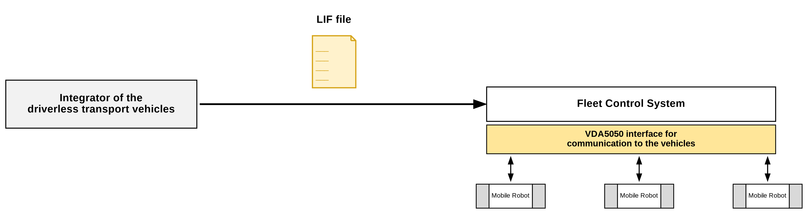

# LIF - Layout Interchange Format

## Definition of a format of path and behavior layouts for exchange between parties to integrate mobile robots and a fleet control system.

## Version 2.0.0 - September 2026

# Abstract

The following embodiment describes an interchange format for one or more layouts (e.g., collections of edges, nodes, and stations). By means of this interchange format, an integrator of mobile robots and fleet control systems will be able to define and transfer a layout definition (or definitions).

This document represents a non-binding approach. Whoever uses it must ensure the correct application in the specific case. It is influenced by the state of the art at the time of the respective edition, in particular the VDA 5050 interface definition. Ascribing to the suggestions described herein does not absolve parties of the responsibility for their own actions. No text in this document claims completeness nor provides exact interpretation of the existing legal provisions. The contents of this document must not replace the study of the relevant directives, laws, and regulations. Furthermore, the special features of the respective products as well as their different possible applications must be considered. In this respect, all parties act at their own risk. Any liability of the VDMA and those involved in the development or application of the suggestions is excluded.

Should you encounter any inaccuracies or the possibility of incorrect interpretation in the application of the proposals, please notify the VDMA immediately so that any deficiencies can be rectified.

| | |
| --- | --- |
| Publisher | VDMA e. V. | 
|  | Lyoner Strasse 18, 60528 Frankfurt am Main | 
| Copyright | VDMA e. V. | 
|  | Reprinting and any other form of reproduction is permitted only if the source is acknowledged. | 
| Status | September 2026 | 
| Version | 2.0.0 |

## Contents

[1 Terms](#1-terms) 
[2 Applicable Documents](#2-applicable-documents) 
[3 Foreword](#3-foreword) 
[4 Aim of the Document](#4-aim-of-the-document) 
[5 Aim of the LIF](#5-aim-of-the-lif) 
[5.1 Requirements](#51-requirements) 
[5.2 Further Assumptions](#52-further-assumptions) 
[5.3 LIF Limitations](#53-lif-limitations) 
[5.3.1 Compatibility with Different VDA 5050 Versions](#531-compatibility-with-different-vda-5050-versions) 
[6 Format of the LIF](#6-format-of-the-lif) 
[7 Responsibilities of the Supplier of a LIF](#7-responsibilities-of-the-supplier-of-a-lif) 
[7.1 Export of the LIF File by the Provider or Integrator of the Mobile Robots](#71-export-of-the-lif-file-by-the-provider-or-integrator-of-the-mobile-robots) 
[7.2 Import and Processing of the LIF File by the Fleet Control System](#72-import-and-processing-of-the-lif-file-by-the-fleet-control-system) 
[7.3 Further Updates and Exports of the LIF File](#73-further-updates-and-exports-of-the-lif-file) 
[8 Specification of LIF](#8-specification-of-lif) 
[8.1 Table Symbols and Meaning of Formatting](#81-table-symbols-and-meaning-of-formatting) 
[8.1.1 Optional Variables](#811-optional-variables) 
[8.2 Element ID Uniqueness](#82-element-id-uniqueness) 
[8.3 Elements of LIF](#83-elements-of-lif) 
[8.3.1 LIF Structure](#831-lif-structure) 
[8.3.2 MetaInformation](#832-metainformation) 
[8.3.3 Origin](#833-origin) 
[8.3.4 Layout](#834-layout) 
[8.3.5 Node](#835-node) 
[8.3.6 MobileRobotTypeNodeProperty](#836-mobilerobottypenodeproperty) 
[8.3.7 MobileRobotType](#837-mobilerobottype) 
[8.3.8 AllowedDeviationXY](#838-alloweddeviationxy) 
[8.3.9 Action](#839-action) 
[8.3.10 ActionParameter](#8310-actionparameter) 
[8.3.11 LoadRestriction](#8311-loadrestriction) 
[8.3.12 Edge](#8312-edge) 
[8.3.13 MobileRobotTypeEdgeProperty](#8313-mobilerobottypeedgeproperty) 
[8.3.14 Trajectory](#8314-trajectory) 
[8.3.15 ControlPoint](#8315-controlpoint) 
[8.3.16 PhysicalLineGuidedProperty](#8316-physicallineguidedproperty) 
[8.3.17 Corridor](#8317-corridor) 
[8.3.18 Station](#8318-station) 
[9 Additional Information that Should Be Exchanged Uniformly](#9-additional-information-that-should-be-exchanged-uniformly) 
[10 Frequently Asked Questions (FAQ)](#10-frequently-asked-questions-faq) 
[11 LIF on GitHub](#11-lif-on-github) 

# 1 Terms

Terms are generally used as they are in the VDA 5050 interface.

The following table is intended to describe supplementary terms:

| **Item** | **Description** |
| --- | --- |
| deadlock | A situation where two or more devices are awaiting one another in a circular fashion, resulting in a system that is unable to exit this state and continue regular operation. Example: Mobile robot A is waiting on mobile robot B to get out of the way, but mobile robot B is also waiting on mobile robot A to do the same. |
| facility | The facility in which the mobile robot system is used. The facility can consist of several levels. The facility could be described by several LIF files from multiple mobile robot integrators. The facility is controlled by one fleet control system. |
| fleet control provider | The provider of a fleet control system which shall respect at minimum the capabilities, limitations, and requirements defined in the LIF. |
| integrator | An integrator is the party responsible for supplying an integrated solution of mobile robots and fleet control software to a customer. The integrator may or may not be the manufacturer or supplier of the mobile robots and/or the fleet control software. |
| layout | A collection of nodes, edges, and stations. A layout represents a level of a facility or a part of a level of a facility. |
| level | A level of a facility that is used by the mobile robot systems. |
| mobile robot provider | A provider of mobile robots, with some or all of the mobile robots' capabilities, limitations, or requirements defined in the LIF. |
| re-entry | The induction of a mobile robot into automatic management under the fleet control system, such as after having been taken under manual operation, or when the mobile robot is first inducted into the system after having been switched off. |
| station | Any point at which a mobile robot can explicitly interact with the environment, including but not limited to physical interactions. |

# 2 Applicable Documents

| **DOCUMENT** | **DESCRIPTION** |
| --- | --- |
| VDI-Richtlinie 2510 | Automated Guided Vehicle Systems (AGVS) |
| VDI-Richtlinie 4451 Blatt 7 | Compatibility of Automated Guided Vehicle Systems (AGVS) - AGVS guidance control system |
| DIN EN ISO 3691-4 | Industrial trucks - Safety requirements and verification - Part 4: Driverless industrial trucks and their systems |
| VDA 5050 | Interface for the Communication between Mobile Robots and a Fleet Control |

# 3 Foreword

The Layout Interchange Format (LIF) was defined at Verband Deutscher Maschinen- und Anlagenbau e. V. Fachverband Fördertechnik und Intralogistik (VDMA). Proposals for changes to the standard format are to be submitted to the VDMA and may be adopted in a future version.

# 4 Aim of the Document

This document describes the LIF and its purpose. This document does not describe any logical processes that a fleet control system shall implement to interpret the data contained in the LIF.

# 5 Aim of the LIF

The objective of the Layout Interchange Format is to standardize a way for the definition of mobile robot layouts to be presented toward a fleet control system provider or other parties.

The first primary goal is to complement the VDA 5050 interface's goal of facilitating decoupling between mobile robot manufacturers and fleet control system providers. It uses the same terminology and much of the same structure as the VDA 5050 interface.

The LIF described in this document is intended to map a common set of necessary information, as explicitly and unambiguously as possible, to enable a fleet control system to steer/navigate one or more mobile robots. The LIF contains information on how mobile robots can interact with their environment and navigate inside of a layout.

## 5.1 Requirements
* The LIF concept and definition shall always be compatible with the current status, terminology, and developments of the latest VDA 5050 interface definition existing at the time of the LIF's release.
* A single LIF file may only contain layouts from one mobile robot provider.
* A single LIF file may contain multiple layouts for multiple mobile robot types of one mobile robot provider.
* A fleet control system shall be able to accept multiple LIF files from multiple mobile robot providers for one facility.
* The LIF shall not preclude the inclusion of mobile robots with different levels of autonomy.

## 5.2 Further Assumptions
* The communication between the fleet control system and the mobile robot corresponds to the latest VDA 5050 interface definition at the time of the LIF's publication. Best efforts are made to preserve backwards compatibility between versions of VDA 5050 where able.
* The mobile robot provider or integrator will also provide the fleet control system with the mobile robots' factsheet per the VDA 5050 specification, which will contain information about mobile robot geometry, kinematics, and other "capabilities of the mobile robot" such as which actions it may perform.

## 5.3 LIF Limitations
The LIF does not describe any specific logical processes by which a mobile robot or fleet control system shall perform its tasks. This includes, but is not limited to, the handling of route planning, traffic management, intersections of multiple mobile robots from the same or different mobile robot providers or integrators, interaction with stationary equipment, and so forth. The LIF is merely a definition of a layout, and what and where a fleet control system may instruct a mobile robot to do within the facility.

The LIF does not affect, nor is it affected by, different localization technologies that mobile robots may use, nor does it contain any information pertaining to localization methods.

The LIF does not define by what means or at which points in time it is to be communicated between involved parties.

### 5.3.1 Compatibility with Different VDA 5050 Versions
LIF version 2.0 was released in the context of VDA 5050 version 3.0, and several changes to LIF version 2.0 were done to match updated terminology in VDA 5050 version 3.0. While there is no explicit provision to guarantee backwards or forwards compatibility between versions of the two sister standards, effort was taken in LIF version 2.0 to still support VDA 5050 version 2.1. Some descriptions of fields below have a note about what changes may be made to allow compatibility between LIF version 2.0 and VDA 5050 version 2.1.

# 6 Format of the LIF

A JSON structure is used for the exchange format. JSON strings shall conform to the RFC 8259 description for object notation. Keys shall be strings and values shall be a valid JSON data type (string, integer, float, object, array, boolean, or null). The data is case sensitive.

The JSON structure allows for future extension of LIF with additional parameters.

# 7 Responsibilities of the Supplier of a LIF

Often a LIF is produced by a mobile robot supplier, and then is imported into a facility's fleet control system by the integrator. While the LIF is primarily intended for consumption by a fleet control system, the LIF itself is merely a declarative definition of some or all of the capabilities, limitations, and requirements for mobile robots that it describes. There is no provision for or against the generation or consumption of the LIF by design tools, fleet control software, mobile robot software, or otherwise.

Regardless of the party who created it, the creator of a LIF file is responsible for the accuracy and viability of its contents, including but not limited to ensuring that the capabilities, limitations, and requirements of the corresponding mobile robots are accurate, that the geometries contained therein are viable and routeable, and that the physical areas which any mobile robots traverse with respect to the LIF's definitions are appropriate for mobile robots to occupy and/or pass through.

The LIF is not all-encompassing. Discussions between the integrator and providers may still be required.

The following sections describe a typical exchange of a LIF file:

1. Export of the LIF file by the provider of the mobile robots.
2. Import and processing of the LIF file by the fleet control system.
3. Further exports of the LIF file and imports into the fleet control system, such as incremental updates or changes.

## 7.1 Export of the LIF File by the Provider or Integrator of the Mobile Robots

The planning and definition of the layout is often done by the provider or integrator of the mobile robots (e.g., by means of a planning or design tool). The mobile robot provider or integrator should plan the layout in compliance with safety-relevant standards (e.g., minimum distances, speed reduction on certain edges, etc.) while considering the analysis of the envelope of the mobile robots.

After the mobile robot provider or integrator has physically tested and verified that the layout can be followed by the mobile robots in compliance with the safety-relevant standards, the mobile robot provider or integrator should present the layout to the fleet control system by means of a LIF file via data transfer.

The elements that are exported into the LIF file shall include:

* The collection of all pathway nodes and any node-specific actions.
* The collection of all edges between these nodes and any edge-specific actions.
* The collection of stations for which the mobile robot may perform actions.

## 7.2 Import and Processing of the LIF File by the Fleet Control System

The fleet control system may import the LIF to understand how a mobile robot or mobile robots can move on the given layout or layouts, as well as the actions that can be performed at the various places within it.

The fleet control system is responsible for the logic ensuring that all commands sent to a mobile robot or mobile robots based on information from a LIF file never result in conflicting commands with other mobile robots also under its control, including but not limited to examples such as commanding two mobile robots to drive through an intersection at the same time, creating deadlocks between multiple mobile robots, and so forth. The fleet control system is further responsible for ensuring that any actions it sends to mobile robots that are not explicitly defined as required for a node or edge in the LIF are indeed valid—this may require further coordination and communication between the integrator, fleet control system provider, and the mobile robot provider. It is always the responsibility of the fleet control system to ensure it has all of the information required to make such determinations.

Based on the provided layout(s), the routes for the individual mobile robots are to be calculated dynamically at runtime by the fleet control system that has consumed one or more LIF files from one or more mobile robot providers and/or for one or more mobile robot types.

Further information about the behavior of a system shall be obtained from outside of the definition of the LIF file. These things may include, but are not limited to:

* Traffic control of the mobile robots on the layout:
  + Method of concurrent route calculation for the mobile robots
  + Regulation of intersections
  + Regulation of right of way
  + Congestion avoidance
* Attributes and parameters required for the management of the mobile robots:
  + Disposition of the mobile robots
  + Battery management of the mobile robots
* Communication with the system periphery (e.g., automatic stations, elevators, doors, etc.)
* Connection to higher-level systems (e.g., material flow computers, warehouse management systems, etc.)
* Expansion to include specific elements of fleet control system

## 7.3 Further Updates and Exports of the LIF File

When any changes are to be made to either a layout or mobile robot behavior which could be reflected in the LIF, a new LIF should be created and supplied to all consuming parties. It is the responsibility of the LIF creator to inform the fleet control system or provider that changes have been made. It is the responsibility of the fleet control integrator or provider to re-process the new LIF file, incorporating any changes, and then to notify the mobile robot provider or integrator that this has been completed. Then and only then are the changes to the system complete and ready for use, and the affected mobile robots may resume operation. Some of these steps may or may not be automated, such as by a fleet control system triggering a mobile robot to perform a map update via the means described in VDA 5050.

**Attention:** Changing a mobile robot's behavior without also updating the LIF file consumed by the fleet control system leads to inconsistencies—potentially harmful or destructive ones. Likewise, a fleet control system provider or integrator that changes information gained from the LIF (e.g., change of layout) without confirming the mobile robot provider or integrator has also implemented these changes, removes and adopts all liability from the mobile robot provider and integrator, and can lead to potentially destructive or harmful outcomes.

# 8 Specification of LIF

The following section describes the structure and details of the Layout Interchange Format and the contents of a Layout Interchange Format file.

## 8.1 Table Symbols and Meaning of Formatting

Each table contains the name of the identifier, its data type, its unit if applicable, and a description.

| **Identification** | **Description** |
| --- | --- |
| standard | Variable is an elementary data type. |
| **bold** | Variable is a non-elementary data type (e. g. JSON object or array) and defined separately. |
| *italics* | Variable is optional. |
| arrayName [squareBrackets] | Variable (here arrayName) is an array of the data type specified in the square brackets (here the data type is squareBrackets). |

### 8.1.1 Optional Variables

If a variable is marked as optional, it is optional for the mobile robot integrator's mobile robots. The fleet control system shall be able to handle optional variables being either specified or not.

If the LIF file contains an optional variable, the fleet control system shall not ignore the variable. If the fleet control system cannot process the variable accordingly, it is expected that the fleet control system will provide a warning or an error message when importing the LIF file.

Variables that are optional in the LIF, but are strictly required by the mobile robot, shall be clearly communicated toward the fleet control system. The LIF does not denote such variables; this agreement shall be made between the mobile robot integrator and fleet control system. It is suggested this is written in an agreement parallel to the mobile robot's factsheet as defined in the VDA 5050 standard.

## 8.2 Element ID Uniqueness

Certain elements, namely: Origins, Layouts, Nodes, Edges, and Stations, have IDs associated with them. These IDs should be unique among their type.

## 8.3 Elements of LIF

The facility is described by a collection of track layouts (here "layout"), which is represented in a JSON object as follows:

### 8.3.1 LIF Structure

| Object structure | Unit | Data type | Description |
| --- | --- | --- | --- |
| { |  | JSON-object |  |
| metaInformation |  | JSON-object | Contains meta information. |
| origins[origin] |  | array of JSON-object | Collection where each origin serves as a reference for multiple associated layouts. |
| } |  |  |  |

The objects contained in this structure are described in more detail below.

### 8.3.2 MetaInformation

| Object structure | Unit | Data type | Description |
| --- | --- | --- | --- |
| metaInformation { |  | JSON-object | Contains meta information. |
| lifId |  | string | Unique identifier for the LIF file describing a specific facility.  Note: Multiple exports of the same LIF file describing the same facility should have the same lifId. Differentiations can be made with exportTimestamp. |
| creator |  | string | Creator of the LIF file (e.g., name of company, or name of person). |
| exportTimestamp |  | string | The timestamp at which this LIF file was created/updated/modified. Used to distinguish LIF file versions over time. The timestamp format is ISO 8601, UTC (YYYY-MM-DDTHH:mm:ss.fffZ, e.g., "2017-04-15T11:40:03.123Z"). |
| lifVersion |  | string | Version of LIF: [Major].[Minor].[Patch] e.g., "2.0.0".  Note: This is the semantic version of the LIF format, as defined at the beginning of this document. |
| } |  |  |  |

### 8.3.3 Origin

| Object structure | Unit | Data type | Description |
| --- | --- | --- | --- |
| { |  |  |  |
| originId |  | string | Unique identifier for this origin. |
| *originDescriptor* |  | string | A user-defined, human-readable name or descriptor (e.g., "Hall B: Floors 1, 2, and 3"). This shall not be used for logical purposes. |
| layouts[layout] |  | array of JSON-object | A collection of layouts within the facility, all sharing the same origin. |
| } |  |  |  |

#### 8.3.3.1 Best Practices for Defining an Origin

The origin object is meant to be coordinated and consistently applied across all LIFs of a facility by the responsible integrator and all parties which consume the LIFs. Sharing an `originId` directly implies that the origin's coordinate system, including its rotation and scale, matches all others with the same `originId`. If this is not the case, different `originId`s should be utilized. Any layouts which may overlap or interact with one another should always belong to the same origin wherever possible.

The LIF does not specify how two layouts from different origins, whether defined in the same LIF file or from multiple LIF files, may or may not relate to one another.

### 8.3.4 Layout

| Object structure | Unit | Data type | Description |
| --- | --- | --- | --- |
| layout { |  | JSON-object | A layout for order generation and routing. This layout holds relevant information independently from possible mobile robots or fleet control systems. It is intended to hold the information for all different mobile robot types.  Nodes and edges model a graph structure that is used as foundation for order generation and routing. A layout holds information that can be topologically considered a "plane", i.e., multiple levels shall be modelled in different layouts.  It is also possible to partition the facility into multiple layouts even if the encoded information can be considered to lie on the same level. |
| layoutId |  | string | Unique identifier for this layout. |
| *layoutDescriptor* |  | string | A user-defined, human-readable name or descriptor. This shall not be used for logical purposes. |
| layoutVersion |  | string | Version of the layout.  Note: It is suggested that this be an integer, represented as a string, incremented with each change, starting at "1". |
| *layoutLevelId* |  | string | This attribute can be used to explicitly indicate which level or floor within a building or buildings a layout represents in a situation where there are multiple, such as multiple levels in the same facility, or two disconnected areas in the same facility. |
| nodes[node] |  | array of JSON-object | Collection of all nodes in the layout. |
| edges[edge] |  | array of JSON-object | Collection of all edges in the layout. |
| *stations[station]* |  | array of JSON-object | Collection of all stations in the layout. |
| } |  |  |  |

### 8.3.5 Node

| Object structure | Unit | Data type | Description |
| --- | --- | --- | --- |
| node { |  | JSON-object | Refers to VDA 5050 node definition. All properties that have the same name are meant to be semantically identical. However, the number of properties differs from VDA 5050 specification. Some properties are only meaningful as soon as an order is generated. Others only provide information for order generation (e.g., routing) itself. |
| nodeId |  | string | Unique identifier of the node across all layouts contained in this LIF file.  Note: Different LIF files, especially from different mobile robot integrators, may contain duplicate nodeIds. In this case, it is the responsibility of the fleet control system to track whichever internal unique nodeId it wishes to use, and to map this to a mobile robot integrator's nodeId for its specific LIF. |
| *nodeDescriptor* |  | string | A user-defined, human-readable name or descriptor. This shall not be used for logical purposes.   Backwards compatibility: for VDA 5050 version 2.1 or prior, use as *nodeDescription*. |
| mapId |  | string | Unique identification of the map in which the node or node's position is referenced. Note: The LIF does not directly define what a VDA 5050 map is or is not. A map may be an alternate declaration of a shared coordinate origin, or may be the same as a layout, or a layout may comprise multiple maps. See the VDA 5050 specification for more information. |
| nodePosition { |  | JSON-object | Geometric location of the node. |
| x | meter | float64 | X position on the layout in reference to the origin. |
| y | meter | float64 | Y position on the layout in reference to the origin. |
| } |  |  |  |
| mobileRobotTypeNodeProperties [mobileRobotTypeNodeProperty] |  | array of JSON-object | Mobile robot type specific properties for this node.  This attribute shall not be empty. There shall be an element for each mobile robot type that may use this node. If no element exists for a particular mobile robot type, the fleet control system shall consider that node invalid for use with that mobile robot type. |
| } |  |  |  |

### 8.3.6 MobileRobotTypeNodeProperty

| Object structure | Unit | Data type | Description |
| --- | --- | --- | --- |
| mobileRobotTypeNodeProperty { |  | JSON-object |  |
| mobileRobotTypes[mobileRobotType] |  | array of JSON-object | Holds mobile robot types to which these properties apply on this node. Only one mobileRobotTypeNodeProperty can be declared per mobile robot type per node. |
| *theta* | rad | float64 | Range: [-Pi ... Pi]  Absolute orientation of the mobile robot on the node in reference to the origin's rotation. |
| *allowedDeviationXY* |  | JSON-object | Indicates the distance a mobile robot needs to deviate from a node to traverse it smoothly. |
| *requiredActions[action]* | | array of JSON-object | Actions on this node which shall always be included when sent by the fleet control system. E.g., waitForTrigger if the intention is that this action is always strictly necessary on this particular node. |
| *feasibleActions[action]* | | array of JSON-object | Actions on this node with validity contingent upon outside factors. Further definition of timing and behavior may be required between the mobile robot provider and fleet control system provider outside of the scope of the LIF. E.g., the pick and drop actions on a node that is an interaction node of a load handling station, the startCharging action on a node when the node is also a transit node which may often be traversed without charging, an action on the node which is only valid if a preceding edge action has also been sent, and so forth. |
| *forbiddenActionTypes[string]* | | array of string | `actionType`s on this node which are strictly forbidden from ever being sent by the fleet control system, and may result in an error state or other negative or undefined consequences. |
| *loadRestriction* |  | JSON-object | Describes the load restriction on this node for each mobile robot type in `mobileRobotTypes`.  Note: If not defined, the node can be used by both unloaded mobile robots and loaded mobile robots carrying any load set. |
| } |  |  |  |

### 8.3.7 MobileRobotType

| Object structure | Unit | Data type | Description |
| --- | --- | --- | --- |
| mobileRobotType { |  | JSON-object |  |
| manufacturer |  | string | Name of the manufacturer of the mobile robot. This should correspond to the manufacturer field of the MQTT header and the corresponding MQTT topic level. |
| seriesName |  | string | Unique name of the mobile robot series in the context of the manufacturer. This should correspond to the robot's factsheet.typeSpecification.seriesName field. |
| } |  |  |  |

### 8.3.8 AllowedDeviationXY

allowedDeviationXY defines an ellipse around the node position within which the mobile robot's control point may deviate from the exact node coordinates while still considering the node traversed. The coordinates of the node define the center of the ellipse. 

- If aMinimum = aMaximum and bMinimum = bMaximum, the provided allowedDeviationXY shall be sent for this node with every order.
- If aMinimum/bMinimum are defined but aMaximum/bMaximum are not, any value of the maximum equal to or greater than the corresponding minimum is assumed to be valid.
- If aMaximum/bMaximum are defined but aMinimum/bMinimum are not, any value of the minimum equal to or less than the corresponding maximum is assumed to be valid.
- If neither pair of aMinimum/aMaximum or bMinimum/bMaximum are defined, the fleet control may send any value when compiling an order.

In the case that an ellipse is not supported by either the mobile robot or by VDA 5050 version (e.g., 2.1 or prior), the fleet control system shall choose a single radius within the minimum and maximum bounds of both a and b when dispatching an order.

Regardless of the values defined for the ellipse, due to the fact that the fleet control system shall always ensure that any VDA 5050 commands resulting from this information require that the semi-minor axis is equal to or less than the semi-major axis, values in the LIF that would directly force such an error are invalid.

| Object structure | Unit | Data type | Description |
| --- | --- | --- | --- |
| allowedDeviationXY { |  | JSON-object |  |
| *aMinimum* | meter | float64 | Range: [0.0 ... float64.maximum]  Minimum length of the ellipse semi-major axis in meters. |
| *aMaximum* | meter | float64 | Range: [0.0 ... float64.maximum]  Maximum length of the ellipse semi-major axis in meters. |
| *bMinimum* | meter | float64 | Range: [0.0 ... float64.maximum]  Minimum length of the ellipse semi-minor axis in meters. |
| *bMaximum* | meter | float64 | Range: [0.0 ... float64.maximum]  Maximum length of the ellipse semi-minor axis in meters. |
| *theta* | rad | float64 | Range: [-Pi/2 ... Pi/2] Rotation angle from the positive horizontal axis to the ellipse's major axis in this origin's coordinate system. |
| } |  |  |  |

### 8.3.9 Action

| Object structure | Unit | Data type | Description |
| --- | --- | --- | --- |
| action { |  | JSON-object | Refers to VDA 5050 action definition. All properties that have the same name are meant to be semantically identical. |
| actionType |  | string | Name of action as described in the VDA 5050 specification document (see VDA 5050 version 3.0 section 6.2.3). Note: Manufacturer-specific actions can be specified. Such actions shall be agreed with the fleet control system such as via the interpretation of a mobile robot's factsheet. |
| *actionDescriptor* |  | string | A user-defined, human-readable name or descriptor. This shall not be used for logical purposes.   Backwards compatibility: for VDA 5050 version 2.1 or prior, use as *actionDescription*. |
| blockingType |  | string | Enum {NONE, SOFT, SINGLE, HARD} See VDA 5050 version 3.0 section 6.2.2 for the description and implication of each blockingType.   Backwards compatibility: for VDA 5050 version 2.1 or prior, use "HARD" instead of "SINGLE". |
| *actionParameters [actionParameter]* |  | array of JSON-object | Exact list of parameters and their statically defined values which shall be sent along with this action.  Note: There may be other actionParameters with dynamic values that are required by an action that are not contained in this list. The fleet control system shall still determine and send these actionParameters. Refer to the mobile robot's factsheet. |
| } |  |  |  |

The mobile robot's factsheet may define actions that can be taken nearly anywhere, such as triggering a series of beeps or activating a light on the mobile robot. These types of general actions may or may not be defined on (most or all) nodes and edges in the LIF. Such actions shall be discussed between the mobile robot integrator and the fleet control system.

### 8.3.10 ActionParameter

| Object structure | Unit | Data type | Description |
| --- | --- | --- | --- |
| actionParameter { |  | JSON-object | actionParameter for the indicated action, e.g., deviceId, loadId, external triggers. |
| key |  | string | The key of the parameter. |
| value |  | One of: array, boolean, number, string, object | The value of the parameter that belongs to the key.  Note: The data type is defined in the mobile robot VDA 5050 factsheet. |
| } |  |  |  |

### 8.3.11 LoadRestriction

| Object structure | Unit | Data type | Description |
| --- | --- | --- | --- |
| loadRestriction { |  | JSON-object |  |
| unloaded |  | boolean | "true": This node or edge may be used by an unloaded mobile robot. "false": This node or edge shall not be used by an unloaded mobile robot. |
| loaded |  | boolean | "true": This node or edge may be used by a loaded mobile robot. "false": This node or edge shall not be used by a loaded mobile robot.  Note: If set to true, the attribute loadSetNames, if given, shall be respected. |
| *loadSetNames[string]* |  | array of string | List of load sets that may be transported by the mobile robot type on this node or edge. The fleet control system shall evaluate this attribute only if the attribute loaded is set to true.    The same names for load sets shall be used in the LIF as they are given in the factsheet of the respective mobile robot type (Factsheet attribute: [loadSets.setName]).    Note: If not defined or the attribute is empty, all load sets supported by the mobile robot type are allowed. |
| } |  |  |  |

### 8.3.12 Edge

| Object structure | Unit | Data type | Description |
| --- | --- | --- | --- |
| edge { |  | JSON-object | Refers to VDA 5050 edge definition. All properties that have the same name are meant to be semantically identical. The LIF only contains edges that can be used by at least one mobile robot type. Therefore, the LIF does not contain any edges that are blocked. |
| edgeId |  | string | Unique identifier of the edge across all layouts within this LIF file.  Note: Different LIF files, especially from different mobile robot integrators, may contain duplicate edgeIds. In this case, it is the responsibility of the fleet control system to track whichever internal unique edgeId it wishes to use, and to map this to a mobile robot integrator's edgeId for its specific LIF. |
| *edgeDescriptor* |  | string | A user-defined, human-readable name or descriptor. This shall not be used for logical purposes.   Backwards compatibility: for VDA 5050 version 2.1 or prior, use as *edgeDescription*. |
| startNodeId |  | string | Id of the start node.  The start node shall always be part of the current layout. |
| endNodeId |  | string | Id of the end node.  The end node can be located in another layout. This models a transition from one layout to another. |
| mobileRobotTypeEdgeProperties [mobileRobotTypeEdgeProperty] |  | array of JSON-object | Mobile robot type specific properties for this edge.  Note: This attribute shall not be empty. For each allowed mobile robot type there shall be an element. |
| } |  |  |  |

### 8.3.13 MobileRobotTypeEdgeProperty

| Object Structure | Unit | Data type | Description |
| --- | --- | --- | --- |
| mobileRobotTypeEdgeProperty { |  | JSON-object |  |
| mobileRobotTypes[mobileRobotType] |  | array of JSON-object | Holds mobile robot types to which these properties apply on this edge. Only one mobileRobotTypeEdgeProperty can be declared per mobile robot type per edge. A mobile robot type listed in an edge's mobileRobotTypeEdgeProperties shall also be listed in the mobileRobotTypeNodeProperties of both its start and end node.|
| *orientationType* |  | string | Enum {GLOBAL, TANGENTIAL}:  "GLOBAL": relative to the global project specific map coordinate system.  "TANGENTIAL": tangential to the edge.  Note: If not defined, the default value is "TANGENTIAL". |
| *reachOrientationBeforeEntering* |  | boolean | This parameter is only valid for omni-directional mobile robots.  "true": Desired edge orientation shall be reached before entering the edge. "false": Mobile robot can rotate into the desired orientation on the edge. The fleet control system shall assume that the mobile robot will rotate in any direction along the edge at any point. The fleet control system is responsible for avoiding issuing commands which will result in invalid or conflicting commands to other mobile robots also under its control (e.g., deadlocks, potential collisions).  Optional. Default: "true".  Backwards compatibility: for VDA 5050 version 2.1 or prior, use as *rotationAllowed* with inverse boolean value. |
| *mobileRobotOrientations* | rad | array of float64 | All possible orientations the mobile robot can take while traversing the edge. The fleet control system needs to select one of the possible orientations. The value `orientationType` defines whether the orientations shall be interpreted relative to the global project specific map coordinate system or tangential to the edge. In case of interpreted tangential to the edge 0.0 = forwards and PI = backwards. If the mobile robot starts in a different orientation, rotate the mobile robot on the edge to the desired orientations if `reachOrientationBeforeEntering` is set to "false". If `reachOrientationBeforeEntering` is "true", rotate before entering the edge (assuming the start node allows rotation). If no trajectory is defined, apply the orientations to the direct path between the two connecting nodes of the edge. If a trajectory is defined for the edge, apply the orientations to the trajectory.  Note: If not defined, such as to allow for truly omnidirectional movement, the fleet control system shall assume the mobile robot traversing the edge could be in any orientation at any time. |
| *rotationAtStartNodeAllowed* |  | string | Enum {NONE, CCW, CW, BOTH}  Allowed directions of rotation for the mobile robot at the start node.  "NONE" - Rotation not allowed.  "CCW" - Counter clockwise (positive).  "CW" - Clockwise (negative).  "BOTH" - Both directions.  Note: If not defined, the default value is "BOTH".  See section 8.3.12.1 for detailed description. |
| *rotationAtEndNodeAllowed* |  | string | Enum {NONE, CCW, CW, BOTH}  Allowed directions of rotation for the mobile robot at the end node.  "NONE" - Rotation not allowed.  "CCW" - Counter clockwise (positive).  "CW" - Clockwise (negative).  "BOTH" - Both directions.  Note: If not defined, the default value is "BOTH".  See section 8.3.12.1 for detailed description. 
| *maximumSpeed* | m/s | float64 | Range: [0.0 ... float64.maximum]  Permitted maximum speed on the edge. Speed is defined by the fastest measurement of the mobile robot.  Note: If not defined, no limitation.   Backwards compatibility: for VDA 5050 version 2.1 or prior, use as *maxSpeed*. |
| *maximumRotationSpeed* | rad/s | float64 | Range: [0.0 ... float64.maximum]  Maximum rotation speed  Note: If not defined, no limitation.   Backwards compatibility: for VDA 5050 version 2.1 or prior, use as *maxRotationSpeed*. |
| *minimumLoadHandlingDeviceHeight* | meter | float64 | Permitted minimal height of the load handling device on the edge.  Note: If not defined, no limitation.   Backwards compatibility: for VDA 5050 version 2.1 or prior, use as *minHeight*. |
| *maximumMobileRobotHeight* | meter | float64 | Range: [0.0 ... float64.maximum]  Permitted maximum height of the mobile robot, including the load, on edge.  Note: If not defined, no limitation.   Backwards compatibility: for VDA 5050 version 2.1 or prior, use as *maxHeight*. |
| *reentryAllowed* |  | boolean | "true": Mobile robots of a type listed in `mobileRobotTypes` are allowed to enter automatic management by the fleet control system while on this edge.  "false": Mobile robots of a type listed in `mobileRobotTypes` are not allowed to enter into automatic management by the fleet control system while on this edge.  Note: If not defined, the default is true. |
| *requiredActions[action]* | | array of JSON-object | Actions on this edge which shall always be included when sent by the fleet control system. E.g., an action which requires hazard lights to engage. |
| *feasibleActions[action]* | | array of JSON-object | Actions on this node with validity contingent upon outside factors. Further definition of timing and behavior may be required between the mobile robot provider and fleet control system provider outside of the scope of the LIF. E.g., an action which shall be taken if this edge has an associated corridor definition, but otherwise shall not. |
| *forbiddenActionTypes[string]* | | array of string | `actionType`s on this edge which are strictly forbidden from ever being sent by the fleet control system, and will result in an error state or other negative or undefined consequences. |
| *loadRestriction* |  | JSON-object | Describes the load restriction on this edge for each mobile robot type in `mobileRobotTypes`.  Note: If not defined, the edge can be used by both unloaded mobile robots and loaded mobile robots carrying any load set. |
| *trajectory* |  | JSON-object | Trajectory JSON-object for this edge as a NURBS. Defines the curve on which the mobile robot should move between startNode and endNode. Can be omitted if the mobile robot cannot process trajectories or if the mobile robot plans its own trajectory.  Note: The trajectory is not required, but if it is not provided, the fleet control system may not have sufficient information to be responsible for determining whether different mobile robots from the same or different manufacturers would collide.  Note: This object shall be used mutually exclusively with the physicalLineGuidedProperty object. |
| *physicalLineGuidedProperty* |  | JSON-object | JSON-object for simple or limited mobile robot types which are unable to process or respect trajectories and are dependent upon the information defined within this object.  Note: This object shall be used mutually exclusively with the trajectory object. |
| *corridor* |  | JSON-object | Describes the options to set a corridor. Note: If not defined, no corridor shall be used. |
| } |  |  |  |

#### 8.3.13.1 Rotation Allowed at Start and End

Two attributes, rotationAtEndNodeAllowed and rotationAtStartNodeAllowed, may contradict one another if they terminate and originate, respectively, at the same node. In such cases, these should be combined as per a boolean *and*. As an example, if the end node rotation is BOTH on the terminating edge, but NONE on the originating edge, this would be interpreted as NONE. For directional rotation values of CW or CCW, they shall also align exactly, or a value of CW or CCW on the terminating edge but BOTH on the originating edge would also only allow CW or CCW rotation, respectively. If these two attributes do not align at such a node, some edges of the layout may be unnavigable depending upon how the mobile robot arrived at the node (which may or may not be intentional).

### 8.3.14 Trajectory

| Object structure | Unit | Data type | Description |
| --- | --- | --- | --- |
| trajectory { |  | JSON-object |  |
| *degree* |  | integer | Range: [1 ... integer.maximum]  Defines the number of control points that influence any given point on the curve. Increasing the degree increases continuity.  If not defined, the default value is 1. |
| knotVector[float64] |  | array of float64 | Range: [0.0 ... 1.0]  Sequence of parameter values that determines where and how the control points affect the NURBS curve.  knotVector has size of number of control points + degree + 1. |
| controlPoints[controlPoint] |  | array of JSON-object | List of JSON controlPoint JSON-objects defining the control points of the NURBS, which includes the beginning and end point. |
| } |  |  |  |

### 8.3.15 ControlPoint

| Object structure | Unit | Data type | Description |
| --- | --- | --- | --- |
| controlPoint { |  | JSON-object |  |
| x | meter | float64 | X position on the layout in reference to the origin. |
| y | meter | float64 | Y position on the layout in reference to the origin. |
| *weight* |  | float64 | Range: ]0.0 ... float64.maximum]  The weight with which this control point pulls on the curve. When not defined, the default is 1.0. |
| } |  |  |  |

### 8.3.16 PhysicalLineGuidedProperty

| Object structure | Unit | Data type | Description |
| --- | --- | --- | --- |
| *physicalLineGuidedProperty* { |  | JSON-object |  |
| *direction* |  | string | Defines the direction identifier of this edge at junctions for line-guided or wire-guided mobile robots.  See the related VDA 5050 attributes for more information. |
| *length* | meter | float64 | The length of this edge for mobile robot types which require it but are unable to process or respect trajectories. |
| } |  |  |  |

### 8.3.17 Corridor

| Object structure | Unit | Data type | Description |
| --- | --- | --- | --- |
| corridor { |  | JSON-object |  |
| maximumLeftWidth | meter | float64 | Range: [0.0 ... float64.maximum]  Maximum corridor margin possible to the left of the edge. |
| maximumRightWidth | meter | float64 | Range: [0.0 ... float64.maximum]  Maximum corridor margin possible to the right of the edge. |
| *corridorReferencePoint* | | string | Defines whether the boundaries are valid for the kinematic center or the contour of the mobile robot. If not specified the boundaries are valid to the mobile robot's kinematic center. Enum {'KINEMATIC_CENTER', 'CONTOUR'}.   Backwards compatibility: for VDA 5050 version 2.1 or prior, use as *corridorRefPoint* and 'KINEMATICCENTER' instead of 'KINEMATIC_CENTER'. |
| } |  |  |  |

### 8.3.18 Station

| Object structure | Unit | Data type | Description |
| --- | --- | --- | --- |
| station { |  | JSON-object | A station represents any logical place where a mobile robot can explicitly interact with the environment, including but not limited to physical interactions. |
| stationId |  | string | Unique identifier of the station across all layouts within this LIF file.  Note: It is recommended that stationIds match and align between all LIFs from all mobile robot integrators and other load handling systems such as WMSs, as well as physical visual labelling and the like. |
| *stationName* |  | string | Name of the station. May be used and forwarded to the mobile robot as part of a VDA 5050 order, such as a pick or drop action. |
| *stationDescriptor* |  | string | A user-defined, human-readable name or descriptor. This shall not be used for logical purposes. |
| *stationType* |  | string | Type of the station. May be used and forwarded to the mobile robot as part of a VDA 5050 order, such as a pick or drop action. |
| *stationHeight* | meter | float64 | Range: [0.0 ... float64.maximum]  If the station is a load handling station, this value represents the physical height of the base of the load on the station when it is picked up or dropped off. May be used and forwarded to the mobile robot as part of a VDA 5050 order, such as a pick or drop action. For other types of stations, this value may have a different meaning. Its interpretation shall be clearly defined and agreed upon between the fleet control system and the mobile robot integrator.  Note: If this value is not specified, the station height shall not be assumed to be zero or any default value. |
| interactionNodeIds[string] |  | array of string | List of nodeIds for this station.  These are the nodes that represent the position at which interaction with this station takes place. Multiple nodes can be listed for stations which can be accessed in multiple ways (such as stations that can be approached from multiple directions, e.g.: a station which can receive a EUR pallet longitudinally or laterally). This attribute shall not be empty; there shall be at least one nodeId.  Note: The decision of which nodeId is used is the responsibility of the fleet control system. Choosing the correct interaction node may require that the fleet control system considers the list of load sets defined on the edge or edges leading to the interaction node. |
| *stationPosition {* |  |  | Center point and orientation of the station.  Note: Only for visualization purposes, to assist how to represent this station in any user interface. This position is commonly the center point of the physical station or the center point of a load on the station but may not always be. |
| x | meter | float64 | X position of the station in the layout in reference to the origin. |
| y | meter | float64 | Y position of the station in the layout in reference to the origin. |
| *theta* | rad | float64 | Range: [-Pi ... Pi]  Absolute orientation of the station on the node. |
| *}* |  |  |  |
| } |  |  |  |

#### 8.3.18.1 Best Practices for Defining a Station

A station could be a battery charging point where a mobile robot must interface with physical charging infrastructure. A station could be (and perhaps most often is) a place to pick or drop a single load. A station could represent a racking bay where multiple loads could be stored next to one another, especially in cases where loads of variable widths may affect how many loads are able to be stored on such a station.

It is possible to have different configurations for stations which accomplish the same thing. It is considered best practice to have stations be as atomic as possible. For example, while a 1 wide, 1 deep, 5 tall (1x1x5) vertical column of load storage positions on a multi-tiered tall metal rack might be able to be represented by a single station, it is likely better to have five stations, one per level for each discrete position for each individual load, even if all five of such stations would share the same interaction node or nodes.

For stations where a variable number of loads might be kept, such as in the example given above for a racking bay which could, for example, hold either two wider loads or three thinner ones, it is suggested to make this a single station, and to utilize action parameters for where and how exactly to pick and drop from the bay. Less elegant, alternative options, such as where there might be a total of five stations for the bay, three for individual thin loads, and two for individual wide loads, many of which overlap with one another, are possible but not encouraged.

As an additional example, imagine a last-in, first-out (LIFO) 1 wide, N deep, 1 tall (1xNx1) variable deep lane, where N is runtime variable depending on the dimensions of the loads being stored. Accurately representing all possible combinations of where loads of varying dimensions may be stored may become impractical. It again is likely best to have the entire variable deep lane be a single station, possibly with a single interaction node of where to begin entering the deep lane. An action parameter could be used to describe the depth offset into the deep lane the mobile robot should drop a load if the fleet control system decides such a thing, or allowing the mobile robot to report back the depth at which it dropped if the mobile robot decides. Conversely, if a 1xNx1 deep lane would always contain loads of all the same dimensions, but there would still be some other reason to vary the number of loads stored in it, and therefore the depth of the deep lane, at runtime, treating each individual position in the deep lane as its own station returns to being the more explicit, atomic representation.

The exact configuration of the above examples and other potentially complex situations shall always be handled on a case-by-case basis between fleet control system and mobile robot integrator(s).

#### 8.3.18.2 How the Fleet Control System Can Identify the Purpose of a Station

If the fleet control system would need to graphically identify certain stations, or would need to filter on a list of stations for human interaction purposes, the purpose of a station is entirely defined by the actions available on its interaction nodes. Every station that represents a charging area, for instance, should have a corresponding charging action, as defined in the mobile robot's VDA 5050 factsheet, on its interaction node. Stations that can have multiple purposes, such as both emergency evacuation and maintenance, could be represented by two overlapping stations, or one station with multiple actions on one or more interaction nodes, or one combined action defined in the mobile robot's factsheet, or so forth.

A station's optional `stationType` is not considered a strong definition of the station's purpose on its own.

# 9 Additional Information that Should Be Exchanged Uniformly

In addition to the reference to the VDA 5050 interface definition, information about geometry, kinematics, lifting systems, "capabilities of the mobile robot", and so forth are included in the mobile robot's factsheet.

# 10 Frequently Asked Questions (FAQ)

## 10.1 Why aren't bi-directional edges supported in LIF?

This is an intentional choice, reflecting the fact that such edges also do not explicitly exist in VDA 5050; there is always a start node and an end node to every edge. While the LIF could be changed to redefine the two nodes on an edge as a "terminalNodes" collection that is always of size 2, this would also cause a loss of precision in what could be defined. For instance, it may be desirable to define different `reachOrientationBeforeEntering` values on the nodes or to have a corridor allowed for only one direction of an edge. Instead of allowing a combination of bidirectional and unidirectional edges, it was deemed simpler to have all edges be unidirectional. It was also assumed that it should be relatively trivial for whichever design tool is being used to create the LIF to allow the user to define a bidirectional edge, which is then encoded as two separate unidirectional edges in the LIF. Likewise, the same design tool, if desired, could recombine these edges when it deems it necessary to do so for such a user.

## 10.2 Why are mobile robot integrator-specific extensions of the LIF not foreseen?

The LIF's intention is to be parsed as automatically as possible while being consistent across all mobile robot integrators. No mobile robot supplier or integrator specific fields should be added, and there are no poorly defined "magic fields" in which to place arbitrary information to achieve this purpose. If any such information is required for a particular combination of mobile robot and fleet control provider, a parallel document shall be required.

# 11 LIF on GitHub

The GitHub project serves as a repository of all previous, present, and in-development work, and as an additional source of information.

https://github.com/Intralogistics-2X-LIF/Layout-Interchange-Format

## 11.1 Examples
LIF version 1.0 included examples within the LIF specification document. As of LIF version 2.0, these have been moved to the GitHub repository (/examples). These examples may now be expanded without the need of a new LIF version release.

## 11.2 JSON Schema
While not an official part of the standard, the schema included on the GitHub may be useful (/json_schemas). 

## 11.3 Decision Records
The most frequently asked, simplest questions are located in the FAQ section above. A select few other decisions and rationales can be found on the GitHub repository (/decision_records).

## 11.4 Submitting Corrections, Suggestions, and Requests
Anyone is welcome to submit corrections and improvement suggestions. New feature requests are also welcome after reviewing the relevant decision records beforehand. As with any open repository, searching the existing issue backlog for similar and related items to be taken into account is expected. 
