# LIF - Layout Interchange Format

## Definition of a format of path and behavior layouts for exchange between parties to integrate mobile robots and a fleet control system.

## Version 2.0.0 - September 2026

# Abstract

The following embodiment describes an interchange format for one or more layouts (e.g., collections of edges, nodes, and stations). By means of this interchange format, an integrator of mobile robots and fleet control systems will be able to define and transfer a layout (or layouts) definition.

This document represents a non-binding approach. Whoever uses it must ensure the correct application in the specific case. It is influenced by the state of the art at the time of the respective edition, in particular the VDA5050 interface definition. Ascribing to the suggestions described herein does not absolve parties of the responsibility for their own actions. No text in this document claims completeness nor provides exact interpretation of the existing legal provisions. The contents of this document must not replace the study of the relevant directives, laws, and regulations. Furthermore, the special features of the respective products as well as their different possible applications must be considered. In this respect, all parties act at their own risk. Any liability of the VDMA and those involved in the development or application of the suggestions is excluded.

Should you encounter any inaccuracies or the possibility of incorrect interpretation in the application of the proposals, please notify the VDMA immediately so that any deficiencies can be rectified.

| | |
|---|---|
Publisher | Verband Deutscher Maschinen- und Anlagenbau e. V. (VDMA) | 
|  | Lyoner Strasse 18, 60528 Frankfurt am Main | 
| Copyright | Verband Deutscher Maschinen- und Anlagenbau e. V. (VDMA) | 
|  | Reprinting and any other form of reproduction is permitted only if the source is acknowledged. | 
| Status | September 2026 | 
| Version | 2.0.0 |

## Contents

[1 Terms](#1-terms)<br>
[2 Applicable Documents](#2-applicable-documents)<br>
[3 Foreword](#3-foreword)<br>
[4 Aim of the Document](#4-aim-of-the-document)<br>
[5 Aim of the LIF](#5-aim-of-the-lif)<br>
[5.1 Requirements](#51-requirements)<br>
[5.2 Further Assumptions](#52-further-assumptions)<br>
[5.3 LIF Limitations](#53-lif-limitations)<br>
[6 LIF Format](#6-lif-format)<br>
[7 LIF Transfer and Responsibilities of Mobile Robot Integrator and (Third-party) Fleet Control System](#7-lif-transfer-and-responsibilities-of-mobile-robot-integrator-and-third-party-fleet-control-system)<br>
[7.1 Export of the LIF File by the Integrator of the Mobile Robots](#71-export-of-the-lif-file-by-the-integrator-of-the-mobile-robots)<br>
[7.2 Import and Processing of the LIF File by the (Third-party) Fleet Control System](#72-import-and-processing-of-the-lif-file-by-the-third-party-fleet-control-system)<br>
[7.3 Further Exports of the LIF File and Imports into the (Third-party) Fleet Control System](#73-further-exports-of-the-lif-file-and-imports-into-the-third-party-fleet-control-system)<br>
[8 Specification of LIF](#8-specification-of-lif)<br>
[8.1 Table Symbols and Meaning of Formatting](#81-table-symbols-and-meaning-of-formatting)<br>
[8.1.1 Optional Variables](#811-optional-variables)<br>
[8.2 Element ID Uniqueness](#82-element-id-uniqueness)<br>
[8.3 Elements of LIF](#83-elements-of-lif)<br>
[8.3.1 LIF Structure](#831-lif-structure)<br>
[8.3.2 MetaInformation](#832-metainformation)<br>
[8.3.3 Origin](#833-origin)<br>
[8.3.4 Layout](#834-layout)<br>
[8.3.5 Node](#835-node)<br>
[8.3.6 MobileRobotTypeNodeProperty](#836-mobilerobottypenodeproperty)<br>
[8.3.7 MobileRobotType](#837-mobilerobottype)<br>
[8.3.8 LoadRestriction](#838-loadrestriction)<br>
[8.3.9 Action](#839-action)<br>
[8.3.10 ActionParameter](#8310-actionparameter)<br>
[8.3.11 Edge](#8311-edge)<br>
[8.3.12 MobileRobotTypeEdgeProperty](#8312-mobilerobottypeedgeproperty)<br>
[8.3.13 Trajectory](#8313-trajectory)<br>
[8.3.14 ControlPoint](#8314-controlpoint)<br>
[8.3.15 PhysicalLineGuidedProperty](#8315-physicallineguidedproperty)<br>
[8.3.16 Station](#8316-station)<br>
[8.4 Complete Data Structure of LIF](#84-complete-data-structure-of-lif)<br>
[9 Additional Information that Should Be Exchanged Uniformly](#9-additional-information-that-should-be-exchanged-uniformly)<br>
[10 Frequently Asked Questions (FAQ)](#10-frequently-asked-questions-faq)<br>
[10.1 Why aren't bi-directional edges supported in LIF?](#101-why-arent-bi-directional-edges-supported-in-lif)<br>
[10.2 Why are mobile robot integrator-specific extensions of the LIF not foreseen?](#102-why-are-mobile-robot-integrator-specific-extensions-of-the-lif-not-foreseen)<br>
[11 Examples](#11-examples)<br>
[11.1 Forward Edge](#111-forward-edge)<br>
[11.2 Bidirectional Edge](#112-bidirectional-edge)<br>
[11.3 Counter-clockwise Rotation on Node](#113-counter-clockwise-rotation-on-node)<br>
[11.4 Omnidirectional Edge](#114-omnidirectional-edge)<br>
[11.5 Multiple Layouts in One LIF](#115-multiple-layouts-in-one-lif)<br>
[11.6 Station with One Node](#116-station-with-one-node)<br>
[11.7 Station with Two Nodes](#117-station-with-two-nodes)<br>
[11.8 Station with Two Nodes, Restricted for Different Mobile Robot Types](#118-station-with-two-nodes-restricted-for-different-mobile-robot-types)<br>
[11.9 Rotation Station](#119-rotation-station)<br>
[11.10 Station with Three Nodes, Restricted to Different Mobile Robot Types](#1110-station-with-three-nodes-restricted-to-different-mobile-robot-types)<br>
[11.11 Multiple Edges with Load Restrictions](#1111-multiple-edges-with-load-restrictions)<br>
[11.12 Multiple Edges Between Same Two Nodes for Different mobileRobotTypeEdgeProperty Constraints.](#1112-multiple-edges-between-same-two-nodes-for-different-mobilerobottypeedgeproperty-constraints)<br>
[11.13 Battery Charging Station](#1113-battery-charging-station)<br>
[11.14 Two Levels of a Facility in One LIF File](#1114-two-levels-of-a-facility-in-one-lif-file)<br>
[11.15 Rack Station Modelled by Three Stations](#1115-rack-station-modelled-by-three-stations)<br>
[11.16 Rack Station Modelled by Three Nodes](#1116-rack-station-modelled-by-three-nodes)<br>
[11.17 Edge with Trajectory Definition](#1117-edge-with-trajectory-definition)<br>
[11.18 Manufacturer Specific Action on an Edge](#1118-manufacturer-specific-action-on-an-edge)<br>
[11.19 Forward Edge with Two Mobile Robot Types with Differing Orientation](#1119-forward-edge-with-two-mobile-robot-types-with-differing-orientation)<br>

# 1 Terms

Terms are generally used as they are in the VDA5050 interface.

The following table is intended to describe supplementary terms:

| **Item** | **Description** |
| --- | --- |
| deadlock | A situation where two or more devices are awaiting one another in a circular fashion, resulting in a system that is unable to exit this state and continue regular operation. Example: Mobile robot A is waiting on mobile robot B to get out of the way, but mobile robot B is also waiting on mobile robot A to do the same. |
| facility | The facility in which the mobile robot system is used. The facility can consist of several levels. The facility could be made up by several LIF files from multiple mobile robot integrators. The facility is controlled by one (third-party) fleet control system. |
| fleet control provider | The provider of a fleet control system which must respect at minimum the capabilities, limitations, and requirements defined in the LIF. |
| integrator | An integrator is the party responsible for supplying an integrated solution of mobile robots and fleet control software to a customer. The integrator may or may not be the manufacturer or supplier of the mobile robots and/or the fleet control software. |
| layout | A collection of nodes, edges, and stations. A layout represents a level of a facility or a part of a level of a facility. |
| level | A level of a facility that is used by the mobile robot systems. |
| mobile robot provider | A provider of mobile robots, with some or all of the mobile robots' capabilities, limitations, or requriements defined in the LIF. |
| re-entry | The induction of a mobile robot into automatic management under the fleet control system, such as after having been taken under manual operation, or when the mobile robot is first inducted into the system after having been switched off. |
| station | Any point at which a mobile robot can explicitly interact with the environment, including but not limited to physical interactions. |

# 2 Applicable Documents

| **DOCUMENT** | **DESCRIPTION** |
| --- | --- |
| VDI-Richtlinie 2510 | Automated Guided Vehicle Systems (AGVS) |
| VDI-Richtlinie 4451 Blatt 7 | Compatibility of Automated Guided Vehicle Systems (AGVS) - AGVS guidance control system |
| DIN EN ISO 3691-4 | Industrial trucks - Safety requirements and verification - Part 4: Driverless industrial trucks and their systems |
| VDA 5050 | Interface for the Communication between Mobile Robots and a Fleet Control |

# 3 Foreword

The Layout Interchange Format (LIF) was defined at Verband Deutscher Maschinen- und Anlagenbau e. V. Fachverband Fördertechnik und Intralogistik (VDMA). Proposals for changes to the standard format are to be submitted to the VDMA and may be adopted in a future version.

# 4 Aim of the Document

This document describes the LIF, its purpose, and examples of how to use it. This document does not describe any logical processes that a fleet control system must implement to interpret the data contained in the LIF.

# 5 Aim of the LIF

The objective of the Layout Interchange Format is to standardize a way for the definition of mobile robot layouts to be presented toward a fleet control system provider or other parties.

The first primary goal is to complement the VDA5050 interface’s goal of facilitating decoupling between mobile robot manufacturers and fleet control system providers. It uses the same terminology and much of the same structure as the VDA5050 interface.

The LIF described in this document is intended to map a common set of necessary information, as explicitly and unambiguously as possible, to enable a fleet control system to steer/navigate one or more mobile robots. The LIF contains information on how mobile robots can interact with their environment and navigate inside of a layout.

## 5.1 Requirements
* The LIF concept and definition must always be compatible with the current status, terminology, and developments of the latest VDA5050 interface definition existing at the time of the LIF's release.
* A single LIF file may only contain layouts from one mobile robot provider.
* A single LIF file may contain multiple layouts for multiple mobile robot types of one mobile robot provider.
* A fleet control system must be able to accept multiple LIF files from multiple mobile robot providers for one facility.
* The LIF must not preclude the inclusion of mobile robots with different levels of autonomy.

## 5.2 Further Assumptions
* The communication between the fleet control system and the mobile robot corresponds to the latest VDA5050 interface definition at the time of the LIF's publication. Best efforts are made to preserve backwards compatibility between versions of VDA5050 where able.
* The mobile robot provider or system integrator will also provide the fleet control system with the mobile robots' factsheet per the VDA5050 specification, which will contain information about mobile robot geometry, kinematics, and other "capabilities of the mobile robot" such as which actions it may perform.

## 5.3 LIF Limitations
The LIF does not describe any specific logical processes by which a mobile robot or fleet control system must perform its tasks. This includes, but is not limited to, the handling of route planning, traffic management, intersections of multiple mobile robots from the same of different mobile robot providers or integrators, interaction with stationary equipment, and so forth. The LIF is merely a definition of a layout, and what and where a fleet controller may instruct a mobile robot to do within the facility.

The LIF does not affect, nor is it affected by, different localization technologies that mobile robots may use, nor does it contain any information pertaining to localization methods.

The LIF does not define by what means or at which points in time it is to be communicated between involved parties.

# 6 LIF Format

A JSON structure is used for the exchange format. JSON strings must conform to the RFC 8259 description for object notation. Keys must be strings and values must be a valid JSON data type (string, integer, float, object, array, boolean, or null). The data is case sensitive.

The JSON structure allows for future extension of LIF with additional parameters.

# 7 Responsibiliites of the Supplier of a LIF

Often a LIF is produced by a mobile robot supplier, and then is imported into a facility's fleet control system by the integrator. While the LIF is primarily intended for consumption by a fleet control system, the LIF itself is merely a declarative definition of some or all of the capabilities, limitations, and requirements for mobile robots that it describes. There is no provision for or against the generation or consumption of the LIF by design tools, fleet control software, mobile robot software, or otherwise.

Regardless of the party who created it, the creator of a LIF file is responsible for the accuracy and viability of its contents, including but not limited to ensuring that the capabilities, limitations, and requirements of the corresponding mobile robots are accurate, that the geometries contained therein are viable and routeable, and that the phsyical areas which any mobile robots traverse with respect to the LIF's definitions are appropriate for mobile robots to occupy and/or pass through.

The LIF is not all-encompasing. Discussions between the integrator and providers may still be required.

The following section describes one of the normal exchange of a LIF file:

1. Export of the LIF file by the provider of the mobile robots.
2. Import and processing of the LIF file by the fleet control system.
3. Further exports of the LIF file and imports into the fleet control system, such as incremental updates or changes.

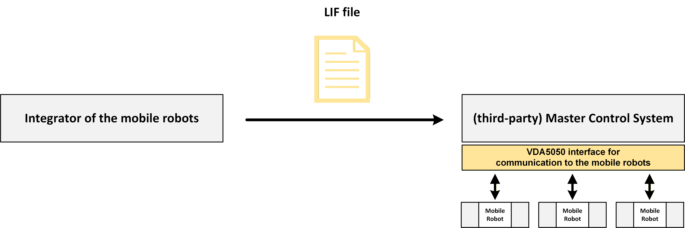

## 7.1 Export of the LIF File by the Provider or Integrator of the Mobile Robots

The planning and definition of the layout is often done by the provider or integrator of the mobile robots (e.g., by means of a planning or design tool). The mobile robot provider or integrator should plan the layout in compliance with safety relevant standards (e.g., minimum distances, speed reduction on certain edges, etc.) while considering the analysis of the envelope of the mobile robots.

After the mobile robot provider or integrator has physically tested and verified that the layout can be followed by the mobile robots in compliance with the safety-relevant standards, the mobile robot provider or integrator should present the layout to the fleet control system by means of a LIF file via data transfer.

The elements that are exported into the LIF file must include:

* The collection of all pathway nodes and any node-specific actions.
* The collection of all edges between these nodes and any edge-specific actions.
* The collection of stations for which the mobile robot may perform actions.

## 7.2 Import and Processing of the LIF File by the Fleet Control System

The fleet control system may import the LIF to understand how a mobile robot or mobile robots can move on the given layout or layouts, as well as the actions that can be performed at the various places within it.

The fleet control system is responsible for the logic ensuring that all commands sent to a mobile robot or mobile robots based on information from a LIF file never result in conflicting commands with other mobile robots also under its control, including but not limited to examples such as commanding two mobile robots to drive through an intersection at the same time, creating deadlocks between multiple mobile robots, and so forth. The fleet control system is further responsible for ensuring that any actions it sends to mobile robots that are not explicitly defined as required for a node or edge in the LIF are indeed valid—this may require further coordination and communication between the system integrator, fleet control system provider, and the mobile robot provider. It is always the responsibility of the fleet control system to ensure it has all of the information required to make such determinations.

Based on the provided layout(s), the routes for the individual mobile robots are to be calculated dynamically at runtime by the fleet control system that has consumed one or more LIF files from one or more mobile robot providers and/or for one or more mobile robot types.

Further information about the behavior of a system must be obtained from outside of the definition of the LIF file. These things may include, but are not limited to:

* Traffic control of the mobile robots on the layout:
  + Method of concurrent route calculation for the mobile robots
  + Regulation of intersections
  + Regulation of right of way
  + Congestion avoidance
* Attributes and parameters required for the management of the mobile robots:
  + Disposition of the mobile robots
  + Battery management of the mobile robots
* Communication with the system periphery (e.g., automatic stations, elevators, doors, etc.)
* Connection to higher-level systems (e.g., material flow computers, warehouse management systems, etc.)
* Expansion to include specific elements of fleet control system

## 7.3 Further Updates and Exports of the LIF File

When any changes are to be made to either a layout or mobile robot behavior which could be reflected in the LIF, a new LIF should be created and supplied to all consuming parties. It is the responsibility of the LIF creator to inform the fleet control system or provider that changes have been made. It is the responsibility of the fleet control system integrator or provider to re-process the new LIF file, incorporating any changes, and then to notify mobile robot provider or integrator that this has been completed. Then and only then are the changes to the system complete and ready for use, and the affected mobile robots may resume operation. Some of these steps may or may not be automated, such as by a fleet control system triggering a vehicle to perform a map update via the means described in VDA5050.

**Attention:** Changing a mobile robot’s behavior without also updating the LIF file consumed by the fleet control system leads to inconsistencies—potentially harmful or destructive ones. Likewise, a fleet control system provider or integrator that changes information gained from the LIF (e.g., change of layout) without confirming the mobile robot provider or integrator has also implemented these changes, removes and adopts all liability from the mobile robot provider and integrator, and can lead to potentially destructive or harmful outcomes.

# 8 Specification of LIF

The following section describes the structure and details of the Layout Interchange Format and the contents of a Layout Interchange Format file.

## 8.1 Table Symbols and Meaning of Formatting

Each table contains the name of the identifier, its data type, its unit if applicable, and a description.

| **Identification** | **Description** |
| --- | --- |
| standard | Variable is an elementary data type. |
| **bold** | Variable is a non-elementary data type (e. g. JSON object or array) and defined separately. |
| *italics* | Variable is optional. |
| arrayName [squareBrackets] | Variable (here arrayName) is an array of the data type specified in the square brackets (here the data type is squareBrackets). |

### 8.1.1 Optional Variables

If a variable is marked as optional, it is optional for the mobile robot integrator’s mobile robots. The (third-party) fleet control system must be able to handle optional variables being either specified or not.

If the LIF file contains an optional variable, the (third-party) fleet control system must not ignore the variable. If the (third-party) fleet control system cannot process the variable accordingly, it is expected that the (third-party) fleet control system will provide a warning or an error message when importing the LIF file.

Variables that are optional in the LIF, but are strictly required by the mobile robot, must be clearly communicated toward the (third-party) fleet control system. The LIF does not denote such variables; this agreement must be made between the mobile robot integrator and (third-party) fleet control system. It is suggested this is written in an agreement parallel to the mobile robot's factsheet as defined in the VDA5050 standard.

## 8.2 Element ID Uniqueness

Certain elements, namely: Layouts, Nodes, Edges and Stations have IDs associated with them. These IDs should be unique among their type.

## 8.3 Elements of LIF
### 8.3.1 LIF Structure

The facility is described by a collection of track layouts (here "layout"), which is represented in a JSON object as follows:

| Object structure | Unit | Data type | Description |
| --- | --- | --- | --- |
| { |  | JSON-object |  |
| metaInformation |  | JSON-object | Contains meta information. |
| origins[origin] |  | array of JSON-object | Collection where each origin serves as a reference for multiple associated layouts. |
| } |  |  |  |

The objects contained in this structure are described in more detail below.

### 8.3.2 MetaInformation

| Object structure | Unit | Data type | Description |
| --- | --- | --- | --- |
| metaInformation { |  | JSON-object | Contains meta information. |
| lifId |  | string | Unique identifier for the LIF file describing a specific facility.  Note: Multiple exports of the same LIF file describing the same facility should have the same lifId. Differentiations can be made with exportTimestamp. |
| creator |  | string | Creator of the LIF file (e.g., name of company, or name of person). |
| exportTimestamp |  | string | The timestamp at which this LIF file was created/updated/modified. Used to distinguish LIF file versions over time. The timestamp format is ISO8601 in UTC (YYYY-MM-DDTHH:mm:ss.ssZ, e.g., "2017-04-15T11:40:03.12Z"). |
| lifVersion |  | string | Version of LIF: [Major].[Minor].[Patch] e.g., "2.0.0".  Note: This is the semantic version of the LIF format, as defined at the beginning of this document. |
| } |  |  |  |

### 8.3.3 Origin

| Object structure | Unit | Data type | Description |
| --- | --- | --- | --- |
| { |  |  |  |
| originId |  | string | Unique identifier for this origin. |
| *originDescriptor* |  | string | A user-defined, human-readable name or descriptor. (e.g., "Hall B: Floors 1, 2, and 3"). This shall not be used for logical purposes. |
| layouts[layout] |  | array of JSON-object | A collection of layouts within the facility, all sharing the same origin. |
| } |  |  |  |

#### 8.3.3.1 Best Practices for Defining an Origin

The origin object is meant to be coordinated and consistently applied across all LIFs of a facility by the responsible integrator and all parties which consume the LIF. Sharing an originId implies that the origin's coordinate system, including its rotation and scale, matches others with the same originId. If this is not the case different originIds should be utilized. Any layouts which may overlap or interact with one another should always belong to the same origin wherever possible.

The LIF does not specify how two layouts from different origins, whether defined in the same LIF file or from multiple LIF files, may overlap or relate to one another.

### 8.3.4 Layout

| Object structure | Unit | Data type | Description |
| --- | --- | --- | --- |
| layout { |  | JSON-object | A layout for order generation and routing. This layout holds relevant information independently from possible mobile robots or (third-party) fleet control systems. It is intended to hold the information for all different mobile robot types.  Nodes and edges model a graph structure that is used as foundation for order generation and routing. A layout holds information that can be topologically considered a "plane", i.e., multiple levels must be modelled in different layouts.  It is also possible to partition the facility into multiple layouts even if the encoded information can be considered to lie on the same level. |
| layoutId |  | string | Unique identifier for this layout. |
| *layoutName* |  | string | Human-readable name of the layout (e.g., for displaying). |
| layoutVersion |  | string | Version of the layout.  Note: It is suggested that this be an integer, represented as a string, incremented with each change, starting at "1". |
| *layoutLevelId* |  | string | This attribute can be used to explicitly indicate which level or floor within a building or buildings a layout represents in a situation where there are multiple, such as multiple levels in the same facility, or two disconnected areas in the same facility. |
| *layoutDescriptor* |  | string | A user-defined, human-readable name or descriptor. This shall not be used for logical purposes. |
| nodes[node] |  | array of JSON-object | Collection of all nodes in the layout. |
| edges[edge] |  | array of JSON-object | Collection of all edges in the layout. |
| *stations[station]* |  | array of JSON-object | Collection of all stations in the layout. |
| } |  |  |  |

### 8.3.5 Node

| Object structure | Unit | Data type | Description |
| --- | --- | --- | --- |
| node { |  | JSON-object | Refers to VDA5050 node definition. All properties that have the same name are meant to be semantically identical. However, the number of properties differs from VDA5050 specification. Some properties are only meaningful as soon as an order is generated. Others only provide information for order generation (e.g., routing) itself. |
| nodeId |  | string | Unique identifier of the node across all layouts contained in this LIF file.  Note: Different LIF files, especially from different mobile robot integrators, may contain duplicate nodeIds. In this case, it is the responsibility of the (third-party) fleet control system to whichever internal unique nodeId it wishes to use, and to map this to a mobile robot integrator's nodeId for its specific LIF. |
| *nodeDescriptor* |  | string | A user-defined, human-readable name or descriptor. This shall not be used for logical purposes. |
| mapId |  | string | Unique identification of the map in which the node or node’s position is referenced. Each map has the same origin of coordinates. When a mobile robot uses an elevator, e.g., leading from a departure floor to a target floor, it will dis-appear off the map of the departure floor and spawn in the related lift node on the map of the target floor. |
| nodePosition { |  | JSON-object | Geometric location of the node. |
| x | meter | float64 | X position on the layout in reference to the origin. |
| y | meter | float64 | Y position on the layout in reference to the origin. |
| } |  |  |  |
| mobileRobotTypeNodeProperties [mobileRobotTypeNodeProperty] |  | array of JSON-object | Mobile robot type specific properties for this node.  This attribute must not be empty. There must be an element for each mobile robot type that may use this node. If no element exists for a particular mobile robot type, the (third-party) fleet control system must consider that node invalid for use with that mobile robot type. |
| } |  |  |  |

### 8.3.6 MobileRobotTypeNodeProperty

| Object structure | Unit | Data type | Description |
| --- | --- | --- | --- |
| mobileRobotTypeNodeProperty { |  | JSON-object |  |
| mobileRobotTypes[mobileRobotType] |  | array of JSON-object | Holds mobile robot types to which these properties apply on this node. Only one mobileRobotTypeNodeProperty can be declared per mobile robot type per node. |
| *theta* | rad | float64 | Range: [-Pi ... Pi]  Absolute orientation of the mobile robot on the node in reference to the origin’s rotation. |
| *allowedDeviationXY* |  | JSON-object | Indicates the distance a mobile robot needs to deviate from a node to traverse it smoothly. |
| *loadRestriction* |  | JSON-object | Describes the load restriction on this node for each mobile robot type ID in mobileRobotTypeIds.  Note: If not defined, the node can be used by both unloaded mobile robots and loaded mobile robots carrying any load set. |
| *actions[action]* |  | array of JSON-object | Holds actions that can be integrated into an order by the third-party fleet control system can send for the given mobile robot types on this node.  The selection of which action to integrate is determined by the third-party fleet control system. If no actions are applicable, this attribute may be omitted. |
| } |  |  |  |

### 8.3.7 MobileRobotType

| Object structure | Unit | Data type | Description |
| --- | --- | --- | --- |
| mobileRobotType { |  | JSON-object |  |
| manufacturer |  | string | Name of the manufacturer of the mobile robot. This should correspond to the manufacturer field of the MQTT header and the corresponding MQTT topic level. |
| seriesName |  | string | Unique name of the mobile robot series in the context of the manufacturer. This should correspond to the robot's factsheet.typeSpecification.seriesName field. |
| } |  |  |  |

### 8.3.8 LoadRestriction

| Object structure | Unit | Data type | Description |
| --- | --- | --- | --- |
| loadRestriction { |  | JSON-object |  |
| unloaded |  | boolean | "true": This node or edge may be used by an unloaded mobile robot. "false": This node or edge must not be used by an unloaded mobile robot. |
| loaded |  | boolean | "true": This node or edge may be used by a loaded mobile robot. "false": This node or edge must not be used by a loaded mobile robot.  Note: If set to true, the attribute loadSetNames, if given, must be respected. |
| *loadSetNames[string]* |  | array of string | List of load sets that may be transported by the mobile robot type on this node or edge. The (third-party) fleet control system must evaluate this attribute only if the attribute loaded is set to true.    The same names for load sets must be used in the LIF as they are given in the factsheet of the respective mobile robot type (Factsheet attribute: [loadSets.setName]).    Note: If not defined or the attribute is empty, all load sets supported by the mobile robot type are allowed. |
| } |  |  |  |

### 8.3.9 Action

| Object structure | Unit | Data type | Description |
| --- | --- | --- | --- |
| action { |  | JSON-object | Refers to VDA5050 action definition. All properties that have the same name are meant to be semantically identical. |
| actionType |  | string | Name of action as described in the VDA5050 specification document (section 6.8.2 in VDA5050 2.0 specification document).  Note: Manufacturer-specific actions can be specified. Such actions must be agreed with the (third-party) fleet control system such as via the interpretation of a mobile robot's factsheet. |
| *actionDescriptor* |  | string | A user-defined, human-readable name or descriptor. This shall not be used for logical purposes. |
| requirementType |  | string | Enum {REQUIRED, CONDITIONAL, OPTIONAL}  "REQUIRED" – The (third-party) fleet control system must always communicate this action to the mobile robot on this node or edge.  "CONDITIONAL" – The action may or may not be required contingent upon various factors. Discussion between the mobile robot integrator and the (third-party) fleet control system is required.  "OPTIONAL" - The action may or may not be communicated to the mobile robot at the (third-party) fleet control system's discretion and responsibility. The mobile robot must be able to execute without issue if OPTIONAL actions are never, sometimes, or always sent to it.  Note: The LIF does not specify a rigid definition of behavior for anything other than at most one required action. If more than one action is marked as required on a node or edge, it is the responsibility of the mobile robot integrator to define the implications of this to the (third-party) fleet control system, either be it that *all* of the required actions are always required, or that *one* of the actions are always required, or some other combination thereof. |
| blockingType |  | string | Enum {NONE, SOFT, SINGLE, HARD} See VDA 5050 3.0.0 section 6.2.2 for the description and implication of each blockingType. |
| *actionParameters [actionParameter]* |  | array of JSON-object | Exact list of parameters and their statically defined values which must be sent along with this action.  Note: There may be other actionParameters with dynamic values that are required by an action that are not contained in this list. The fleet control system must still determine and send these actionParameters. Refer to the mobile robot's factsheet. |
| } |  |  |  |

The mobile robot's factsheet may define actions that can be taken nearly anywhere, such as triggering a series of beeps or activating a light on the mobile robot. These types of general actions may or may not be defined on (most or all) nodes and edges in the LIF. Such actions must be discussed between the mobile robot integrator and the (third-party) fleet control system.

### 8.3.10 ActionParameter

| Object structure | Unit | Data type | Description |
| --- | --- | --- | --- |
| actionParameter { |  | JSON-object | actionParameter for the indicated action, e.g., deviceId, loadId, external triggers. |
| key |  | string | The key of the parameter. |
| value |  | One of: array, boolean, number, string, object | The value of the parameter that belongs to the key.  Note: The data type is defined in the mobile robot VDA5050 factsheet. |
| } |  |  |  |

### 8.3.11 Edge

| Object structure | Unit | Data type | Description |
| --- | --- | --- | --- |
| edge { |  | JSON-object | Refers to VDA5050 edge definition. All properties that have the same name are meant to be semantically identical. The LIF only contains edges that can be used by at least one mobile robot type. Therefore, the LIF does not contain any edges that are blocked. |
| edgeId |  | string | Unique identifier of the edge across all layouts within this LIF file.  Note: Different LIF files, especially from different mobile robot integrators, may contain duplicate edgeIds. In this case, it is the responsibility of the (third-party) fleet control system to whichever internal unique edgeId it wishes to use, and to map this to a mobile robot integrator's edgeId for its specific LIF. |
| *edgeName* |  | string | Name of the edge.  This should only for visualization purposes. This attribute must not be used for any kind of identification or other logical purpose. |
| *edgeDescriptor* |  | string | A user-defined, human-readable name or descriptor. This shall not be used for logical purposes. |
| startNodeId |  | string | Id of the start node.  The start node must always be part of the current layout. |
| endNodeId |  | string | Id of the end node.  The end node can be located in another layout. This models a transition from one layout to another. |
| mobileRobotTypeEdgeProperties [mobileRobotTypeEdgeProperty] |  | array of JSON-object | Mobile robot type specific properties for this edge.  Note: This attribute must not be empty. For each allowed mobile robot type there must be an element. |
| } |  |  |  |

### 8.3.11 MobileRobotTypeEdgeProperty

| Object Structure | Unit | Data type | Description |
| --- | --- | --- | --- |
| mobileRobotTypeEdgeProperty { |  | JSON-object |  |
| mobileRobotTypes[mobileRobotType] |  | array of JSON-object | Holds mobile robot types to which these properties apply on this edge. Only one mobileRobotTypeEdgeProperty can be declared per mobile robot type per edge. |
| *orientationType* |  | string | Enum {GLOBAL, TANGENTIAL}:  "GLOBAL": relative to the global project specific map coordinate system.  "TANGENTIAL": tangential to the edge.  Note: If not defined, the default value is "TANGENTIAL". |
| *reachOrientationBeforeEntering* |  | boolean | This parameter is only valid for omni-directional mobile robots. <br>"true": Desired edge orientation shall be reached before entering the edge.<br>"false": Mobile robot can rotate into the desired orientation on the edge. The (third-party) fleet control system must assume that the mobile robot will rotate in any direction along the edge at any point. The (third-party) fleet control system is responsible for avoiding issuing commands which will result in invalid or conflicting commands to other mobile robots also under its control (e.g., deadlocks, potential collisions).<br><br>Optional:<br>Default: "true". |
| *mobileRobotOrientations* | rad | array of float64 | All possible orientations the mobile robot can take while traversing the edge. The fleet control system needs to select one of the possible orientations. The value *orientationType* defines whether the orientations must be interpreted relative to the global project specific map coordinate system or tangential to the edge. In case of interpreted tangential to the edge 0.0 = forwards and PI = backwards.<br>If the mobile robot starts in different orientation, rotate the mobile robot on the edge to the desired orientations if *rotationAllowed* is set to "true".  If *rotationAllowed* is "false", rotate before entering the edge (assuming the start node allows rotation). If no trajectory is defined, apply the orientations to the direct path between the two connecting nodes of the edge. If a trajectory is defined for the edge, apply the orientations to the trajectory.  Note: If not defined, such as to allow for truly omnidirectional movement, the (third-party) fleet control system must assume the mobile robot traversing the edge could be in any orientation at any time. |
| *rotationAtStartNodeAllowed* |  | string | Enum {NONE, CCW, CW, BOTH}  Allowed directions of rotation for the mobile robot at the start node.  "NONE" - Rotation not allowed.  "CCW" - Counter clockwise (positive).  "CW" - Clockwise (negative).  "BOTH" - Both directions.  Note: If not defined, the default value is "BOTH".  See section 8.3.11.1 for detailed description. |
| *rotationAtEndNodeAllowed* |  | string | Enum {NONE, CCW, CW, BOTH}  Allowed directions of rotation for the mobile robot at the end node.  "NONE" - Rotation not allowed.  "CCW" - Counter clockwise (positive).  "CW" - Clockwise (negative).  "BOTH" - Both directions.  Note: If not defined, the default value is "BOTH".  See section 8.3.11.1 for detailed description. |
| *maximumSpeed* | m/s | float64 | Permitted maximum speed on the edge. Speed is defined by the fastest measurement of the mobile robot.  Note: If not defined, no limitation. |
| *maximumRotationSpeed* | rad/s | float64 | Maximum rotation speed  Note: If not defined, no limitation. |
| *minimumLoadHandlingDeviceHeight* | meter | float64 | Permitted minimal height of the load handling device on the edge.  Note: If not defined, no limitation. |
| *maximumMobileRobotHeight* | meter | float64 | Permitted maximum height of the mobile robot, including the load, on edge.  Note: If not defined, no limitation. |
| *loadRestriction* |  | JSON-object | Describes the load restriction on this edge for each mobile robot type ID in mobileRobotTypeIds.  Note: If not defined, the edge can be used by both unloaded mobile robots and loaded mobile robots carrying any load set. |
| *actions[action]* |  | array of JSON-object | Holds actions that can be integrated into the order by the (third-party) fleet control system each time any mobile robot of a type listed in mobileRobotTypeIds is sent an order/order update that contains this edge.  Note: If no actions must be integrated, the attribute can be omitted. |
| *trajectory* |  | JSON-object | Trajectory JSON-object for this edge as a NURBS. Defines the curve on which the mobile robot should move between startNode and endNode. Can be omitted if the mobile robot cannot process trajectories or if the mobile robot plans its own trajectory.  Note: The trajectory is not required, but if it is not provided, the (third-party) fleet control system may not have sufficient information to be responsible for determining whether different mobile robots from the same or different manufacturers would collide.  Note: This object must be used mutually exclusively with the physicalLineGuidedProperty object. |
| *physicalLineGuidedProperty* |  | JSON-object | JSON-object for simple or limited mobile robot types which are unable to process or respect trajectories and are dependent upon the information defined within this object.  Note: This object must be used mutually exclusively with the trajectory object. |
| *reentryAllowed* |  | boolean | "true": Mobile robots of a type listed in mobileRobotTypeIds are allowed to enter automatic management by the third-party fleet control system while on this edge.  "false": Mobile robots of a type listed in mobileRobotTypeIds are not allowed to enter into automatic management by the (third-party) fleet control system while on this edge.  Note: If not defined, the default is true. |
| *corridor* |  | JSON-object | Describes the options to set a corridor. Note: If not defined, no corridor shall be used. |
| } |  |  |  |

#### 8.3.12.1 Rotation Allowed at Start and End

Two attributes, rotationAtEndNodeAllowed and rotationAtStartNodeAllowed, may contradict one another if they terminate and originate, respectively, at the same node. In such cases, these should be combined as per a boolean *and*. As an example, if the end node rotation is BOTH on the terminating edge, but NONE on the originating edge, this would be interpreted as NONE. For directional rotation values of CW or CCW, they must also align exactly, or value of CW or CCW on the terminating edge but BOTH on the originating edge would also only allow CW or CCW rotation, respectively. If these two attributes do not align at such a node, some edges of the layout may be unnavigable depending upon how the mobile robot arrived at the node (which may or may not be intentional).

### 8.3.13 Trajectory

| Object structure | Unit | Data type | Description |
| --- | --- | --- | --- |
| trajectory { |  | JSON-object |  |
| *degree* |  | integer | Range: [1.0 ... integer.maximum]  Defines the number of control points that influence any given point on the curve. Increasing the degree increases continuity.  If not defined, the default value is 1. |
| knotVector[float64] |  | array of float64 | Range: [0.0 ... 1.0]  Sequence of parameter values that determines where and how the control points affect the NURBS curve.  knotVector has size of number of control points + degree + 1. |
| controlPoints[controlPoint] |  | array of JSON-object | List of JSON controlPoint JSON-objects defining the control points of the NURBS, which includes the beginning and end point. |
| } |  |  |  |

### 8.3.14 ControlPoint

| Object structure | Unit | Data type | Description |
| --- | --- | --- | --- |
| controlPoint { |  | JSON-object |  |
| x | meter | float64 | X position on the layout in reference to the origin. |
| y | meter | float64 | Y position on the layout in reference to the origin. |
| *weight* |  | float64 | Range: [0.0 ... float64.maximum]  The weight with which this control point pulls on the curve. When not defined, the default is 1.0. |
| } |  |  |  |

### 8.3.15 PhysicalLineGuidedProperty

| Object structure | Unit | Data type | Description |
| --- | --- | --- | --- |
| *physicalLineGuidedProperty* { |  | JSON-object |  |
| *direction* |  | string | Defines the direction identifier of this edge at junctions for line-guided or wire-guided mobile robots.  See the related VDA5050 attributes for more information. |
| *length* | meter | float64 | The length of this edge for mobile robot types which require it but are unable to process or respect trajectories. |
| } |  |  |  |

### 8.3.16 Station

| Object structure | Unit | Data type | Description |
| --- | --- | --- | --- |
| station { |  | JSON-object | A station represents any logical place where a mobile robot can explicitly interact with the environment, including but not limited to physical interactions. |
| stationId |  | string | Unique identifier of the station across all layouts within this LIF file.  Note: It is recommended that stationIds match and align between all LIFs from all mobile robot integrators and other load handling systems such as WMSs, as well as physical visual labelling and the like. |
| interactionNodeIds[string] |  | array of string | List of nodeIds for this station.  These are the nodes that represent the position at which interaction with this station takes place. Multiple nodes can be listed for stations which can be accessed in multiple ways (such as stations that can be approached from multiple directions, e.g.: a station which can receive a EUR pallet longitudinally or laterally). This attribute must not be empty; there must be at least one nodeId.  Note: The decision of which nodeId is used is the responsibility of the (third-party) fleet control system. Choosing the correct interaction node may require that the (third-party) fleet control system considers the list of load sets defined on the edge or edges leading to the interaction node. |
| *stationName* |  | string | Name of the station. May be used and forwarded to the mobile robot as part of a VDA5050 order, such as a pick or drop action. |
| *stationType* |  | string | Type of the station. May be used and forwarded to the mobile robot as part of a VDA5050 order, such as a pick or drop action. |
| *stationDescription* |  | string | Brief description of the station. |
| *stationHeight* | meter | float64 | Range: [0 ... float64.maximum]  If the station is a load handling station, this value represents the physical height of the base of the load on the station when it is picked up or dropped off. May be used and forwarded to the mobile robot as part of a VDA5050 order, such as a pick or drop action. For other types of stations, this value may have a different meaning. Its interpretation must be clearly defined and agreed upon between the fleet control system and the mobile robot integrator.  Note: If this value is not specified, the station height must not be assumed to be zero or any default value. |
| *stationPosition {* |  |  | Center point and orientation of the station.  Note: Only for visualization purposes, to assist how to represent this station in any user interface. This position is commonly the center point of the physical station or the center point of a load on the station but may not always be. |
| x | meter | float64 | X position of the station in the layout in reference to the origin. |
| y | meter | float64 | Y position of the station in the layout in reference to the origin. |
| *theta* | radians | float64 | Range: [-Pi ... Pi]  Absolute orientation of the station on the node. |
| *}* |  |  |  |
| } |  |  |  |

#### 8.3.16.1 Best Practices for Defining a Station

A station could be a battery charting point where a mobile robot must interface with a physical charging infrastructure. A station could be a place to drop a single load. A station could represent a racking bay where multiple loads could be stored next to one another, especially in cases where loads of variable widths may affect how many loads are able to be stored on such a station.

It is possible to have different configurations for stations that accomplish the same thing. It is considered best practice to have stations be as atomic as possible. For example, while a 1 wide, 1 deep, 5 tall (1x1x5) vertical column of load storage positions on a tall rack might be able to be represented by a single station, it is likely better to have five stations, one per level for each discrete position, even if they would share the same interaction node or nodes.

For stations where a variable number of loads might be kept, such as in the example given above for a racking bay which could, for example, hold either two wider loads or three thinner ones, it is suggested to make this a single station, and to utilize action parameters for where and how exactly to pick and drop from the bay. This contrasts with alternative options, such as where there might be a total of five stations for the bay, three for individual thin loads, and two for individual wide loads.

An additional example would be a last in first out (LIFO) 1xNx1 variable deep lane, where N is variable at runtime depending on the dimensions of the loads being stored. Accurately representing all possible combinations of where loads of varying dimensions may be stored may become impractical. It again is likely best to have the entire variable deep lane be a single station, ideally with a single interaction node of where to begin entering the deep lane and using an action parameter for the depth offset into the deep lane if the traffic controller decides or allowing the mobile robot to report the depth at which it dropped if the mobile robot decides. Conversely, if a 1xNx1 deep lane would contain loads of all the same dimensions, but there is some other reason to vary the number of loads stored in it, and therefore depth, at runtime, treating each individual position in the deep lane as its own station returns to being the explicit, more atomic representation.

The exact configuration of the above and other more complex situations must always be handled on a case-by-case basis between the (third-party) fleet control system and the mobile robot integrator(s).

#### 8.3.16.2 How the (Third-party) Fleet Control System Can Identify the Purpose of a Station

If the (third-party) fleet control system would need to graphically identify certain stations, or would need to filter on a list of stations for human interaction purposes, the purpose of a station is entirely defined by the actions available on its interaction nodes. Every station that represents a charging area, for instance, should have a corresponding charging action, as defined in the mobile robot's factsheet, on its interaction node. Stations that can have multiple purposes, such as both emergency evacuation and maintenance, could be represented by two overlapping stations, or one station with multiple actions on one or more interaction nodes, or one combined action defined in the mobile robot's factsheet, and so forth.

### 8.3.17 AllowedDeviationXY

Indicates how precisely a mobile robot shall match the position of a node for it to be considered traversed.

If a = b = 0.0: no deviation is allowed, which means the mobile robot shall reach or pass the node position with the mobile robot control point as precisely as is technically possible for the mobile robot. This applies also if allowedDeviationXY is smaller than what is technically viable for the mobile robot. If the mobile robot supports this attribute, but it is not defined for this node by the fleet control system the mobile robot shall assume the value of a and b as 0.0.

In the case that an ellipse is not supported by either the mobile robot or by VDA5050 version (e.g., 2.1 or prior), it should be defined such that a = b and theta = 0.0 in order to define a circle.

| Object structure | Unit | Data type | Description |
| --- | --- | --- | --- |
| allowedDeviationXY { |  | JSON-object |  |
| a | meter | float64 | length of the ellipse semi-major axis in meters. |
| b | meter | float64 | length of the ellipse semi-minor axis in meters. |
| theta |  | float64 | rotation angle (the angle from the positive horizontal axis to the ellipse's major axis inside the project-specific coordinate system). |
| } |  |  |  |
*The coordinates of the node defines the center of the ellipse.*

### 8.3.16 Corridor

| Object structure | Unit | Data type | Description |
| --- | --- | --- | --- |
| corridor { |  | JSON-object |  |
| maximumLeftWidth | meter | float64 | Maximum corridor margin possible to the left of the edge. |
| maximumRightWidth | meter | float64 | Maximum corridor margin possible to the right of the edge. |
| *corridorReferencePoint* | | string | Defines whether the boundaries are valid for the kinematic center or the contour of the mobile robot. If not specified the boundaries are valid to the mobile robots kinematic center. Enum {'KINEMATIC_CENTER', 'CONTOUR'} |
| } |  |  |  |

## 8.4 Complete Data Structure of LIF

The complete data structure of LIF is shown below:

```json
{
   "metaInformation":{
      "lifId":"string",
      "creator":"string",
      "exportTimestamp":"string",
      "lifVersion":"string"
   },
   "origins":[
      {
         "originId":"string",
         "originDescription":"string",
         "layouts":[
            {
               "layoutId":"string",
               "layoutName":"string",
               "layoutVersion":"string",
               "layoutLevelId":"string",
               "layoutDescription":"string",
               "nodes":[
                  {
                     "nodeId":"string",
                     "nodeDescriptor":"string",
                     "mapId":"string",
                     "nodePosition":{
                        "x":"number",
                        "y":"number"
                     },
                     "mobileRobotTypeNodeProperties":[
                        {
                           "mobileRobotTypes":[
                              {
                                 "manufacturer":"string",
                                 "seriesName":"string"
                              }
                           ],
                           "theta":"number",
                           "allowedDeviationXY":{
                              "a":"number",
                              "b":"number",
                              "theta":"number"
                           },
                           "loadRestriction":{
                              "unloaded":"boolean",
                              "loaded":"boolean",
                              "loadSetNames":[
                                 "string"
                              ]
                           },
                           "actions":[
                              {
                                 "actionType":"string",
                                 "actionDescription":"string",
                                 "requirementType":"REQUIRED | CONDITIONAL | OPTIONAL",
                                 "blockingType":"NONE | SOFT | SINGLE | HARD",
                                 "actionParameters":[
                                    {
                                       "key":"string",
                                       "value":"array | boolean | number | string | object"
                                    }
                                 ]
                              }
                           ]
                        }
                     ]
                  }
               ],
               "edges":[
                  {
                     "edgeId":"string",
                     "edgeName":"string",
                     "edgeDescription":"string",
                     "startNodeId":"string",
                     "endNodeId":"string",
                     "mobileRobotTypeEdgeProperties":[
                        {
                           "mobileRobotTypes":[
                              {
                                 "manufacturer":"string",
                                 "seriesName":"string"
                              }
                           ],
                           "orientationType":"GLOBAL | TANGENTIAL",
                           "reachOrientationBeforeEntering":"boolean",
                           "mobileRobotOrientations":[
                              "number"
                           ],
                           "rotationAtStartNodeAllowed":"NONE | CCW | CW | BOTH",
                           "rotationAtEndNodeAllowed":"NONE | CCW | CW | BOTH",
                           "maximumSpeed":"number",
                           "maximumRotationSpeed":"number",
                           "minimumLoadHandlingDeviceHeight":"number",
                           "maximumMobileRobotHeight":"number",
                           "loadRestriction":{
                              "unloaded":"boolean",
                              "loaded":"boolean",
                              "loadSetNames":[
                                 "string"
                              ]
                           },
                           "actions":[
                              {
                                 "actionType":"string",
                                 "actionDescription":"string",
                                 "requirementType":"REQUIRED | CONDITIONAL | OPTIONAL",
                                 "blockingType":"NONE | SOFT | SINGLE | HARD",
                                 "actionParameters":[
                                    {
                                       "key":"string",
                                       "value":"any"
                                    }
                                 ]
                              }
                           ],
                           "trajectory":{
                              "degree":"number",
                              "knotVector":[
                                 "number"
                              ],
                              "controlPoints":[
                                 {
                                    "x":"number",
                                    "y":"number",
                                    "weight":"number"
                                 }
                              ]
                           },
                           "physicalLineGuidedProperty":{
                              "direction":"string",
                              "length":"number"
                           },
                           "reentryAllowed":"boolean",
                           "corridor":{
                              "maximumLeftWidth":"number",
                              "maximumRightWidth":"number",
                              "corridorReferencePoint":"KINEMATIC_CENTER | CONTOUR"
                           }
                        }
                     ]
                  }
               ],
               "stations":[
                  {
                     "stationId":"string",
                     "interactionNodeIds":[
                        "string"
                     ],
                     "stationName":"string",
                     "stationType":"string",
                     "stationDescription":"string",
                     "stationHeight":"number",
                     "stationPosition":{
                        "x":"number",
                        "y":"number",
                        "theta":"number"
                     }
                  }
               ]
            }
         ]
      }
   ]
}
```

# 9 Additional Information that Should Be Exchanged Uniformly

In addition to the reference to the VDA5050 interface definition, information about geometry, kinematics, lifting systems, "capabilities of the mobile robot", and so forth are included in the mobile robot's factsheet.

# 10 Frequently Asked Questions (FAQ)

## 10.1 Why aren't bi-directional edges supported in LIF?

This is an intentional choice, reflecting the fact that such edges also do not explicitly exist in VDA5050; there is always a start node and an end node to every edge. While the LIF could be changed to redefine the two nodes on an edge as a "terminalNodes" collection that is always of size 2, this would also cause a loss of precision in what could be defined. For instance, it may be desirable to define different rotationAllowed values on the nodes or to have a corridor allowed for only one direction of an edge. Instead of allowing a combination of bidirectional and unidirectional edges, it was deemed simpler to have all edges be unidirectional. It was also judged that it should be relatively trivial for whichever design tool is being used to create the LIF to allow the user to define a bidirectional edge, which is then encoded as two separate unidirectional edges in the LIF. Likewise, the same design tool, if desired, could recombine these edges when it deems it necessary to do so for such a user.

## 10.2 Why are mobile robot integrator-specific extensions of the LIF not foreseen?

The LIF's intention is to be parsed as automatically as possible while being consistent across all mobile robot integrators. No mobile robot integrator-specific fields should be added, and there are no poorly defined "magic fields" in which to place information to achieve this purpose.

If your use case is not supported by the LIF, contact the VDMA for it to be considered for a future version.

# 11 Examples

**Note:** The examples are kept simple, thus optional attributes (e.g. trajectory) are not defined for most.

## 11.1 Forward Edge

One Edge (straight line) between two nodes. The mobile robot may only move forward oriented on this edge.

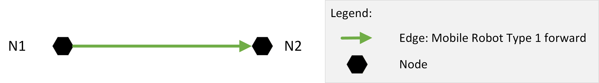

LIF-File:
```json
{
    "metaInformation": {
        "projectIdentification": "LIF Example 01",
        "creator": "VDMA",
        "exportTimestamp": "2023-09-28T10:00:00.00Z",
        "lifVersion": "0.11.0"
    },
    "layouts": [
        {
            "layoutId":"Layout_Ground_Level",
            "layoutName": "Name of Layout Ground Level",
            "layoutVersion": "1",
            "layoutdescriptor": "Ground level of Customer",
            "nodes": [
                {
                    "nodeId": "N1",
                    "mapId":"Map_Z-Level_1",
                    "nodePosition": {
                        "x": 0.0,
                        "y": 0.0
                    },
                    "mobileRobotTypeNodeProperties": [
                        {
                            "mobileRobotTypeId":"Mobile_Robot_Type_1"
                        }
                    ]
                },
                {
                    "nodeId": "N2",
                    "mapId":"Map_Z-Level_1",
                    "nodePosition": {
                        "x": 11.0,
                        "y": 0.0
                    },
                    "mobileRobotTypeNodeProperties": [
                        {
                            "mobileRobotTypeId":"Mobile_Robot_Type_1"
                        }
                    ]
                }
            ],
            "edges": [
                {
                    "edgeId": "N1-N2",
                    "startNodeId": "N1",
                    "endNodeId": "N2",
                    "mobileRobotTypeEdgeProperties": [
                        {
                            "mobileRobotTypeId":"Mobile_Robot_Type_1",
                            "mobileRobotOrientations": [0.0],
                            "orientationType": "TANGENTIAL",
                            "reachOrientationBeforeEntering": true
                        }
                    ]
                }
            ]
        }
    ]
}
```

## 11.2 Bidirectional Edge

Two Edges (straight line) between two nodes. The mobile robot may only move forward oriented on one edge and backward oriented on the other edge.

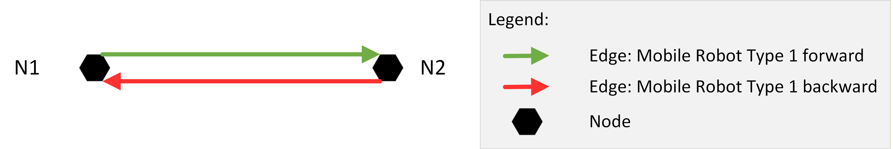

LIF-File:
```json
{
    "metaInformation": {
        "projectIdentification": "LIF Example 02",
        "creator": "VDMA",
        "exportTimestamp": "2023-09-28T10:00:00.00Z",
        "lifVersion": "0.11.0"
    },
    "layouts": [
        {
            "layoutId":"Layout_Ground_Level",
            "layoutName": "Name of Layout Ground Level",
            "layoutVersion": "1",
            "layoutdescriptor": "Ground level of Customer",
            "nodes": [
                {
                    "nodeId": "N1",
                    "mapId":"Map_Z-Level_1",
                    "nodePosition": {
                        "x": 0.0,
                        "y": 0.0
                    },
                    "mobileRobotTypeNodeProperties": [
                        {
                            "mobileRobotTypeId":"Mobile_Robot_Type_1"
                        }
                    ]
                },
                {
                    "nodeId": "N2",
                    "mapId":"Map_Z-Level_1",
                    "nodePosition": {
                        "x": 11.0,
                        "y": 0.0
                    },
                    "mobileRobotTypeNodeProperties": [
                        {
                            "mobileRobotTypeId":"Mobile_Robot_Type_1"
                        }
                    ]
                }
            ],
            "edges": [
                {
                    "edgeId": "N1-N2",
                    "startNodeId": "N1",
                    "endNodeId": "N2",
                    "mobileRobotTypeEdgeProperties": [
                        {
                            "mobileRobotTypeId":"Mobile_Robot_Type_1",
                            "mobileRobotOrientations": [0.0],
                            "orientationType": "TANGENTIAL",
                            "reachOrientationBeforeEntering": true
                        }
                    ]
                },
                {
                    "edgeId": "N2-N1",
                    "startNodeId": "N2",
                    "endNodeId": "N1",
                    "mobileRobotTypeEdgeProperties": [
                        {
                            "mobileRobotTypeId":"Mobile_Robot_Type_1",
                            "mobileRobotOrientations": [3.1415926535897931],
                            "orientationType": "TANGENTIAL",
                            "reachOrientationBeforeEntering": true
                        }
                    ]
                }
            ]
        }
    ]
}
```
## 11.3 Counter-clockwise Rotation on Node

Two Edges (straight line) between two nodes. The mobile robot may only move forward oriented on both edge, rotation counter-clockwise allowed at node N1.

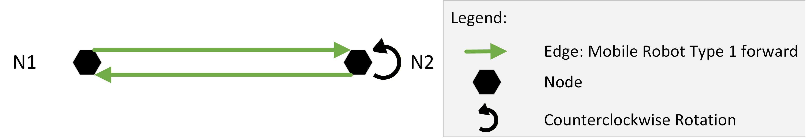

LIF-File:
```json
{
    "metaInformation": {
        "projectIdentification": "LIF Example 03",
        "creator": "VDMA",
        "exportTimestamp": "2023-09-28T10:00:00.00Z",
        "lifVersion": "0.11.0"
    },
    "layouts": [
        {
            "layoutId": "Layout_Ground_Level",
            "layoutName": "Name of Layout Ground Level",
            "layoutVersion": "1",
            "layoutdescriptor": "Ground level of Customer",
            "nodes": [
                {
                    "nodeId": "N1",
                    "mapId": "Map_Z-Level_1",
                    "nodePosition": {
                        "x": 0.0,
                        "y": 0.0
                    },
                    "mobileRobotTypeNodeProperties": [
                        {
                            "mobileRobotTypeId": "Mobile_Robot_Type_1"
                        }
                    ]
                },
                {
                    "nodeId": "N2",
                    "mapId": "Map_Z-Level_1",
                    "nodePosition": {
                        "x": 11.0,
                        "y": 0.0
                    },
                    "mobileRobotTypeNodeProperties": [
                        {
                            "mobileRobotTypeId": "Mobile_Robot_Type_1"
                        }
                    ]
                }
            ],
            "edges": [
                {
                    "edgeId": "N1-N2",
                    "startNodeId": "N1",
                    "endNodeId": "N2",
                    "mobileRobotTypeEdgeProperties": [
                        {
                            "mobileRobotTypeId": "Mobile_Robot_Type_1",
                            "mobileRobotOrientations": [0.0],
                            "orientationType": "TANGENTIAL",
                            "reachOrientationBeforeEntering": true,
                            "rotationAtStartNodeAllowed": "NONE",
                            "rotationAtEndNodeAllowed": "CCW"
                        }
                    ]
                },
                {
                    "edgeId": "N2-N1",
                    "startNodeId": "N2",
                    "endNodeId": "N1",
                    "mobileRobotTypeEdgeProperties": [
                        {
                            "mobileRobotTypeId": "Mobile_Robot_Type_1",
                            "mobileRobotOrientation": 0.0,
                            "orientationType": "TANGENTIAL",
                            "reachOrientationBeforeEntering": true,
                            "rotationAtStartNodeAllowed": "CCW",
                            "rotationAtEndNodeAllowed": "NONE"
                        }
                    ]
                }
            ]
        }
    ]
}
```
## 11.4 Omnidirectional Edge

Two Edges (straight line) between two nodes. The mobile robot moves omnidirectionally to 90° on the edge from N1 to N2 and the mobile robot moves omnidirectionally back to -90° on the edge from N2 back to N1.

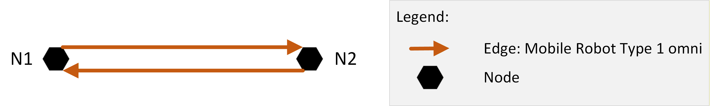

LIF-File:
```json
{
    "metaInformation": {
        "projectIdentification": "LIF Example 04",
        "creator": "VDMA",
        "exportTimestamp": "2023-09-28T10:00:00.00Z",
        "lifVersion": "0.11.0"
    },
    "layouts": [
        {
            "layoutId": "Layout_Ground_Level",
            "layoutName": "Name of Layout Ground Level",
            "layoutVersion": "1",
            "layoutdescriptor": "Ground level of Customer",
            "nodes": [
                {
                    "nodeId": "N1",
                    "mapId": "Map_Z-Level_1",
                    "nodePosition": {
                        "x": 0.0,
                        "y": 0.0
                    },
                    "mobileRobotTypeNodeProperties": [
                        {
                            "mobileRobotTypeId": "Mobile_Robot_Type_1"
                        }
                    ]
                },
                {
                    "nodeId": "N2",
                    "mapId": "Map_Z-Level_1",
                    "nodePosition": {
                        "x": 11.0,
                        "y": 0.0
                    },
                    "mobileRobotTypeNodeProperties": [
                        {
                            "mobileRobotTypeId": "Mobile_Robot_Type_1"
                        }
                    ]
                }
            ],
            "edges": [
                {
                    "edgeId": "N1-N2",
                    "startNodeId": "N1",
                    "endNodeId": "N2",
                    "mobileRobotTypeEdgeProperties": [
                        {
                            "mobileRobotTypeId": "Mobile_Robot_Type_1",
                            "mobileRobotOrientations": [1.5707963267948966],
                            "orientationType": "TANGENTIAL",
                            "reachOrientationBeforeEntering": false,
                            "rotationAtStartNodeAllowed": "NONE",
                            "rotationAtEndNodeAllowed": "NONE"
                        }
                    ]
                },
                {
                    "edgeId": "N2-N1",
                    "startNodeId": "N2",
                    "endNodeId": "N1",
                    "mobileRobotTypeEdgeProperties": [
                        {
                            "mobileRobotTypeId": "Mobile_Robot_Type_1",
                            "mobileRobotOrientation": -1.5707963267948966,
                            "orientationType": "TANGENTIAL",
                            "reachOrientationBeforeEntering": false,
                            "rotationAtStartNodeAllowed": "NONE",
                            "rotationAtEndNodeAllowed": "NONE"
                        }
                    ]
                }
            ]
        }
    ]
}
```

## 11.5 Multiple Layouts in One LIF

Two layouts in one LIF file, representing two different levels of the facility.

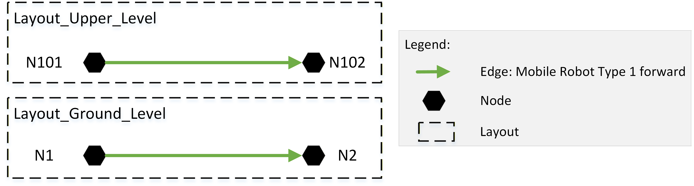

LIF-File:
```json
{
    "metaInformation": {
        "projectIdentification": "LIF Example 05",
        "creator": "VDMA",
        "exportTimestamp": "2023-09-28T10:00:00.00Z",
        "lifVersion": "0.11.0"
    },
    "layouts": [
        {
            "layoutId": "Layout_Ground_Level",
            "layoutName": "Name of Layout Ground Level",
            "layoutVersion": "1",
            "layoutLevelId": "0",
            "layoutdescriptor": "Ground level of Customer",
            "nodes": [
                {
                    "nodeId": "N1",
                    "mapId": "Map_Z-Level_1",
                    "nodePosition": {
                        "x": 0.0,
                        "y": 0.0
                    },
                    "mobileRobotTypeNodeProperties": [
                        {
                            "mobileRobotTypeId": "Mobile_Robot_Type_1"
                        }
                    ]
                },
                {
                    "nodeId": "N2",
                    "mapId": "Map_Z-Level_1",
                    "nodePosition": {
                        "x": 11.0,
                        "y": 0.0
                    },
                    "mobileRobotTypeNodeProperties": [
                        {
                            "mobileRobotTypeId": "Mobile_Robot_Type_1"
                        }
                    ]
                }
            ],
            "edges": [
                {
                    "edgeId": "N1-N2",
                    "startNodeId": "N1",
                    "endNodeId": "N2",
                    "mobileRobotTypeEdgeProperties": [
                        {
                            "mobileRobotTypeId": "Mobile_Robot_Type_1",
                            "mobileRobotOrientations": [0.0],
                            "orientationType": "TANGENTIAL",
                            "reachOrientationBeforeEntering": true
                        }
                    ]
                }
            ]
        },
        {
            "layoutId": "Layout_Upper_Level",
            "layoutName": "Name of Layout Upper Level",
            "layoutVersion": "1",
            "layoutLevelId": "1",
            "layoutdescriptor": "Upper level of Customer",
            "nodes": [
                {
                    "nodeId": "N101",
                    "mapId": "Map_Z-Level_2",
                    "nodePosition": {
                        "x": 12.4,
                        "y": 3.4
                    },
                    "mobileRobotTypeNodeProperties": [
                        {
                            "mobileRobotTypeId": "Mobile_Robot_Type_1"
                        }
                    ]
                },
                {
                    "nodeId": "N102",
                    "mapId": "Map_Z-Level_2",
                    "nodePosition": {
                        "x": 12.0,
                        "y": 3.4
                    },
                    "mobileRobotTypeNodeProperties": [
                        {
                            "mobileRobotTypeId": "Mobile_Robot_Type_1"
                        }
                    ]
                }
            ],
            "edges": [
                {
                    "edgeId": "N101-N102",
                    "startNodeId": "N101",
                    "endNodeId": "N102",
                    "mobileRobotTypeEdgeProperties": [
                        {
                            "mobileRobotTypeId": "Mobile_Robot_Type_1",
                            "mobileRobotOrientations": [0.0],
                            "orientationType": "TANGENTIAL",
                            "reachOrientationBeforeEntering": true
                        }
                    ]
                }
            ]
        }
    ]
}
```

## 11.6 Station with One Node

Two Edges (straight line) between two nodes. At one node there is a station for picking up pallets. The mobile robot may only move forward oriented on one edge and backward oriented on the other edge.


LIF-File:
```json
{
    "metaInformation": {
        "projectIdentification": "LIF Example 06",
        "creator": "VDMA",
        "exportTimestamp": "2023-09-28T10:00:00.00Z",
        "lifVersion": "0.11.0"
    },
    "layouts": [
        {
            "layoutId": "Layout_Ground_Level",
            "layoutName": "Name of Layout Ground Level",
            "layoutVersion": "1",
            "layoutdescriptor": "Ground level of Customer",
            "nodes": [
                {
                    "nodeId": "N1",
                    "mapId": "Map_Z-Level_1",
                    "nodePosition": {
                        "x": 0.0,
                        "y": 0.0
                    },
                    "mobileRobotTypeNodeProperties": [
                        {
                            "mobileRobotTypeId": "Mobile_Robot_Type_1"
                        }
                    ]
                },
                {
                    "nodeId": "N2",
                    "mapId": "Map_Z-Level_1",
                    "nodePosition": {
                        "x": 11.0,
                        "y": 0.0
                    },
                    "mobileRobotTypeNodeProperties": [
                        {
                            "mobileRobotTypeId": "Mobile_Robot_Type_1",
                            "actions": [
                                {
                                    "actionType": "pick",
                                    "requirementType": "CONDITIONAL",
                                    "blockingType": "HARD",
                                    "actionParameters": [
                                        {
                                            "key": "loadType",
                                            "value": "Example load type"
                                        }
                                    ]
                                }
                            ]
                        }
                    ]
                }
            ],
            "edges": [
                {
                    "edgeId": "N1-N2",
                    "startNodeId": "N1",
                    "endNodeId": "N2",
                    "mobileRobotTypeEdgeProperties": [
                        {
                            "mobileRobotTypeId": "Mobile_Robot_Type_1",
                            "mobileRobotOrientations": [3.1415926535897931],
                            "orientationType": "TANGENTIAL",
                            "reachOrientationBeforeEntering": true
                        }
                    ]
                },
                {
                    "edgeId": "N2-N1",
                    "startNodeId": "N2",
                    "endNodeId": "N1",
                    "mobileRobotTypeEdgeProperties": [
                        {
                            "mobileRobotTypeId": "Mobile_Robot_Type_1",
                            "mobileRobotOrientations": [0.0],
                            "orientationType": "TANGENTIAL",
                            "reachOrientationBeforeEntering": true
                        }
                    ]
                }
            ],
            "stations": [
                {
                    "stationId": "S01",
                    "interactionNodeIds": [
                        "N2"
                    ],
                    "stationName": "SOURCE_01",
                    "stationDescription": "Source to pick up pallet",
                    "stationHeight": "0.55"
                }
            ]
        }
    ]
}
```

## 11.7 Station with Two Nodes

Modelling a Station with two different nodes (e.g. Rotation station for a pallet).

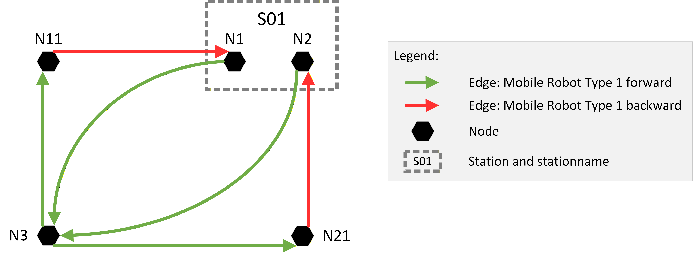

LIF-File:
```json
{
    "metaInformation": {
        "projectIdentification": "LIF Example 07",
        "creator": "VDMA",
        "exportTimestamp": "2023-09-28T10:00:00.00Z",
        "lifVersion": "0.11.0"
    },
    "layouts": [
        {
            "layoutId":"Layout_Ground_Level",
            "layoutName": "Name of Layout Ground Level",
            "layoutVersion": "1",
            "layoutdescriptor": "Ground level of Customer",
            "nodes": [
                {
                    "nodeId": "N1",
                    "mapId":"Map_Z-Level_1",
                    "nodePosition": {
                        "x": 9.2,
                        "y": 3.4
                    },
                    "mobileRobotTypeNodeProperties": [
                        {
                            "mobileRobotTypeId":"Mobile_Robot_Type_1",
                            "actions": [
                                {
                                    "actionType": "pick",
                                    "requirementType": "CONDITIONAL",
                                    "blockingType": "HARD",
                                    "actionParameters": [
                                        {
                                            "key": "loadType",
                                            "value": "Example load type"
                                        }
                                    ]
                                },
                                {
                                    "actionType": "drop",
                                    "requirementType": "CONDITIONAL",
                                    "blockingType": "HARD",
                                    "actionParameters": [
                                        {
                                            "key": "loadType",
                                            "value": "Example load type"
                                        }
                                    ]
                                }
                            ]
                        }
                    ]
                },
                {
                    "nodeId": "N2",
                    "mapId":"Map_Z-Level_1",
                    "nodePosition": {
                        "x": 9.4,
                        "y": 3.2
                    },
                    "mobileRobotTypeNodeProperties": [
                        {
                            "mobileRobotTypeId":"Mobile_Robot_Type_1",
                            "actions": [
                                {
                                    "actionType": "pick",
                                    "requirementType": "CONDITIONAL",
                                    "blockingType": "HARD"
                                },
                                {
                                    "actionType": "drop",
                                    "requirementType": "CONDITIONAL",
                                    "blockingType": "HARD"
                                }
                            ]
                        }
                    ]
                },
                {
                    "nodeId": "N3",
                    "mapId":"Map_Z-Level_1",
                    "nodePosition": {
                        "x": 0.0,
                        "y": 0.0
                    },
                    "mobileRobotTypeNodeProperties": [
                        {
                            "mobileRobotTypeId":"Mobile_Robot_Type_1"
                        }
                    ]
                },
                {
                    "nodeId": "N11",
                    "mapId":"Map_Z-Level_1",
                    "nodePosition": {
                        "x": 0.0,
                        "y": 3.4
                    },
                    "mobileRobotTypeNodeProperties": [
                        {
                            "mobileRobotTypeId":"Mobile_Robot_Type_1"
                        }
                    ]
                },
                {
                    "nodeId": "N21",
                    "mapId":"Map_Z-Level_1",
                    "nodePosition": {
                        "x": 9.2,
                        "y": 0.0
                    },
                    "mobileRobotTypeNodeProperties": [
                        {
                            "mobileRobotTypeId":"Mobile_Robot_Type_1"
                        }
                    ]
                }
            ],
            "edges": [
                {
                    "edgeId": "N11-N1",
                    "startNodeId": "N11",
                    "endNodeId": "N1",
                    "mobileRobotTypeEdgeProperties": [
                        {
                            "mobileRobotTypeId":"Mobile_Robot_Type_1",
                            "mobileRobotOrientations": [3.1415926535897931],
                            "orientationType": "TANGENTIAL",
                            "reachOrientationBeforeEntering": true
                        }
                    ]
                },
                {
                    "edgeId": "N3-N11",
                    "startNodeId": "N3",
                    "endNodeId": "N11",
                    "mobileRobotTypeEdgeProperties": [
                        {
                            "mobileRobotTypeId":"Mobile_Robot_Type_1",
                            "mobileRobotOrientations": [0.0],
                            "orientationType": "TANGENTIAL",
                            "reachOrientationBeforeEntering": true
                        }
                    ]
                },
                {
                    "edgeId": "N1-N3",
                    "startNodeId": "N1",
                    "endNodeId": "N3",
                    "mobileRobotTypeEdgeProperties": [
                        {
                            "mobileRobotTypeId":"Mobile_Robot_Type_1",
                            "mobileRobotOrientations": [0.0],
                            "orientationType": "TANGENTIAL",
                            "reachOrientationBeforeEntering": true
                        }
                    ]
                },
                {
                    "edgeId": "N3-N21",
                    "startNodeId": "N3",
                    "endNodeId": "N21",
                    "mobileRobotTypeEdgeProperties": [
                        {
                            "mobileRobotTypeId":"Mobile_Robot_Type_1",
                            "mobileRobotOrientations": [0.0],
                            "orientationType": "TANGENTIAL",
                            "reachOrientationBeforeEntering": true
                        }
                    ]
                },
                {
                    "edgeId": "N21-N2",
                    "startNodeId": "N21",
                    "endNodeId": "N2",
                    "mobileRobotTypeEdgeProperties": [
                        {
                            "mobileRobotTypeId":"Mobile_Robot_Type_1",
                            "mobileRobotOrientations": [3.1415926535897931],
                            "orientationType": "TANGENTIAL",
                            "reachOrientationBeforeEntering": true
                        }
                    ]
                },
                {
                    "edgeId": "N2-N3",
                    "startNodeId": "N2",
                    "endNodeId": "N3",
                    "mobileRobotTypeEdgeProperties": [
                        {
                            "mobileRobotTypeId":"Mobile_Robot_Type_1",
                            "mobileRobotOrientations": [0.0],
                            "orientationType": "TANGENTIAL",
                            "reachOrientationBeforeEntering": true
                        }
                    ]
                }
            ],
            "stations": [
                {
                    "stationId": "S01",
                    "interactionNodeIds": [
                        "N1",
                        "N2"
                    ],
                    "stationName":"SOURCE_01",
                    "stationDescription": "Pallet rotation station",
                    "stationHeight": "0.55"
                }
            ]
        }
    ]
}
```

## 11.8 Station with Two Nodes, Restricted for Different Mobile Robot Types

Station with tow Nodes but restricted for different mobile robot types.

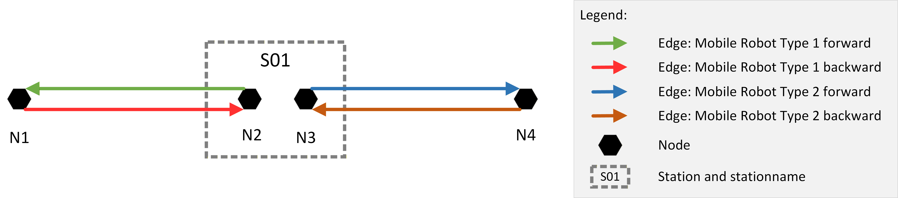

LIF-File:
```json
{
    "metaInformation": {
        "projectIdentification": "LIF Example 08",
        "creator": "VDMA",
        "exportTimestamp": "2023-09-28T10:00:00.00Z",
        "lifVersion": "0.11.0"
    },
    "layouts": [
        {
            "layoutId": "Layout_Ground_Level",
            "layoutName": "Name of Layout Ground Level",
            "layoutVersion": "1",
            "layoutdescriptor": "Ground level of Customer",
            "nodes": [
                {
                    "nodeId": "N1",
                    "mapId": "Map_Z-Level_1",
                    "nodePosition": {
                        "x": 7.2,
                        "y": 0.0
                    },
                    "mobileRobotTypeNodeProperties": [
                        {
                            "mobileRobotTypeId": "Mobile_Robot_Type_1"
                        }
                    ]
                },
                {
                    "nodeId": "N2",
                    "mapId": "Map_Z-Level_1",
                    "nodePosition": {
                        "x": 9.2,
                        "y": 0.0
                    },
                    "mobileRobotTypeNodeProperties": [
                        {
                            "mobileRobotTypeId": "Mobile_Robot_Type_1",
                            "actions": [
                                {
                                    "actionType": "drop",
                                    "requirementType": "CONDITIONAL",
                                    "blockingType": "HARD",
                                    "actionParameters": [
                                        {
                                            "key": "loadType",
                                            "value": "Example load type"
                                        }
                                    ]
                                }
                            ]
                        }
                    ]
                },
                {
                    "nodeId": "N3",
                    "mapId": "Map_Z-Level_1",
                    "nodePosition": {
                        "x": 9.6,
                        "y": 0.0
                    },
                    "mobileRobotTypeNodeProperties": [
                        {
                            "mobileRobotTypeId": "Mobile_Robot_Type_2",
                            "actions": [
                                {
                                    "actionType": "pick",
                                    "requirementType": "CONDITIONAL",
                                    "blockingType": "HARD",
                                    "actionParameters": [
                                        {
                                            "key": "loadType",
                                            "value": "Example load type"
                                        }
                                    ]
                                }
                            ]
                        }
                    ]
                },
                {
                    "nodeId": "N4",
                    "mapId": "Map_Z-Level_1",
                    "nodePosition": {
                        "x": 14.8,
                        "y": 3.4
                    },
                    "mobileRobotTypeNodeProperties": [
                        {
                            "mobileRobotTypeId": "Mobile_Robot_Type_2"
                        }
                    ]
                }
            ],
            "edges": [
                {
                    "edgeId": "N1-N2",
                    "startNodeId": "N1",
                    "endNodeId": "N2",
                    "mobileRobotTypeEdgeProperties": [
                        {
                            "mobileRobotTypeId": "Mobile_Robot_Type_1",
                            "mobileRobotOrientations": [3.1415926535897931],
                            "orientationType": "TANGENTIAL",
                            "reachOrientationBeforeEntering": true
                        }
                    ]
                },
                {
                    "edgeId": "N2-N1",
                    "startNodeId": "N2",
                    "endNodeId": "N1",
                    "mobileRobotTypeEdgeProperties": [
                        {
                            "mobileRobotTypeId": "Mobile_Robot_Type_1",
                            "mobileRobotOrientations": [0.0],
                            "orientationType": "TANGENTIAL",
                            "reachOrientationBeforeEntering": true
                        }
                    ]
                },
                {
                    "edgeId": "N4-N3",
                    "startNodeId": "N4",
                    "endNodeId": "N3",
                    "mobileRobotTypeEdgeProperties": [
                        {
                            "mobileRobotTypeId": "Mobile_Robot_Type_2",
                            "mobileRobotOrientations": [3.1415926535897931],
                            "orientationType": "TANGENTIAL",
                            "reachOrientationBeforeEntering": true
                        }
                    ]
                },
                {
                    "edgeId": "N3-N4",
                    "startNodeId": "N3",
                    "endNodeId": "N4",
                    "mobileRobotTypeEdgeProperties": [
                        {
                            "mobileRobotTypeId": "Mobile_Robot_Type_2",
                            "mobileRobotOrientations": [0.0],
                            "orientationType": "TANGENTIAL",
                            "reachOrientationBeforeEntering": true
                        }
                    ]
                }
            ],
            "stations": [
                {
                    "stationId": "S01",
                    "interactionNodeIds": [
                        "N2",
                        "N3"
                    ],
                    "stationName": "SOURCE_01",
                    "stationDescription": "Handover station for pallet",
                    "stationHeight": "0.0"
                }
            ]
        }
    ]
}
```

## 11.9 Rotation Station

Rotation station for pallet, on which a rectangular load can be dropped "short side leading" and then picked up "long side leading".

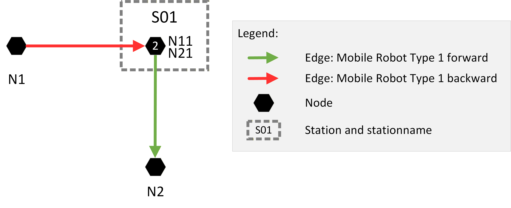

LIF-File:
```json
{
    "metaInformation": {
        "projectIdentification": "LIF Example 09",
        "creator": "VDMA",
        "exportTimestamp": "2023-09-28T10:00:00.00Z",
        "lifVersion": "0.11.0"
    },
    "layouts": [
        {
            "layoutId": "Layout_Ground_Level",
            "layoutName": "Name of Layout Ground Level",
            "layoutVersion": "1",
            "layoutdescriptor": "Ground level of Customer",
            "nodes": [
                {
                    "nodeId": "N1",
                    "mapId": "Map_Z-Level_1",
                    "nodePosition": {
                        "x": 7.2,
                        "y": 0.0
                    },
                    "mobileRobotTypeNodeProperties": [
                        {
                            "mobileRobotTypeId": "Mobile_Robot_Type_1"
                        }
                    ]
                },
                {
                    "nodeId": "N11",
                    "mapId": "Map_Z-Level_1",
                    "nodePosition": {
                        "x": 9.2,
                        "y": 0.0
                    },
                    "mobileRobotTypeNodeProperties": [
                        {
                            "mobileRobotTypeId": "Mobile_Robot_Type_1",
                            "actions": [
                                {
                                    "actionType": "drop",
                                    "requirementType": "CONDITIONAL",
                                    "blockingType": "HARD"
                                }
                            ]
                        }
                    ]
                },
                {
                    "nodeId": "N21",
                    "mapId": "Map_Z-Level_1",
                    "nodePosition": {
                        "x": 9.2,
                        "y": 0.0
                    },
                    "mobileRobotTypeNodeProperties": [
                        {
                            "mobileRobotTypeId": "Mobile_Robot_Type_1",
                            "theta": -1.5707963268,
                            "actions": [
                                {
                                    "actionType": "pick",
                                    "requirementType": "CONDITIONAL",
                                    "blockingType": "HARD",
                                    "actionParameters": [
                                        {
                                            "key": "loadType",
                                            "value": "Example load type"
                                        }
                                    ]
                                }
                            ]
                        }
                    ]
                },
                {
                    "nodeId": "N2",
                    "mapId": "Map_Z-Level_1",
                    "nodePosition": {
                        "x": 9.2,
                        "y": -5.0
                    },
                    "mobileRobotTypeNodeProperties": [
                        {
                            "mobileRobotTypeId": "Mobile_Robot_Type_1"
                        }
                    ]
                }
            ],
            "edges": [
                {
                    "edgeId": "N1-N11",
                    "startNodeId": "N1",
                    "endNodeId": "N11",
                    "mobileRobotTypeEdgeProperties": [
                        {
                            "mobileRobotTypeId": "Mobile_Robot_Type_1",
                            "mobileRobotOrientations": [3.1415926535897931],
                            "orientationType": "TANGENTIAL",
                            "reachOrientationBeforeEntering": true
                        }
                    ]
                },
                {
                    "edgeId": "N11-N21",
                    "startNodeId": "N11",
                    "endNodeId": "N21",
                    "mobileRobotTypeEdgeProperties": [
                        {
                            "mobileRobotTypeId": "Mobile_Robot_Type_1",
                            "reachOrientationBeforeEntering": true,
                            "rotationAtStartNodeAllowed": "CW"
                        }
                    ]
                },
                {
                    "edgeId": "N21-N2",
                    "startNodeId": "N21",
                    "endNodeId": "N2",
                    "mobileRobotTypeEdgeProperties": [
                        {
                            "mobileRobotTypeId": "Mobile_Robot_Type_1",
                            "mobileRobotOrientations": [0.0],
                            "orientationType": "TANGENTIAL",
                            "reachOrientationBeforeEntering": true
                        }
                    ]
                }
            ],
            "stations": [
                {
                    "stationId": "S01",
                    "interactionNodeIds": [
                        "N11",
                        "N21"
                    ],
                    "stationName": "Rotation_01",
                    "stationDescription": "Rotation station for pallet",
                    "stationHeight": "0.75"
                }
            ]
        }
    ]
}
```

## 11.10 Station with Three Nodes, Restricted to Different Mobile Robot Types

One station with three nodes, but restricted to different mobile robot types.

Restriction on edges:

* Mobile Robot Type 1 Forward
* Mobile Robot Type 2 Backward
* Mobile Robot Type 2 & 3 Forward
* Mobile Robot Type 2 & 3 Backward

Explanation:

* NSL: Mobile Robot Type 1 pick and drop
* NSB: Mobile Robot Type 1 pick
* NSR: Mobile Robot Type 2 drop
* NSR: Mobile Robot Type 3 pick and drop

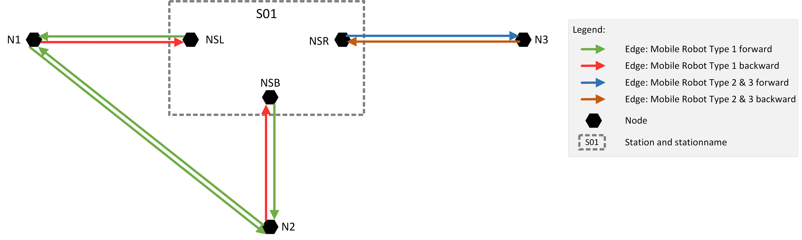

LIF-File:
```json
{
    "metaInformation": {
        "projectIdentification": "LIF Example 10",
        "creator": "VDMA",
        "exportTimestamp": "2023-09-28T10:00:00.00Z",
        "lifVersion": "0.11.0"
    },
    "layouts": [
        {
            "layoutId": "Layout_Ground_Level",
            "layoutName": "Name of Layout Ground Level",
            "layoutVersion": "1",
            "layoutdescriptor": "Ground level of Customer",
            "nodes": [
                {
                    "nodeId": "N1",
                    "mapId": "Map_Z-Level_1",
                    "nodePosition": {
                        "x": 7.2,
                        "y": 0.0
                    },
                    "mobileRobotTypeNodeProperties": [
                        {
                            "mobileRobotTypeId": "Mobile_Robot_Type_1"
                        }
                    ]
                },
                {
                    "nodeId": "NSL",
                    "mapId": "Map_Z-Level_1",
                    "nodePosition": {
                        "x": 9.2,
                        "y": 0.0
                    },
                    "mobileRobotTypeNodeProperties": [
                        {
                            "mobileRobotTypeId": "Mobile_Robot_Type_1",
                            "actions": [
                                {
                                    "actionType": "pick",
                                    "requirementType": "CONDITIONAL",
                                    "blockingType": "HARD"
                                },
                                {
                                    "actionType": "drop",
                                    "requirementType": "CONDITIONAL",
                                    "blockingType": "HARD"
                                }
                            ]
                        }
                    ]
                },
                {
                    "nodeId": "NSR",
                    "mapId": "Map_Z-Level_1",
                    "nodePosition": {
                        "x": 10.2,
                        "y": 0.0
                    },
                    "mobileRobotTypeNodeProperties": [
                        {
                            "mobileRobotTypeId": "Mobile_Robot_Type_2",
                            "actions": [
                                {
                                    "actionType": "drop",
                                    "requirementType": "CONDITIONAL",
                                    "blockingType": "HARD"
                                }
                            ]
                        },
                        {
                            "mobileRobotTypeId": "Mobile_Robot_Type_3",
                            "actions": [
                                {
                                    "actionType": "pick",
                                    "requirementType": "CONDITIONAL",
                                    "blockingType": "HARD"
                                },
                                {
                                    "actionType": "drop",
                                    "requirementType": "CONDITIONAL",
                                    "blockingType": "HARD"
                                }
                            ]
                        }
                    ]
                },
                {
                    "nodeId": "NSB",
                    "mapId": "Map_Z-Level_1",
                    "nodePosition": {
                        "x": 9.7,
                        "y": -0.5
                    },
                    "mobileRobotTypeNodeProperties": [
                        {
                            "mobileRobotTypeId": "Mobile_Robot_Type_1",
                            "actions": [
                                {
                                    "actionType": "pick",
                                    "requirementType": "CONDITIONAL",
                                    "blockingType": "HARD"
                                }
                            ]
                        }
                    ]
                },
                {
                    "nodeId": "N2",
                    "mapId": "Map_Z-Level_1",
                    "nodePosition": {
                        "x": 9.7,
                        "y": -5.0
                    },
                    "mobileRobotTypeNodeProperties": [
                        {
                            "mobileRobotTypeId": "Mobile_Robot_Type_1"
                        }
                    ]
                },
                {
                    "nodeId": "N3",
                    "mapId": "Map_Z-Level_1",
                    "nodePosition": {
                        "x": 13.2,
                        "y": 0.0
                    },
                    "mobileRobotTypeNodeProperties": [
                        {
                            "mobileRobotTypeId": "Mobile_Robot_Type_2"
                        },
                        {
                            "mobileRobotTypeId": "Mobile_Robot_Type_3"
                        }
                    ]
                }
            ],
            "edges": [
                {
                    "edgeId": "N1-NSL",
                    "startNodeId": "N1",
                    "endNodeId": "NSL",
                    "mobileRobotTypeEdgeProperties": [
                        {
                            "mobileRobotTypeId": "Mobile_Robot_Type_1",
                            "mobileRobotOrientations": [3.1415926535897931],
                            "orientationType": "TANGENTIAL",
                            "reachOrientationBeforeEntering": true
                        }
                    ]
                },
                {
                    "edgeId": "NSL-N1",
                    "startNodeId": "NSL",
                    "endNodeId": "N1",
                    "mobileRobotTypeEdgeProperties": [
                        {
                            "mobileRobotTypeId": "Mobile_Robot_Type_1",
                            "mobileRobotOrientations": [0.0],
                            "orientationType": "TANGENTIAL",
                            "reachOrientationBeforeEntering": true
                        }
                    ]
                },
                {
                    "edgeId": "N2-NSB",
                    "startNodeId": "N2",
                    "endNodeId": "NSB",
                    "mobileRobotTypeEdgeProperties": [
                        {
                            "mobileRobotTypeId": "Mobile_Robot_Type_1",
                            "mobileRobotOrientations": [3.1415926535897931],
                            "orientationType": "TANGENTIAL",
                            "reachOrientationBeforeEntering": true
                        }
                    ]
                },
                {
                    "edgeId": "NSB-N2",
                    "startNodeId": "NSB",
                    "endNodeId": "N2",
                    "mobileRobotTypeEdgeProperties": [
                        {
                            "mobileRobotTypeId": "Mobile_Robot_Type_1",
                            "mobileRobotOrientations": [0.0],
                            "orientationType": "TANGENTIAL",
                            "reachOrientationBeforeEntering": true
                        }
                    ]
                },
                {
                    "edgeId": "N3-NSR",
                    "startNodeId": "N3",
                    "endNodeId": "NSR",
                    "mobileRobotTypeEdgeProperties": [
                        {
                            "mobileRobotTypeId": "Mobile_Robot_Type_2",
                            "mobileRobotOrientations": [3.1415926535897931],
                            "orientationType": "TANGENTIAL",
                            "reachOrientationBeforeEntering": true
                        },
                        {
                            "mobileRobotTypeId": "Mobile_Robot_Type_3",
                            "mobileRobotOrientations": [3.1415926535897931],
                            "orientationType": "TANGENTIAL",
                            "reachOrientationBeforeEntering": true
                        }
                    ]
                },
                {
                    "edgeId": "NSR-N3",
                    "startNodeId": "NSR",
                    "endNodeId": "N3",
                    "mobileRobotTypeEdgeProperties": [
                        {
                            "mobileRobotTypeId": "Mobile_Robot_Type_2",
                            "mobileRobotOrientations": [0.0],
                            "orientationType": "TANGENTIAL",
                            "reachOrientationBeforeEntering": true
                        },
                        {
                            "mobileRobotTypeId": "Mobile_Robot_Type_3",
                            "mobileRobotOrientations": [0.0],
                            "orientationType": "TANGENTIAL",
                            "reachOrientationBeforeEntering": true
                        }
                    ]
                }
            ],
            "stations": [
                {
                    "stationId": "NS",
                    "interactionNodeIds": [
                        "NSL",
                        "NSB",
                        "NSR"
                    ],
                    "stationName": "Complicated handover station",
                    "stationDescription": "Handover station for multiple mobile robot types with different allowed actions",
                    "stationHeight": "0.5"
                }
            ]
        }
    ]
}
```

## 11.11 Multiple Edges with Load Restrictions

Multiple Edges with different load restrictions applied.

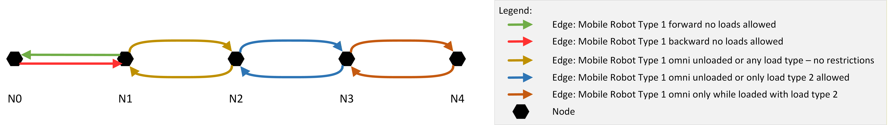

LIF-File:
```json
{
    "metaInformation": {
        "projectIdentification": "LIF Example 11",
        "creator": "VDMA",
        "exportTimestamp": "2023-09-28T10:00:00.00Z",
        "lifVersion": "0.11.0"
    },
    "layouts": [
        {
            "layoutId": "Layout_Ground_Level",
            "layoutName": "Name of Layout Ground Level",
            "layoutVersion": "1",
            "layoutdescriptor": "Ground level of Customer",
            "nodes": [
                {
                    "nodeId": "N0",
                    "mapId": "Map_Z-Level_1",
                    "nodePosition": {
                        "x": 0.0,
                        "y": 0.0
                    },
                    "mobileRobotTypeNodeProperties": [
                        {
                            "mobileRobotTypeId": "Mobile_Robot_Type_1",
                            "actions": [
                                {
                                    "actionType": "startCharging",
                                    "requirementType": "CONDITIONAL",
                                    "blockingType": "HARD"
                                },
                                {
                                    "actionType": "stopCharging",
                                    "requirementType": "CONDITIONAL",
                                    "blockingType": "HARD"
                                }
                            ]
                        }
                    ]
                },
                {
                    "nodeId": "N1",
                    "mapId": "Map_Z-Level_1",
                    "nodePosition": {
                        "x": 5.0,
                        "y": 0.0
                    },
                    "mobileRobotTypeNodeProperties": [
                        {
                            "mobileRobotTypeId": "Mobile_Robot_Type_1"
                        }
                    ]
                },
                {
                    "nodeId": "N2",
                    "mapId": "Map_Z-Level_1",
                    "nodePosition": {
                        "x": 15.0,
                        "y": 0.0
                    },
                    "mobileRobotTypeNodeProperties": [
                        {
                            "mobileRobotTypeId": "Mobile_Robot_Type_1"
                        }
                    ]
                },
                {
                    "nodeId": "N3",
                    "mapId": "Map_Z-Level_1",
                    "nodePosition": {
                        "x": 25.0,
                        "y": 0.0
                    },
                    "mobileRobotTypeNodeProperties": [
                        {
                            "mobileRobotTypeId": "Mobile_Robot_Type_1"
                        }
                    ]
                },
                {
                    "nodeId": "N4",
                    "mapId": "Map_Z-Level_1",
                    "nodePosition": {
                        "x": 35.0,
                        "y": 0.0
                    },
                    "mobileRobotTypeNodeProperties": [
                        {
                            "mobileRobotTypeId": "Mobile_Robot_Type_1"
                        }
                    ]
                }
            ],
            "edges": [
                {
                    "edgeId": "N0-N1",
                    "startNodeId": "N0",
                    "endNodeId": "N1",
                    "mobileRobotTypeEdgeProperties": [
                        {
                            "mobileRobotTypeId": "Mobile_Robot_Type_1",
                            "mobileRobotOrientations": [3.1415926535897931],
                            "orientationType": "TANGENTIAL",
                            "reachOrientationBeforeEntering": true,
                            "rotationAtStartNodeAllowed": "NONE",
                            "rotationAtEndNodeAllowed": "BOTH",
                            "loadRestriction": {
                                "unloaded": true,
                                "loaded": false
                            }
                        }
                    ]
                },
                {
                    "edgeId": "N1-N0",
                    "startNodeId": "N1",
                    "endNodeId": "N0",
                    "mobileRobotTypeEdgeProperties": [
                        {
                            "mobileRobotTypeId": "Mobile_Robot_Type_1",
                            "mobileRobotOrientations": [0.0],
                            "orientationType": "TANGENTIAL",
                            "reachOrientationBeforeEntering": true,
                            "rotationAtStartNodeAllowed": "BOTH",
                            "rotationAtEndNodeAllowed": "NONE",
                            "loadRestriction": {
                                "unloaded": true,
                                "loaded": false
                            }
                        }
                    ]
                },
                {
                    "edgeId": "N1-N2",
                    "startNodeId": "N1",
                    "endNodeId": "N2",
                    "mobileRobotTypeEdgeProperties": [
                        {
                            "mobileRobotTypeId": "Mobile_Robot_Type_1",
                            "reachOrientationBeforeEntering": true,
                            "rotationAtStartNodeAllowed": "BOTH",
                            "rotationAtEndNodeAllowed": "BOTH"
                        }
                    ]
                },
                {
                    "edgeId": "N2-N1",
                    "startNodeId": "N2",
                    "endNodeId": "N1",
                    "mobileRobotTypeEdgeProperties": [
                        {
                            "mobileRobotTypeId": "Mobile_Robot_Type_1",
                            "reachOrientationBeforeEntering": true,
                            "rotationAtStartNodeAllowed": "BOTH",
                            "rotationAtEndNodeAllowed": "BOTH"
                        }
                    ]
                },
                {
                    "edgeId": "N2-N3",
                    "startNodeId": "N2",
                    "endNodeId": "N3",
                    "mobileRobotTypeEdgeProperties": [
                        {
                            "mobileRobotTypeId": "Mobile_Robot_Type_1",
                            "reachOrientationBeforeEntering": true,
                            "rotationAtStartNodeAllowed": "BOTH",
                            "rotationAtEndNodeAllowed": "BOTH",
                            "loadRestriction": {
                                "unloaded": true,
                                "loaded": true,
                                "loadSetNames": [
                                    "Load_Type_EUR"
                                ]
                            }
                        }
                    ]
                },
                {
                    "edgeId": "N3-N2",
                    "startNodeId": "N3",
                    "endNodeId": "N2",
                    "mobileRobotTypeEdgeProperties": [
                        {
                            "mobileRobotTypeId": "Mobile_Robot_Type_1",
                            "reachOrientationBeforeEntering": true,
                            "rotationAtStartNodeAllowed": "BOTH",
                            "rotationAtEndNodeAllowed": "BOTH",
                            "loadRestriction": {
                                "unloaded": true,
                                "loaded": true,
                                "loadSetNames": [
                                    "Load_Type_EUR"
                                ]
                            }
                        }
                    ]
                },
                {
                    "edgeId": "N3-N4",
                    "startNodeId": "N3",
                    "endNodeId": "N4",
                    "mobileRobotTypeEdgeProperties": [
                        {
                            "mobileRobotTypeId": "Mobile_Robot_Type_1",
                            "reachOrientationBeforeEntering": true,
                            "rotationAtStartNodeAllowed": "BOTH",
                            "rotationAtEndNodeAllowed": "BOTH",
                            "loadRestriction": {
                                "unloaded": false,
                                "loaded": true,
                                "loadSetNames": [
                                    "Load_Type_EUR"
                                ]
                            }
                        }
                    ]
                },
                {
                    "edgeId": "N4-N3",
                    "startNodeId": "N4",
                    "endNodeId": "N3",
                    "mobileRobotTypeEdgeProperties": [
                        {
                            "mobileRobotTypeId": "Mobile_Robot_Type_1",
                            "reachOrientationBeforeEntering": true,
                            "rotationAtStartNodeAllowed": "BOTH",
                            "rotationAtEndNodeAllowed": "BOTH",
                            "loadRestriction": {
                                "unloaded": false,
                                "loaded": true,
                                "loadSetNames": [
                                    "Load_Type_EUR"
                                ]
                            }
                        }
                    ]
                }
            ]
        }
    ]
}
```

## 11.12 Multiple Edges Between Same Two Nodes for Different mobileRobotTypeEdgeProperty Constraints.

If, for example, a mobile robot would be incapable of remembering the properties of the load it is carrying, and/or the traffic controller would be asked to manage the mobile robots' maximumSpeed or other behavior, multiple overlapping edges (or in other cases nodes) can accomplish this.

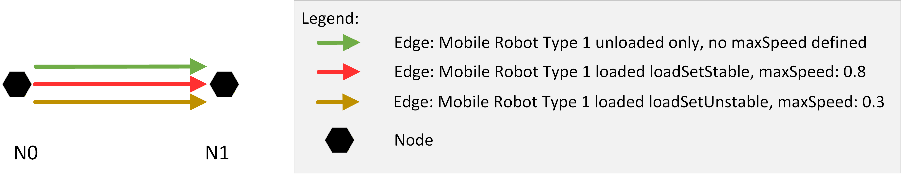

LIF-File:
```json
{
    "metaInformation": {
        "projectIdentification": "LIF Example 12",
        "creator": "VDMA",
        "exportTimestamp": "2023-09-28T10:00:00.00Z",
        "lifVersion": "0.11.0"
    },
    "layouts": [
        {
            "layoutId": "Layout_Ground_Level",
            "layoutName": "Name of Layout Ground Level",
            "layoutVersion": "1",
            "layoutdescriptor": "Ground level of Customer",
            "nodes": [
                {
                    "nodeId": "N0",
                    "mapId": "Map_Z-Level_1",
                    "nodePosition": {
                        "x": 0.0,
                        "y": 0.0
                    },
                    "mobileRobotTypeNodeProperties": [
                        {
                            "mobileRobotTypeId": "Mobile_Robot_Type_1",
                            "actions": [
                                {
                                    "actionType": "startCharging",
                                    "requirementType": "CONDITIONAL",
                                    "blockingType": "HARD"
                                },
                                {
                                    "actionType": "stopCharging",
                                    "requirementType": "CONDITIONAL",
                                    "blockingType": "HARD"
                                }
                            ]
                        }
                    ]
                },
                {
                    "nodeId": "N1",
                    "mapId": "Map_Z-Level_1",
                    "nodePosition": {
                        "x": 5.0,
                        "y": 0.0
                    },
                    "mobileRobotTypeNodeProperties": [
                        {
                            "mobileRobotTypeId": "Mobile_Robot_Type_1"
                        }
                    ]
                },
                {
                    "nodeId": "N2",
                    "mapId": "Map_Z-Level_1",
                    "nodePosition": {
                        "x": 15.0,
                        "y": 0.0
                    },
                    "mobileRobotTypeNodeProperties": [
                        {
                            "mobileRobotTypeId": "Mobile_Robot_Type_1"
                        }
                    ]
                }
            ],
            "edges": [
                {
                    "edgeId": "N0-N1_Unloaded",
                    "startNodeId": "N0",
                    "endNodeId": "N1",
                    "mobileRobotTypeEdgeProperties": [
                        {
                            "mobileRobotTypeId": "Mobile_Robot_Type_1",
                            "mobileRobotOrientations": [3.1415926535897931],
                            "orientationType": "TANGENTIAL",
                            "reachOrientationBeforeEntering": true,
                            "rotationAtStartNodeAllowed": "NONE",
                            "rotationAtEndNodeAllowed": "BOTH",
                            "loadRestriction": {
                                "unloaded": true,
                                "loaded": false
                            }
                        }
                    ]
                },
                {
                    "edgeId": "N1-N0_Stable_Load",
                    "startNodeId": "N1",
                    "endNodeId": "N0",
                    "mobileRobotTypeEdgeProperties": [
                        {
                            "mobileRobotTypeId": "Mobile_Robot_Type_1",
                            "mobileRobotOrientations": [0.0],
                            "orientationType": "TANGENTIAL",
                            "reachOrientationBeforeEntering": true,
                            "rotationAtStartNodeAllowed": "BOTH",
                            "rotationAtEndNodeAllowed": "NONE",
                            "maximumSpeed": 0.8,
                            "loadRestriction": {
                                "unloaded": false,
                                "loaded": true,
                                "loadSetNames": [
                                    "Stable_Load_Unit"
                                ]
                            }
                        }
                    ]
                },
                {
                    "edgeId": "N1-N0_Unstable_Load",
                    "startNodeId": "N1",
                    "endNodeId": "N0",
                    "mobileRobotTypeEdgeProperties": [
                        {
                            "mobileRobotTypeId": "Mobile_Robot_Type_1",
                            "mobileRobotOrientations": [0.0],
                            "orientationType": "TANGENTIAL",
                            "reachOrientationBeforeEntering": true,
                            "rotationAtStartNodeAllowed": "BOTH",
                            "rotationAtEndNodeAllowed": "NONE",
                            "maximumSpeed": 0.3,
                            "loadRestriction": {
                                "unloaded": false,
                                "loaded": true,
                                "loadSetNames": [
                                    "Unstable_Load_Unit"
                                ]
                            }
                        }
                    ]
                }
            ]
        }
    ]
}
```

## 11.13 Battery Charging Station

Modelling of a battery charging station.

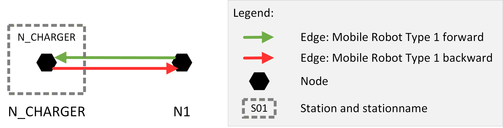

LIF-File:
```json
{
    "metaInformation": {
        "projectIdentification": "LIF Example 13",
        "creator": "VDMA",
        "exportTimestamp": "2023-09-28T10:00:00.00Z",
        "lifVersion": "0.11.0"
    },
    "layouts": [
        {
            "layoutId": "Layout_Ground_Level",
            "layoutName": "Name of Layout Ground Level",
            "layoutVersion": "1",
            "layoutdescriptor": "Ground level of Customer",
            "nodes": [
                {
                    "nodeId": "N_CHARGER",
                    "mapId": "Map_Z-Level_1",
                    "nodePosition": {
                        "x": 0.0,
                        "y": 0.0
                    },
                    "mobileRobotTypeNodeProperties": [
                        {
                            "mobileRobotTypeId": "Mobile_Robot_Type_1",
                            "actions": [
                                {
                                    "actionType": "startCharging",
                                    "requirementType": "CONDITIONAL",
                                    "blockingType": "HARD"
                                },
                                {
                                    "actionType": "stopCharging",
                                    "requirementType": "CONDITIONAL",
                                    "blockingType": "HARD"
                                }
                            ]
                        }
                    ]
                },
                {
                    "nodeId": "N1",
                    "mapId": "Map_Z-Level_1",
                    "nodePosition": {
                        "x": 5.0,
                        "y": 0.0
                    },
                    "mobileRobotTypeNodeProperties": [
                        {
                            "mobileRobotTypeId": "Mobile_Robot_Type_1"
                        }
                    ]
                }
            ],
            "edges": [
                {
                    "edgeId": "N_CHARGER-N1",
                    "startNodeId": "N_CHARGER",
                    "endNodeId": "N1",
                    "mobileRobotTypeEdgeProperties": [
                        {
                            "mobileRobotTypeId": "Mobile_Robot_Type_1",
                            "mobileRobotOrientations": [3.1415926535897931],
                            "orientationType": "TANGENTIAL",
                            "reachOrientationBeforeEntering": true,
                            "rotationAtStartNodeAllowed": "NONE",
                            "rotationAtEndNodeAllowed": "BOTH",
                            "loadRestriction": {
                                "unloaded": true,
                                "loaded": false
                            }
                        }
                    ]
                },
                {
                    "edgeId": "N1-N_CHARGER",
                    "startNodeId": "N1",
                    "endNodeId": "N_CHARGER",
                    "mobileRobotTypeEdgeProperties": [
                        {
                            "mobileRobotTypeId": "Mobile_Robot_Type_1",
                            "mobileRobotOrientations": [0.0],
                            "orientationType": "TANGENTIAL",
                            "reachOrientationBeforeEntering": true,
                            "rotationAtStartNodeAllowed": "BOTH",
                            "rotationAtEndNodeAllowed": "NONE",
                            "loadRestriction": {
                                "unloaded": true,
                                "loaded": false
                            }
                        }
                    ]
                }
            ],
            "stations": [
                {
                    "stationId": "N_CHARGER",
                    "interactionNodeIds": [
                        "N_CHARGER"
                    ],
                    "stationName": "Battery Charging Station",
                    "stationDescription": "Station to charge the battery or park the mobile robot",
                    "stationHeight": "0.0"
                }
            ]
        }
    ]
}
```

## 11.14 Two Levels of a Facility in One LIF File

Two layouts in one LIF file, representing two different levels of the facility. Modelling of a transition between two levels.

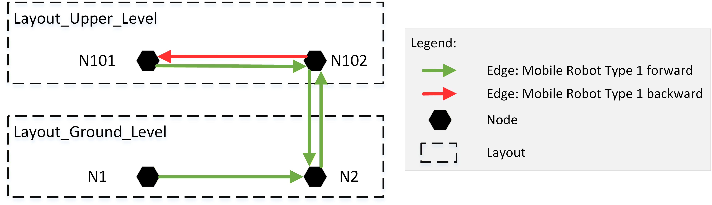

LIF-File:
```json
{
    "metaInformation": {
        "projectIdentification": "LIF Example 14",
        "creator": "VDMA",
        "exportTimestamp": "2023-09-28T10:00:00.00Z",
        "lifVersion": "0.11.0"
    },
    "layouts": [
        {
            "layoutId": "Layout_Ground_Level",
            "layoutName": "Name of Layout Ground Level",
            "layoutVersion": "1",
            "layoutLevelId": "0",
            "layoutdescriptor": "Ground level of Customer",
            "nodes": [
                {
                    "nodeId": "N1",
                    "mapId": "Map_Z-Level_1",
                    "nodePosition": {
                        "x": 0.0,
                        "y": 0.0
                    },
                    "mobileRobotTypeNodeProperties": [
                        {
                            "mobileRobotTypeId": "Mobile_Robot_Type_1"
                        }
                    ]
                },
                {
                    "nodeId": "N2",
                    "mapId": "Map_Z-Level_1",
                    "nodePosition": {
                        "x": 11.0,
                        "y": 0.0
                    },
                    "mobileRobotTypeNodeProperties": [
                        {
                            "mobileRobotTypeId": "Mobile_Robot_Type_1"
                        }
                    ]
                }
            ],
            "edges": [
                {
                    "edgeId": "N1-N2",
                    "startNodeId": "N1",
                    "endNodeId": "N2",
                    "mobileRobotTypeEdgeProperties": [
                        {
                            "mobileRobotTypeId": "Mobile_Robot_Type_1",
                            "mobileRobotOrientations": [0.0],
                            "orientationType": "TANGENTIAL",
                            "reachOrientationBeforeEntering": true
                        }
                    ]
                },
                {
                    "edgeId": "N2-N102",
                    "startNodeId": "N2",
                    "endNodeId": "N102",
                    "mobileRobotTypeEdgeProperties": [
                        {
                            "mobileRobotTypeId": "Mobile_Robot_Type_1",
                            "mobileRobotOrientations": [0.0],
                            "orientationType": "TANGENTIAL",
                            "reachOrientationBeforeEntering": true
                        }
                    ]
                }
            ]
        },
        {
            "layoutId": "Layout_Upper_Level",
            "layoutName": "Name of Layout Upper Level",
            "layoutVersion": "1",
            "layoutLevelId": "1",
            "layoutdescriptor": "Upper level of Customer",
            "nodes": [
                {
                    "nodeId": "N102",
                    "mapId": "Map_Z-Level_2",
                    "nodePosition": {
                        "x": 12.4,
                        "y": 3.4
                    },
                    "mobileRobotTypeNodeProperties": [
                        {
                            "mobileRobotTypeId": "Mobile_Robot_Type_1"
                        }
                    ]
                },
                {
                    "nodeId": "N101",
                    "mapId": "Map_Z-Level_2",
                    "nodePosition": {
                        "x": 12.0,
                        "y": 3.4
                    },
                    "mobileRobotTypeNodeProperties": [
                        {
                            "mobileRobotTypeId": "Mobile_Robot_Type_1"
                        }
                    ]
                }
            ],
            "edges": [
                {
                    "edgeId": "N102-N101",
                    "startNodeId": "N102",
                    "endNodeId": "N101",
                    "mobileRobotTypeEdgeProperties": [
                        {
                            "mobileRobotTypeId": "Mobile_Robot_Type_1",
                            "mobileRobotOrientations": [3.1415926535897931],
                            "orientationType": "TANGENTIAL",
                            "reachOrientationBeforeEntering": true
                        }
                    ]
                },
                {
                    "edgeId": "N101-N102",
                    "startNodeId": "N101",
                    "endNodeId": "N102",
                    "mobileRobotTypeEdgeProperties": [
                        {
                            "mobileRobotTypeId": "Mobile_Robot_Type_1",
                            "mobileRobotOrientations": [0.0],
                            "orientationType": "TANGENTIAL",
                            "reachOrientationBeforeEntering": true
                        }
                    ]
                },
                {
                    "edgeId": "N102-N2",
                    "startNodeId": "N102",
                    "endNodeId": "N2",
                    "mobileRobotTypeEdgeProperties": [
                        {
                            "mobileRobotTypeId": "Mobile_Robot_Type_1",
                            "mobileRobotOrientations": [0.0],
                            "orientationType": "TANGENTIAL",
                            "reachOrientationBeforeEntering": true
                        }
                    ]
                }
            ]
        }
    ]
}
```

## 11.15 Rack Station Modelled by Three Stations

Rack station with three levels modelled by three individual stations.

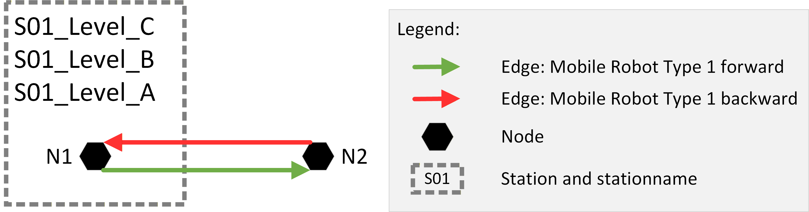

LIF-File:
```json 
{
    "metaInformation": {
        "projectIdentification": "LIF Example 15",
        "creator": "VDMA",
        "exportTimestamp": "2023-09-28T10:00:00.00Z",
        "lifVersion": "0.11.0"
    },
    "layouts": [
        {
            "layoutId": "Layout_Ground_Level",
            "layoutName": "Name of Layout Ground Level",
            "layoutVersion": "1",
            "layoutdescriptor": "Ground level of Customer",
            "nodes": [
                {
                    "nodeId": "N1",
                    "mapId": "Map_Z-Level_1",
                    "nodePosition": {
                        "x": 7.2,
                        "y": 0.0
                    },
                    "mobileRobotTypeNodeProperties": [
                        {
                            "mobileRobotTypeId": "Mobile_Robot_Type_1",
                            "actions": [
                                {
                                    "actionType": "pick",
                                    "requirementType": "CONDITIONAL",
                                    "blockingType": "HARD"
                                },
                                {
                                    "actionType": "drop",
                                    "requirementType": "CONDITIONAL",
                                    "blockingType": "HARD"
                                }
                            ]
                        }
                    ]
                },
                {
                    "nodeId": "N2",
                    "mapId": "Map_Z-Level_1",
                    "nodePosition": {
                        "x": 9.2,
                        "y": 0.0
                    },
                    "mobileRobotTypeNodeProperties": [
                        {
                            "mobileRobotTypeId": "Mobile_Robot_Type_1"
                        }
                    ]
                }
            ],
            "edges": [
                {
                    "edgeId": "N1-N2",
                    "startNodeId": "N1",
                    "endNodeId": "N2",
                    "mobileRobotTypeEdgeProperties": [
                        {
                            "mobileRobotTypeId": "Mobile_Robot_Type_1",
                            "mobileRobotOrientations": [3.1415926535897931],
                            "orientationType": "TANGENTIAL",
                            "reachOrientationBeforeEntering": true
                        }
                    ]
                },
                {
                    "edgeId": "N2-N1",
                    "startNodeId": "N2",
                    "endNodeId": "N1",
                    "mobileRobotTypeEdgeProperties": [
                        {
                            "mobileRobotTypeId": "Mobile_Robot_Type_1",
                            "mobileRobotOrientations": [0.0],
                            "orientationType": "TANGENTIAL",
                            "reachOrientationBeforeEntering": true
                        }
                    ]
                }
            ],
            "stations": [
                {
                    "stationId": "S01_Level_A",
                    "interactionNodeIds": [
                        "N1"
                    ],
                    "stationName": "Shelf on Level A",
                    "stationDescription": "Shelf on level A",
                    "stationHeight": "0.0"
                },
                {
                    "stationId": "S01_Level_B",
                    "interactionNodeIds": [
                        "N1"
                    ],
                    "stationName": "Shelf on Level B",
                    "stationDescription": "Shelf on level B",
                    "stationHeight": "2.5"
                },
                {
                    "stationId": "S01_Level_2",
                    "interactionNodeIds": [
                        "N1"
                    ],
                    "stationName": "Shelf on Level C",
                    "stationDescription": "Shelf on level C",
                    "stationHeight": "5.0"
                }
            ]
        }
    ]
}
```
## 11.16 Rack Station Modelled by Three Nodes

Rack station with three levels modelled by three different nodes:

* Node NA is only for picking a load.
* Node NB is only for dropping a load.
* Node NC is for picking and dropping a load.

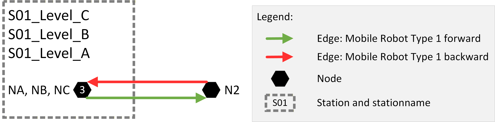

LIF-File:
```json
{
  "metaInformation": {
      "projectIdentification": "LIF Example 16",
      "creator": "VDMA",
      "exportTimestamp": "2023-09-28T10:00:00.00Z",
      "lifVersion": "0.11.0"
  },
  "layouts": [
      {
          "layoutId": "Layout_Ground_Level",
          "layoutName": "Name of Layout Ground Level",
          "layoutVersion": "1",
          "layoutdescriptor": "Ground level of Customer",
          "nodes": [
              {
                  "nodeId": "NA",
                  "mapId": "Map_Z-Level_1",
                  "nodePosition": {
                      "x": 7.2,
                      "y": 0.0
                  },
                  "mobileRobotTypeNodeProperties": [
                      {
                          "mobileRobotTypeId": "Mobile_Robot_Type_1",
                          "actions": [
                              {
                                  "actionType": "pick",
                                  "requirementType": "CONDITIONAL",
                                  "blockingType": "HARD"
                              }
                          ]
                      }
                  ]
              },
              {
                  "nodeId": "NB",
                  "mapId": "Map_Z-Level_1",
                  "nodePosition": {
                      "x": 7.2,
                      "y": 0.0
                  },
                  "mobileRobotTypeNodeProperties": [
                      {
                          "mobileRobotTypeId": "Mobile_Robot_Type_1",
                          "actions": [
                              {
                                  "actionType": "drop",
                                  "requirementType": "CONDITIONAL",
                                  "blockingType": "HARD"
                              }
                          ]
                      }
                  ]
              },
              {
                  "nodeId": "NC",
                  "mapId": "Map_Z-Level_1",
                  "nodePosition": {
                      "x": 7.2,
                      "y": 0.0
                  },
                  "mobileRobotTypeNodeProperties": [
                      {
                          "mobileRobotTypeId": "Mobile_Robot_Type_1",
                          "actions": [
                              {
                                  "actionType": "pick",
                                  "requirementType": "CONDITIONAL",
                                  "blockingType": "HARD"
                              },
                              {
                                  "actionType": "drop",
                                  "requirementType": "CONDITIONAL",
                                  "blockingType": "HARD"
                              }
                          ]
                      }
                  ]
              },
              {
                  "nodeId": "N2",
                  "mapId": "Map_Z-Level_1",
                  "nodePosition": {
                      "x": 9.2,
                      "y": 0.0
                  },
                  "mobileRobotTypeNodeProperties": [
                      {
                          "mobileRobotTypeId": "Mobile_Robot_Type_1"
                      }
                  ]
              }
          ],
          "edges": [
              {
                  "edgeId": "NA-N2",
                  "startNodeId": "NA",
                  "endNodeId": "N2",
                  "mobileRobotTypeEdgeProperties": [
                      {
                          "mobileRobotTypeId": "Mobile_Robot_Type_1",
                          "mobileRobotOrientations": [3.1415926535897931],
                          "orientationType": "TANGENTIAL",
                          "reachOrientationBeforeEntering": true
                      }
                  ]
              },
              {
                  "edgeId": "N2-NA",
                  "startNodeId": "N2",
                  "endNodeId": "NA",
                  "mobileRobotTypeEdgeProperties": [
                      {
                          "mobileRobotTypeId": "Mobile_Robot_Type_1",
                          "mobileRobotOrientations": [0.0],
                          "orientationType": "TANGENTIAL",
                          "reachOrientationBeforeEntering": true
                      }
                  ]
              },
              {
                  "edgeId": "NB-N2",
                  "startNodeId": "NA",
                  "endNodeId": "N2",
                  "mobileRobotTypeEdgeProperties": [
                      {
                          "mobileRobotTypeId": "Mobile_Robot_Type_1",
                          "mobileRobotOrientations": [3.1415926535897931],
                          "orientationType": "TANGENTIAL",
                          "reachOrientationBeforeEntering": true
                      }
                  ]
              },
              {
                  "edgeId": "N2-NB",
                  "startNodeId": "N2",
                  "endNodeId": "NB",
                  "mobileRobotTypeEdgeProperties": [
                      {
                          "mobileRobotTypeId": "Mobile_Robot_Type_1",
                          "mobileRobotOrientations": [0.0],
                          "orientationType": "TANGENTIAL",
                          "reachOrientationBeforeEntering": true
                      }
                  ]
              },
              {
                  "edgeId": "NC-N2",
                  "startNodeId": "NC",
                  "endNodeId": "N2",
                  "mobileRobotTypeEdgeProperties": [
                      {
                          "mobileRobotTypeId": "Mobile_Robot_Type_1",
                          "mobileRobotOrientations": [3.1415926535897931],
                          "orientationType": "TANGENTIAL",
                          "reachOrientationBeforeEntering": true
                      }
                  ]
              },
              {
                  "edgeId": "N2-NC",
                  "startNodeId": "N2",
                  "endNodeId": "NC",
                  "mobileRobotTypeEdgeProperties": [
                      {
                          "mobileRobotTypeId": "Mobile_Robot_Type_1",
                          "mobileRobotOrientations": [0.0],
                          "orientationType": "TANGENTIAL",
                          "reachOrientationBeforeEntering": true
                      }
                  ]
              }
          ],
          "stations": [
              {
                  "stationId": "S01_Level_A",
                  "interactionNodeIds": [
                      "NA"
                  ],
                  "stationName": "Shelf on Level A",
                  "stationDescription": "Handover shelf from manual trucks (inbound).",
                  "stationHeight": "0.0"
              },
              {
                  "stationId": "S01_Level_B",
                  "interactionNodeIds": [
                      "NB"
                  ],
                  "stationName": "Shelf on Level B",
                  "stationDescription": "Handover shelf toward manual trucks (outbound).",
                  "stationHeight": "2.5"
              },
              {
                  "stationId": "S01_Level_C",
                  "interactionNodeIds": [
                      "NC"
                  ],
                  "stationName": "Shelf on Level C",
                  "stationDescription": "Special bi-directional handover shelf.",
                  "stationHeight": "5.0"
              }
          ]
      }
  ]
}
```
## 11.17 Edge with Trajectory Definition

Two edges between node N1 and N2 with a half circle trajectory. Before entering the edge N1 to N2 the mobile robot needs to rotate on N1 to -90°. The mobile robot will maintain the -90° while moving on the edge. Before entering the edge N2 to N1 the mobile robot needs to rotate to 90°. The mobile robot will maintain the 90° while moving on the edge.

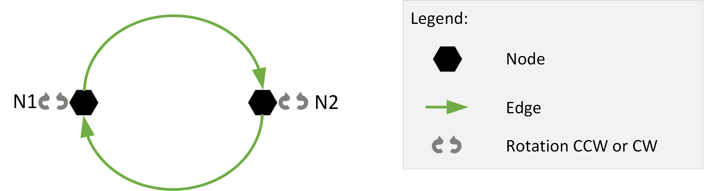

LIF-File:
```json
{
    "metaInformation": {
        "projectIdentification": "LIF Example 17",
        "creator": "VDMA",
        "exportTimestamp": "2023-09-28T10:00:00.00Z",
        "lifVersion": "0.11.0"
    },
    "layouts": [
        {
            "layoutId": "Layout_Ground_Level",
            "layoutName": "Name of Layout Ground Level",
            "layoutVersion": "1",
            "layoutdescriptor": "Ground level of Customer",
            "nodes": [
                {
                    "nodeId": "N1",
                    "mapId": "Map_Z-Level_1",
                    "nodePosition": {
                        "x": 5.0,
                        "y": 0.0
                    },
                    "mobileRobotTypeNodeProperties": [
                        {
                            "mobileRobotTypeId": "Mobile_Robot_Type_1"
                        }
                    ]
                },
                {
                    "nodeId": "N2",
                    "mapId": "Map_Z-Level_1",
                    "nodePosition": {
                        "x": 15.0,
                        "y": 0.0
                    },
                    "mobileRobotTypeNodeProperties": [
                        {
                            "mobileRobotTypeId": "Mobile_Robot_Type_1"
                        }
                    ]
                }
            ],
            "edges": [
                {
                    "edgeId": "N1-N2",
                    "startNodeId": "N1",
                    "endNodeId": "N2",
                    "mobileRobotTypeEdgeProperties": [
                        {
                            "mobileRobotTypeId": "Mobile_Robot_Type_1",
                            "mobileRobotOrientations": [-1.5707963267948966],
                            "orientationType": "TANGENTIAL",
                            "reachOrientationBeforeEntering": true,
                            "rotationAtStartNodeAllowed": "BOTH",
                            "rotationAtEndNodeAllowed": "BOTH",
                            "trajectory": {
                                "degree": 2,
                                "knotVector": [
                                    0,
                                    0,
                                    0,
                                    0.5,
                                    1,
                                    1,
                                    1
                                ],
                                "controlPoints": [
                                    {
                                        "x": 0,
                                        "y": 0
                                    },
                                    {
                                        "x": 0,
                                        "y": 1.8
                                    },
                                    {
                                        "x": 3.6,
                                        "y": 1.8
                                    },
                                    {
                                        "x": 3.6,
                                        "y": 0
                                    }
                                ]
                            }
                        }
                    ]
                },
                {
                    "edgeId": "N2-N1",
                    "startNodeId": "N2",
                    "endNodeId": "N1",
                    "mobileRobotTypeEdgeProperties": [
                        {
                            "mobileRobotTypeId": "Mobile_Robot_Type_1",
                            "mobileRobotOrientations": [1.5707963267948966],
                            "orientationType": "TANGENTIAL",
                            "reachOrientationBeforeEntering": true,
                            "rotationAtStartNodeAllowed": "BOTH",
                            "rotationAtEndNodeAllowed": "BOTH",
                            "trajectory": {
                                "degree": 2,
                                "knotVector": [
                                    0,
                                    0,
                                    0,
                                    0.5,
                                    1,
                                    1,
                                    1
                                ],
                                "controlPoints": [
                                    {
                                        "x": 3.6,
                                        "y": 0
                                    },
                                    {
                                        "x": 3.6,
                                        "y": -1.8
                                    },
                                    {
                                        "x": 0,
                                        "y": -1.8
                                    },
                                    {
                                        "x": 0,
                                        "y": 0
                                    }
                                ]
                            }
                        }
                    ]
                }
            ]
        }
    ]
}
```

## 11.18 Manufacturer Specific Action on an Edge

Manufacturer specific action on an edge.

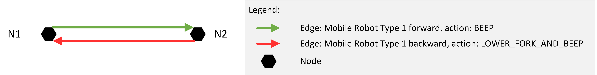

LIF-File:
```json
{
    "metaInformation": {
        "projectIdentification": "LIF Example 18",
        "creator": "VDMA",
        "exportTimestamp": "2023-09-28T10:00:00.00Z",
        "lifVersion": "0.11.0"
    },
    "layouts": [
        {
            "layoutId": "Layout_Ground_Level",
            "layoutName": "Name of Layout Ground Level",
            "layoutVersion": "1",
            "layoutdescriptor": "Ground level of Customer",
            "nodes": [
                {
                    "nodeId": "N1",
                    "mapId": "Map_Z-Level_1",
                    "nodePosition": {
                        "x": 0.0,
                        "y": 0.0
                    },
                    "mobileRobotTypeNodeProperties": [
                        {
                            "mobileRobotTypeId": "Mobile_Robot_Type_1"
                        }
                    ]
                },
                {
                    "nodeId": "N2",
                    "mapId": "Map_Z-Level_1",
                    "nodePosition": {
                        "x": 11.0,
                        "y": 0.0
                    },
                    "mobileRobotTypeNodeProperties": [
                        {
                            "mobileRobotTypeId": "Mobile_Robot_Type_1"
                        }
                    ]
                }
            ],
            "edges": [
                {
                    "edgeId": "N1-N2",
                    "startNodeId": "N1",
                    "endNodeId": "N2",
                    "mobileRobotTypeEdgeProperties": [
                        {
                            "mobileRobotTypeId": "Mobile_Robot_Type_1",
                            "mobileRobotOrientations": [0.0],
                            "orientationType": "TANGENTIAL",
                            "reachOrientationBeforeEntering": true,
                            "actions": [
                                {
                                    "actionType": "BEEP",
                                    "actionDescriptor": "Section where the (third-party) fleet control system could instruct the mobile robot to beep",
                                    "requirementType": "OPTIONAL",
                                    "blockingType": "SOFT"
                                }
                            ]
                        }
                    ]
                },
                {
                    "edgeId": "N2-N1",
                    "startNodeId": "N2",
                    "endNodeId": "N1",
                    "mobileRobotTypeEdgeProperties": [
                        {
                            "mobileRobotTypeId": "Mobile_Robot_Type_1",
                            "mobileRobotOrientations": [3.1415926535897931],
                            "orientationType": "TANGENTIAL",
                            "reachOrientationBeforeEntering": true,
                            "actions": [
                                {
                                    "actionType": "LOWER_FORK_AND_BEEP",
                                    "actionDescriptor": "Section where the (third-party) fleet control system must tell the mobile robot to lower forks and beep",
                                    "requirementType": "REQUIRED",
                                    "blockingType": "SOFT"
                                }
                            ]
                        }
                    ]
                }
            ]
        }
    ]
}
```

## 11.19 Forward Edge with Two Mobile Robot Types with Differing Orientation

One edge (straight line) between two nodes, where two different mobile robot types from the same mobile robot integrator must adopt different orientations.

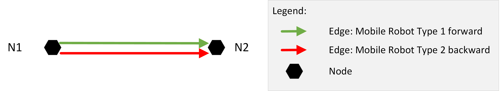

LIF-File:
```json
{
    "metaInformation": {
        "projectIdentification": "LIF Example 19",
        "creator": "VDMA",
        "exportTimestamp": "2023-09-28T10:00:00.00Z",
        "lifVersion": "0.11.0"
    },
    "layouts": [
        {
            "layoutId": "Layout_Ground_Level",
            "layoutName": "Name of Layout Ground Level",
            "layoutVersion": "1",
            "layoutdescriptor": "Ground level of Customer",
            "nodes": [
                {
                    "nodeId": "N1",
                    "mapId": "Map_Z-Level_1",
                    "nodePosition": {
                        "x": 0.0,
                        "y": 0.0
                    },
                    "mobileRobotTypeNodeProperties": [
                        {
                            "mobileRobotTypeId": "Mobile_Robot_Type_1"
                        },
                        {
                            "mobileRobotTypeId": "Mobile_Robot_Type_2"
                        }
                    ]
                },
                {
                    "nodeId": "N2",
                    "mapId": "Map_Z-Level_1",
                    "nodePosition": {
                        "x": 11.0,
                        "y": 0.0
                    },
                    "mobileRobotTypeNodeProperties": [
                        {
                            "mobileRobotTypeId": "Mobile_Robot_Type_1"
                        },
                        {
                            "mobileRobotTypeId": "Mobile_Robot_Type_2"
                        }
                    ]
                }
            ],
            "edges": [
                {
                    "edgeId": "N1-N2",
                    "startNodeId": "N1",
                    "endNodeId": "N2",
                    "mobileRobotTypeEdgeProperties": [
                        {
                            "mobileRobotTypeId": "Mobile_Robot_Type_1",
                            "mobileRobotOrientations": [0.0],
                            "orientationType": "TANGENTIAL",
                            "reachOrientationBeforeEntering": true,
                            "rotationAtStartNodeAllowed": "NONE",
                            "rotationAtEndNodeAllowed": "NONE"
                        },
                        {
                            "mobileRobotTypeId": "Mobile_Robot_Type_2",
                            "mobileRobotOrientations": [1.5707963267948966],
                            "orientationType": "TANGENTIAL",
                            "reachOrientationBeforeEntering": true,
                            "rotationAtStartNodeAllowed": "NONE",
                            "rotationAtEndNodeAllowed": "NONE"
                        }
                    ]
                }
            ]
        }
    ]
}```
